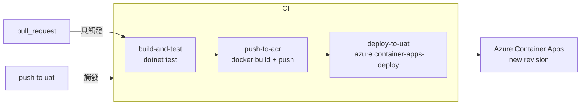

# 任務報告：CI/CD Pipeline 初始建置 — 2026-05-17

1. **主要解決什麼問題？**
   每次程式碼變更需要手動 build、測試、部署到 Azure Container Apps；建立 GitHub Actions CI/CD pipeline，讓 push 到 uat 分支時自動完成 build → test → push image → deploy 全流程。

2. **如何證明是否執行正確？**
   - PR merge 到 uat 後，GitHub Actions 出現三個綠燈 job（build-and-test、push-to-acr、deploy-to-uat）
   - Azure Container Apps 出現新的 revision，`az containerapp show` 可取到 FQDN
   - 瀏覽器開啟 FQDN 可看到應用程式回應

3. **怎樣才是好的作法？**
   三個 job 分離（build/test、push image、deploy），每個 job 職責單一；`needs` 關鍵字確保順序依賴；敏感資訊（ACR 帳密、Azure 憑證）全部存 GitHub Secrets，YAML 裡不出現明文。

4. **最重要的知識或概念（最多三個）**
   - **Multi-stage CI Jobs**：就像工廠流水線，先品管（test）再包裝（push image）再出貨（deploy），任一環節失敗整條線停工。
   - **GitHub Secrets**：敏感資訊的保險箱，只有 GitHub Actions 執行時才開箱，不會出現在 git log 或 PR diff 裡。
   - **`if: github.event_name == 'push' && github.ref == 'refs/heads/uat'`**：PR 時只跑 build/test，真正 merge 才跑 deploy，避免每個 PR 都觸發部署。

5. **核心的變數是什麼？**

   | 變數 | 說明 |
   |------|------|
   | `IMAGE_NAME` | ACR 完整 image 路徑（env 層級，全 job 共用） |
   | `github.sha` | 每次 commit 唯一 hash，用於 image tag 確保版本可追溯 |
   | `secrets.AZURE_CREDENTIALS` | Azure service principal JSON，deploy job 的認證憑證 |

6. **新手可能常犯的誤區？**
   - `push-to-acr` 忘記加 `needs: build-and-test`，導致 build 失敗時仍然 push 壞掉的 image。
   - `deploy-to-uat` 的 `if` 條件沒加 `github.event_name == 'push'`，PR 的 CI 也會觸發 deploy。
   - Docker image tag 用 `latest` 而非 `github.sha`，無法追溯哪個 commit 在 UAT 上執行。

7. **流程圖與結構圖**

8. **分支與部署記錄**
   - 開發分支：feature/ci-cd-pipeline（PR #1）、feature/cd-deploy-container-app（PR #2）
   - PR 編號：#1、#2
   - Merge 到：uat
   - Merge 時間：2026-05-17 04:17（#2）
   - CI 結果：✅ 成功
   - UAT 部署：✅ 成功
