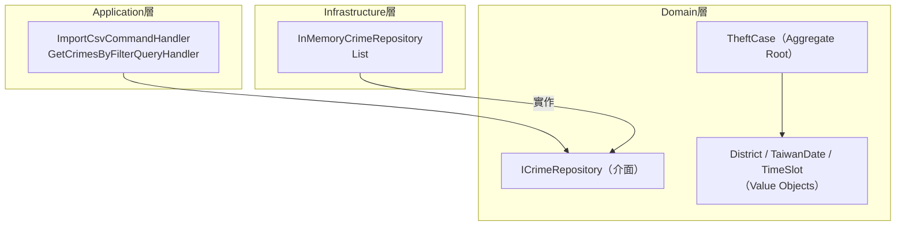

# 任務報告：DDD Domain 層與 InMemory Repository — 2026-05-18

1. **主要解決什麼問題？**
   建立 DDD 架構的核心骨架：Domain 層的 Aggregates、Value Objects、Repository 介面，以及 Infrastructure 層的 InMemoryCrimeRepository，讓上層 Application/API 可以在不依賴真實 DB 的情況下開發與測試。

2. **如何證明是否執行正確？**
   - `dotnet build` 零錯誤
   - Domain Unit Tests 通過（TheftCase、District、TaiwanDate 等 value object 邊界條件）
   - InMemoryCrimeRepository 的 AddAsync / GetByFilterAsync 可在測試中正常運作

3. **怎樣才是好的作法？**
   Domain 層不依賴任何 infrastructure 套件（零 NuGet package，只用 .NET BCL）；Repository 介面定義在 Domain，實作在 Infrastructure，遵循 Dependency Inversion；Value Object 用 record 型別實作，天然不可變（immutable）。

4. **最重要的知識或概念（最多三個）**
   - **Aggregate Root**：`TheftCase` 是整個竊盜案件的入口，外界只能透過它操作內部狀態，就像一個公司只能透過 CEO 下指令，不能直接跟員工說話。
   - **Value Object**：`District`、`TaiwanDate` 沒有自己的 ID，只靠值來判斷是否相等，就像兩張「100元鈔票」，只要面額相同就是等價的。
   - **Repository Pattern**：`ICrimeRepository` 把「如何存取資料」的細節藏起來，Domain 層只知道「我可以找到案件」，不知道是存在記憶體還是資料庫。

5. **核心的變因是什麼？（影響結果的關鍵因素）**

   | 變因 | 影響 |
   |------|------|
   | Repository 介面定義位置（Domain vs Application） | 決定依賴方向是否正確，Domain 是否被上層污染 |
   | Value Object 的相等比較實作（Equals / GetHashCode） | 決定集合去重、Dictionary 查找是否正確 |
   | Domain 層是否引用 ORM 套件 | 決定 Clean Architecture 是否被破壞 |

6. **新手可能常犯的誤區？**
   - 把 EF Core 或 Dapper 等 ORM 直接引用在 Domain 層，破壞 Clean Architecture 的依賴方向。
   - Value Object 忘記 override `Equals` / `GetHashCode`，導致集合操作（Distinct、Dictionary）行為錯誤。
   - Repository 介面放在 Application 層而非 Domain 層，導致 Domain 反依賴 Application。

7. **流程圖與結構圖**

8. **分支與部署記錄**
   - 開發分支：feature/in-memory-repository
   - PR 編號：#3
   - Merge 到：uat
   - Merge 時間：2026-05-18 11:19
   - CI 結果：✅ 成功
   - UAT 部署：✅ 成功
