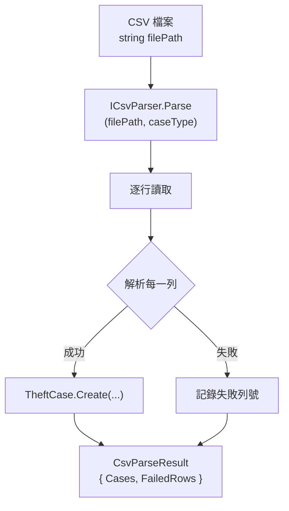

# 任務報告：CSV 解析器（CsvParser） — 2026-05-23

1. **主要解決什麼問題？**
   台北市政府提供的竊盜資料為 CSV 格式，需要將每一列解析成 `TheftCase` domain 物件，包含日期格式轉換（民國年→西元年）、時段正規化、行政區對應等邏輯。

2. **如何證明是否執行正確？**
   - `CsvParserTests` 覆蓋正常欄位、缺失欄位、日期格式邊界（民國 113 年→2024 年）
   - Infrastructure Tests 全數通過
   - 手動匯入測試 CSV 後，`GET /api/crime` 可查詢到正確筆數與欄位值

3. **怎樣才是好的作法？**
   Parser 只負責解析，不負責驗證業務規則（那是 Domain 的職責）；欄位缺失時回傳 `CsvParseResult` 的部分成功結果而非拋出例外，讓呼叫端決定如何處理；用 `TaiwanDate.Parse()` 封裝民國年轉換邏輯，避免散落在各處。

4. **最重要的知識或概念（最多三個）**
   - **民國年轉西元年**：台灣資料格式 `1130101` = 民國 113 年 01 月 01 日 = 2024-01-01。規則：年份 + 1911 = 西元年。
   - **單一職責（SRP）**：`CsvParser` 只做「把文字變成物件」，不做「存進資料庫」或「驗證業務邏輯」，就像翻譯只負責翻譯，不負責審查內容對不對。
   - **部分成功結果（CsvParseResult）**：一個 CSV 有 11,514 列，不能因為一列格式錯就整批失敗；回傳成功/失敗筆數，讓呼叫端決定是否繼續。

5. **核心的變因是什麼？（影響結果的關鍵因素）**

   | 變因 | 影響 |
   |------|------|
   | 民國年轉西元年規則（+1911） | 決定解析出的日期是否正確 |
   | 解析失敗策略（部分成功 vs 全批中止） | 決定一筆格式錯誤是否導致整個匯入失敗 |
   | BOM 字元處理 | 決定 UTF-8 with BOM 的 CSV 第一欄是否可正確讀取 |

6. **新手可能常犯的誤區？**
   - 直接 `int.Parse()` 民國年字串，遇到空值或格式錯誤就拋出例外，沒有防護。
   - 把「哪個 CaseType 對應哪個 CSV 檔」的邏輯寫在 Parser 裡，應該在呼叫端（ImportCsvCommandHandler）傳入。
   - 忘記處理 BOM（UTF-8 with BOM）CSV，第一欄的欄位名稱會含有不可見字元，導致欄位對應失敗。

7. **流程圖與結構圖**

8. **分支與部署記錄**
   - 開發分支：feature/csv-parser
   - PR 編號：#4
   - Merge 到：uat
   - Merge 時間：2026-05-23 08:45
   - CI 結果：✅ 成功
   - UAT 部署：✅ 成功
