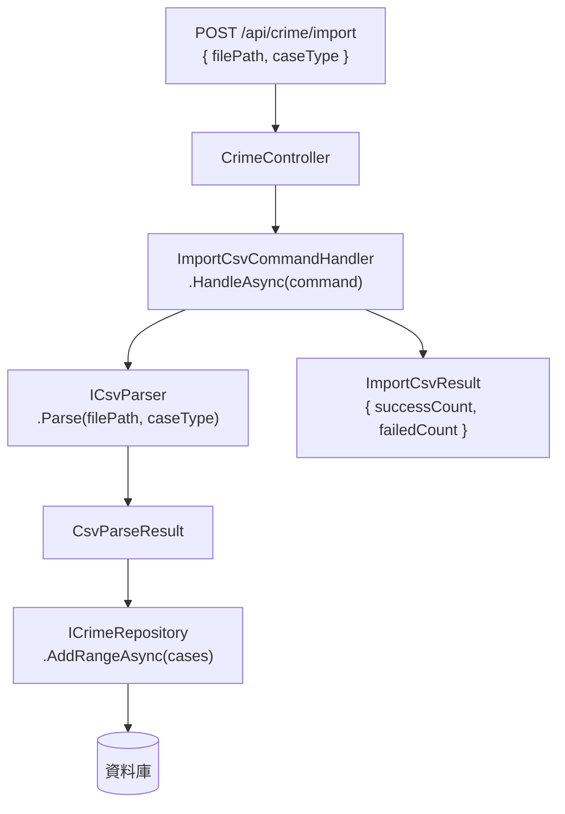

# 任務報告：ImportCsvCommand（CQRS Command + API） — 2026-05-26

1. **主要解決什麼問題？**
   需要將六個 CSV 檔案的竊盜資料匯入資料庫；用 CQRS Command 模式封裝「匯入 CSV」的業務邏輯，並透過 `POST /api/crime/import` REST 端點觸發，讓 CI pipeline 可以自動呼叫 API 完成資料匯入。

2. **如何證明是否執行正確？**
   - `ImportCsvCommandHandlerTests` 覆蓋成功/失敗/空資料三種路徑
   - Application Tests 全數通過
   - `POST /api/crime/import` 回傳 `{ successCount, failedCount }` 且值與 CSV 列數相符

3. **怎樣才是好的作法？**
   Command 只含輸入資料（`FilePath`、`CaseType`），Handler 負責協調 Parser 與 Repository；Handler 不直接知道 CSV 格式細節，只呼叫 `ICsvParser` 介面，保持 Application 層對 Infrastructure 的依賴反轉。

4. **最重要的知識或概念（最多三個）**
   - **CQRS Command**：把「寫入」操作封裝成獨立物件（Command），讓業務邏輯集中在 Handler，Controller 只做 HTTP 轉接，不含業務規則。
   - **Result Pattern vs 例外**：`ImportCsvResult` 回傳 `SuccessCount / FailedCount`，不拋例外，讓呼叫端可以決定失敗時的行為（部分成功可繼續）。
   - **介面隔離**：`ImportCsvCommandHandler` 只依賴 `ICsvParser` 和 `ICrimeRepository`，不知道底層是 CSV 還是 Excel，是 PostgreSQL 還是 InMemory。

5. **核心的變因是什麼？（影響結果的關鍵因素）**

   | 變因 | 影響 |
   |------|------|
   | CaseType 是否正確傳遞給 Parser | 決定匯入的案件是否被分類到正確的竊盜類型 |
   | 批次寫入 vs 逐筆寫入 | 決定效能與 transaction 一致性（部分成功是否可能） |
   | ICsvParser 以介面注入 vs 直接 new | 決定測試時是否能替換假實作 |

6. **新手可能常犯的誤區？**
   - `Handler` 直接 `new CsvParser(...)` 而非注入 `ICsvParser`，導致無法在測試中替換假實作。
   - `CaseType` 忘記傳給 Parser，所有案件的 case type 都是 null。
   - `AddRangeAsync` 用迴圈逐筆 `AddAsync` 替代，效能差且 transaction 無法保證。

7. **流程圖與結構圖**

8. **分支與部署記錄**
   - 開發分支：feature/import-csv-command
   - PR 編號：#5
   - Merge 到：uat
   - Merge 時間：2026-05-26 15:52
   - CI 結果：✅ 成功
   - UAT 部署：✅ 成功
