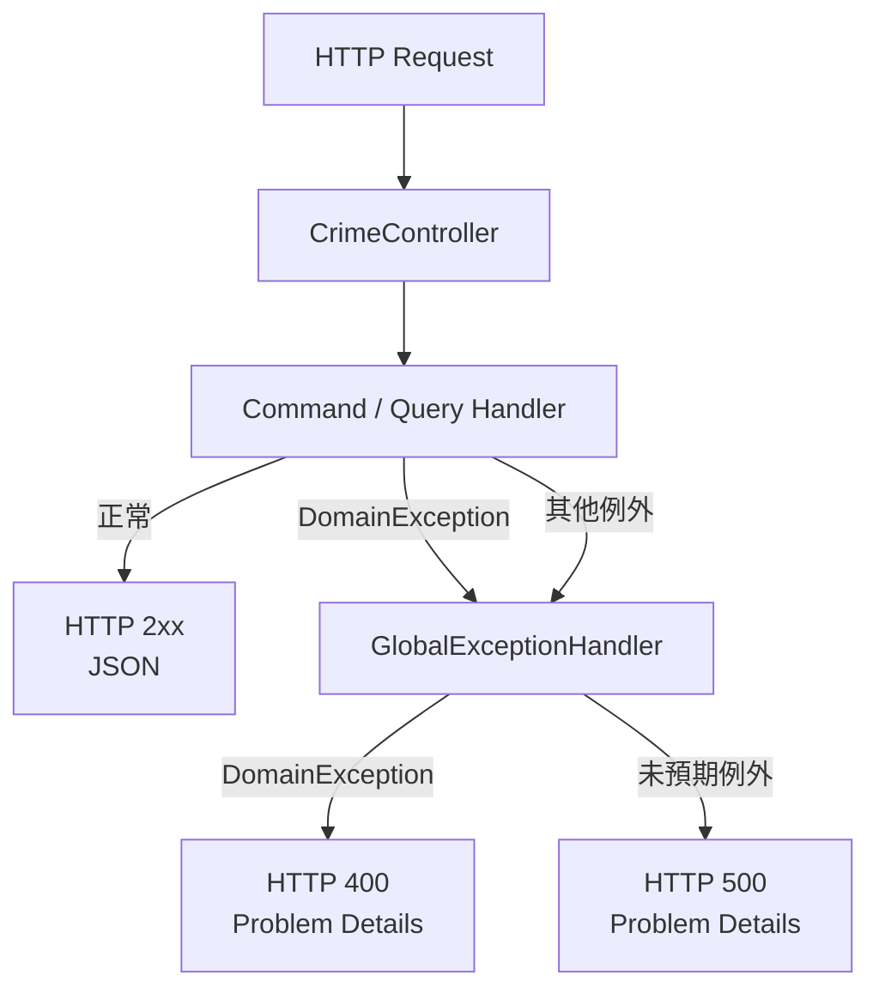

# 任務報告：CrimeController + GlobalExceptionHandler — 2026-05-28

1. **主要解決什麼問題？**
   需要將 Application 層的 Command/Query Handler 暴露為 REST API，並統一處理例外（DomainException → 400、未預期例外 → 500），避免原始 stack trace 暴露給外部呼叫端。

2. **如何證明是否執行正確？**
   - Integration Tests 對 `POST /api/crime/import` 和 `GET /api/crime` 發送請求，確認 HTTP 狀態碼與 JSON 格式正確
   - `GET /api/crime?rawTimeSlot=invalid` 回傳 HTTP 400 with Problem Details（不含 stack trace）
   - 不存在的路由回傳 404

3. **怎樣才是好的作法？**
   Controller 只做 HTTP 轉接（接收請求 → 呼叫 Handler → 回傳結果），不含業務邏輯；`GlobalExceptionHandler` 統一捕捉例外，按例外型別決定 HTTP status code，讓 Controller 無需 try/catch；使用 `AddProblemDetails` 讓錯誤回應符合 RFC 7807 標準。

4. **最重要的知識或概念（最多三個）**
   - **Controller 薄層原則**：Controller 就像服務生，只負責點餐（接請求）和上菜（回回應），廚房的事（業務邏輯）完全不管。
   - **GlobalExceptionHandler**：設置一個「集中式垃圾桶」，所有未被捕捉的例外都在這裡統一處理，不讓錯誤資訊直接暴露。
   - **Problem Details（RFC 7807）**：API 錯誤回應的國際標準格式 `{ type, title, status, detail }`，讓前端可以機械化解析錯誤，不用靠字串比對。

5. **核心的變因是什麼？（影響結果的關鍵因素）**

   | 變因 | 影響 |
   |------|------|
   | 例外處理位置（集中 GlobalExceptionHandler vs 各 Action try/catch） | 決定程式碼重複程度與錯誤處理一致性 |
   | Exception 型別對應的 HTTP 狀態碼 | 決定 API 呼叫端能否區分「輸入錯誤」與「系統錯誤」 |
   | `app.UseExceptionHandler()` 是否呼叫 | 決定 GlobalExceptionHandler 是否實際生效 |

6. **新手可能常犯的誤區？**
   - Controller 直接 `try/catch` 每個 Action，重複程式碼多且容易遺漏。
   - 把 `DomainException` 的訊息直接回傳 500，客戶端看不出是輸入錯誤還是系統錯誤。
   - 沒有呼叫 `app.UseExceptionHandler()`，`GlobalExceptionHandler` 根本沒生效。

7. **流程圖與結構圖**

8. **分支與部署記錄**
   - 開發分支：feature/crime-controller
   - PR 編號：#7
   - Merge 到：uat
   - Merge 時間：2026-05-28 17:20
   - CI 結果：✅ 成功
   - UAT 部署：✅ 成功
