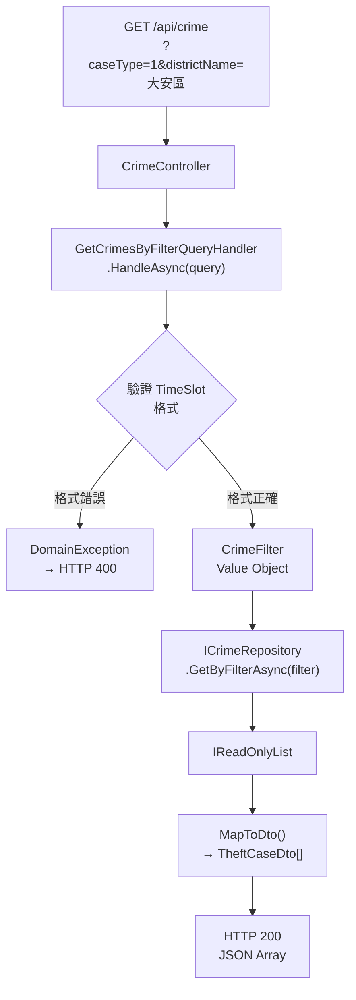

# 任務報告：GetCrimesByFilterQuery（CQRS Query） — 2026-05-28

1. **主要解決什麼問題？**
   前端需要依多個條件（案類、行政區、年份、時段）查詢竊盜案件；用 CQRS Query 模式封裝查詢邏輯，`GET /api/crime` 端點接收查詢參數、轉為 Domain Filter 物件，再透過 Repository 查詢並回傳 DTO 清單。

2. **如何證明是否執行正確？**
   - `GetCrimesByFilterQueryHandlerTests` 覆蓋多種篩選條件組合
   - Application Tests 全數通過
   - `GET /api/crime?districtName=大安區` 回傳只含大安區案件的 JSON

3. **怎樣才是好的作法？**
   Query 回傳 DTO（`TheftCaseDto`）而非 Domain Entity，避免暴露內部實作細節；`CrimeFilter` Value Object 封裝所有篩選條件，讓 Repository 介面保持乾淨（一個方法而非多個重載）；Domain 驗證（時段格式錯誤）在 Handler 拋出 `DomainException`，由 GlobalExceptionHandler 統一轉成 HTTP 400。

4. **最重要的知識或概念（最多三個）**
   - **CQRS Query**：把「讀取」和「寫入」分開，Query 只取資料不改變狀態，就像看菜單不會改變廚房的庫存。
   - **DTO（Data Transfer Object）**：API 回傳的是 DTO 而非 Entity，就像餐廳給客人的是菜單（簡化版），不是食材庫存表（完整資料）。
   - **CrimeFilter Value Object**：把所有篩選條件打包成一個物件傳給 Repository，比傳 7 個參數更清晰，也更容易測試。

5. **核心的變數是什麼？**

   | 變數 | 說明 |
   |------|------|
   | `GetCrimesByFilterQuery` | 含 CaseType, DistrictName, YearFrom/To, RawTimeSlot |
   | `CrimeFilter` | Domain Value Object，封裝所有篩選邏輯 |
   | `TheftCaseDto` | 回傳給前端的扁平資料結構，隱藏 Domain 複雜度 |

6. **新手可能常犯的誤區？**
   - Handler 直接回傳 `TheftCase` Entity，暴露 Domain 細節給 API，耦合過高。
   - 多個篩選條件用多個 Repository 方法（`GetByDistrict`、`GetByYear`...），造成組合爆炸。
   - `DomainException` 沒有被 GlobalExceptionHandler 捕捉，原始 stack trace 暴露給 API 呼叫端。

7. **流程圖與結構圖**

8. **分支與部署記錄**
   - 開發分支：feature/get-crimes-by-filter-query
   - PR 編號：#6
   - Merge 到：uat
   - Merge 時間：2026-05-28 11:16
   - CI 結果：✅ 成功
   - UAT 部署：✅ 成功
