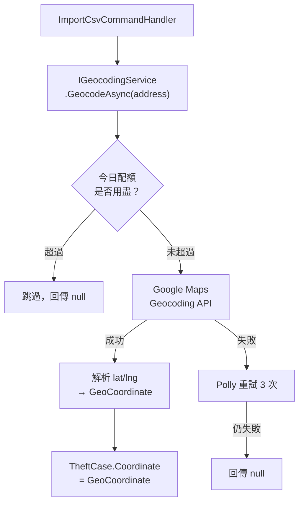

# 任務報告：GoogleGeocodingService — 2026-05-29

1. **主要解決什麼問題？**
   CSV 資料只有文字地址（如「臺北市大安區信義路四段」），地圖無法顯示；透過 Google Maps Geocoding API 將地址轉換為經緯度，讓案件可以標示在地圖上。

2. **如何證明是否執行正確？**
   - `GoogleGeocodingServiceTests` Mock HttpClient 回應，驗證地址→經緯度的解析邏輯
   - Infrastructure Tests 全數通過
   - 呼叫真實 API 後，`TheftCase.Coordinate` 包含合理的台北市範圍經緯度（緯度 24~26、經度 121~122）

3. **怎樣才是好的作法？**
   用 `HttpClientFactory` 建立 HttpClient，加上 Polly 的 `AddStandardResilienceHandler()` 自動重試與熔斷；`IGeocodingService` 介面讓 Application 層不依賴 Google Maps；API Key 存 appsettings 而非硬碼；每日配額由 `DailyQuotaLimit` 控制避免超收費。

4. **最重要的知識或概念（最多三個）**
   - **HttpClientFactory**：不直接 `new HttpClient()`，而是讓工廠管理生命週期，避免 socket exhaustion（socket 耗盡）的問題。
   - **Polly 重試策略**：網路請求偶爾失敗很正常，自動重試 3 次比直接報錯更友善，就像門沒開就多敲幾下。
   - **每日配額控制**：Google Maps API 有免費額度上限，超過就計費；用計數器限制每日最多呼叫 N 次，避免帳單意外暴增。

5. **核心的變因是什麼？（影響結果的關鍵因素）**

   | 變因 | 影響 |
   |------|------|
   | API Key 存放位置（appsettings vs 硬碼） | 決定金鑰是否洩漏進 git 歷史 |
   | 每日配額上限（DailyQuotaLimit） | 決定一次批次匯入是否產生意外費用 |
   | HttpClient 建立方式（Factory vs new） | 決定高並發時是否發生 socket exhaustion |

6. **新手可能常犯的誤區？**
   - 直接 `new HttpClient()` 在每次請求時建立，造成 socket exhaustion（too many open sockets）。
   - API Key 寫死在程式碼裡，進 git 就洩漏了。
   - 沒有重試機制，第一次 503 就回傳失敗，地址永遠沒有座標。

7. **流程圖與結構圖**

8. **分支與部署記錄**
   - 開發分支：feature/geocoding-service
   - PR 編號：#8
   - Merge 到：uat
   - Merge 時間：2026-05-29 16:25
   - CI 結果：✅ 成功
   - UAT 部署：✅ 成功
