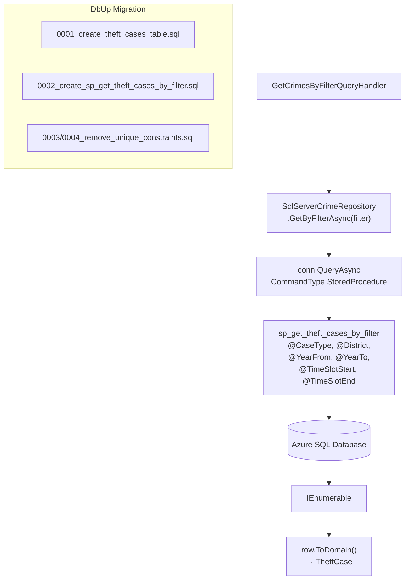

# 任務報告：Dapper + Stored Procedure 查詢層 — 2026-06-02

1. **主要解決什麼問題？**
   原本用 EF Core 做資料存取，查詢效能難以細調，且 Integration Test 環境不穩定；改用 Dapper 直接執行 SQL，並將複雜的多條件篩選查詢封裝為 Stored Procedure，讓查詢邏輯集中在 DB 端、效能可控。

2. **如何證明是否執行正確？**
   - `CrimeRepositoryTests` Integration Tests 驗證各種篩選條件組合在真實 DB 上回傳正確結果
   - `dotnet test` 包含 Integration Tests 全數通過
   - `GET /api/crime?caseType=1&districtName=大安區` 回傳符合條件的案件

3. **怎樣才是好的作法？**
   Dapper 讓 SQL 保持透明可控，避免 EF Core 生成難以預期的 SQL；Stored Procedure 封裝 `IF @Param IS NOT NULL` 的動態查詢，比在 C# 動態拼接 SQL 更安全；`CommandType.StoredProcedure` 告訴 Dapper 這是 SP 呼叫而非查詢字串，防止 SQL Injection。

4. **最重要的知識或概念（最多三個）**
   - **Dapper vs EF Core**：Dapper 像手動排檔，你控制每一行 SQL；EF Core 像自動排檔，方便但有時換擋時機不對。在需要效能調優的查詢上，手動排檔更可靠。
   - **Stored Procedure 動態篩選**：用 `IF @District IS NOT NULL ... ELSE ...` 讓一個 SP 處理多種篩選組合，比建立很多個 SP 更好維護。
   - **DbUp SQL 版本管理**：SQL 腳本有版本號（`0001_create_table.sql`、`0002_create_sp.sql`），每次只跑新腳本，確保資料庫和程式碼版本同步。

5. **核心的變數是什麼？**

   | 變數 | 說明 |
   |------|------|
   | `CommandType.StoredProcedure` | 告訴 Dapper 用 EXEC 方式呼叫 SP |
   | `sp_get_theft_cases_by_filter` | 處理多條件篩選的 Stored Procedure 名稱 |
   | `DateOnlyTypeHandler` | Dapper 自訂型別映射，解決 `DateOnly` ↔ `DATE` 的對應 |

6. **新手可能常犯的誤區？**
   - 用字串拼接 SQL（`"WHERE district = '" + district + "'"），容易被 SQL Injection 攻擊。
   - 忘記在 `Program.cs` 設定 `DefaultTypeMap.MatchNamesWithUnderscores = true`，snake_case 欄位（`case_number`）無法自動對應 PascalCase 屬性（`CaseNumber`）。
   - SP 腳本直接 `CREATE PROCEDURE`，重複執行會報「已存在」錯誤；應用 `CREATE OR ALTER PROCEDURE`。

7. **流程圖與結構圖**

8. **分支與部署記錄**
   - 開發分支：feature/dapper-stored-procedure
   - PR 編號：#9（主要 Dapper + SP 實作）、#10（排除 Integration Tests 於 Dockerfile build stage）
   - Merge 到：uat
   - Merge 時間：2026-06-02 14:33（#9）、2026-06-02 16:31（#10）
   - CI 結果：✅ 成功
   - UAT 部署：✅ 成功
