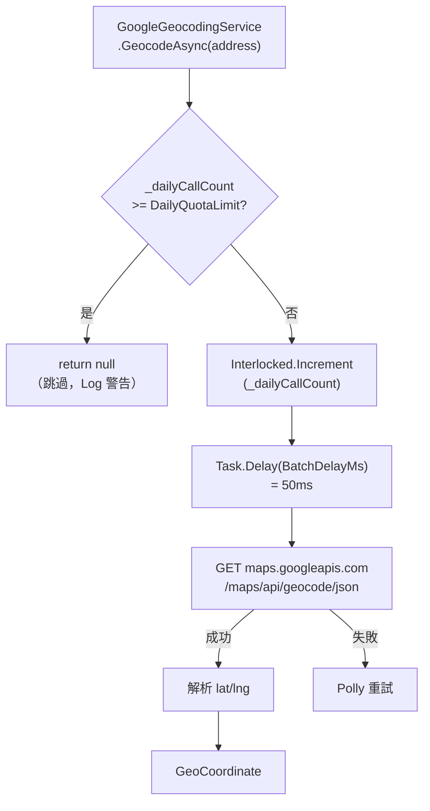

# 任務報告：成本控制（Google Maps 配額限制） — 2026-06-03

1. **主要解決什麼問題？**
   Google Maps Geocoding API 每日免費額度有限（$200/月折抵後約 40,000 次/日），全量資料 11,514 筆若不限制，一次匯入就可能超過配額並產生費用；加入每日配額上限（`DailyQuotaLimit = 100`）和批次延遲（`BatchDelayMs = 50`），避免費用意外暴增。

2. **如何證明是否執行正確？**
   - `GoogleGeocodingServiceTests` 驗證達到 DailyQuotaLimit 後跳過 API 呼叫
   - Infrastructure Tests 全數通過
   - Log 輸出顯示「今日配額已用盡，跳過 geocoding」訊息

3. **怎樣才是好的作法？**
   配額上限設在 `appsettings.json`，不寫死在程式碼裡，方便調整；計數器用 `Interlocked.Increment` 確保多執行緒安全；每次呼叫間加 `BatchDelayMs` 延遲，避免觸發 Google Maps 的 rate limit（QPM 限制）。

4. **最重要的知識或概念（最多三個）**
   - **每日配額（DailyQuotaLimit）**：就像每天的零用錢，花完就不再花，避免月底帳單嚇到。每日上限 100 次 = 100 個地址獲得座標，其餘保留下次再填。
   - **BatchDelayMs**：每次 API 呼叫中間等一下（50ms），就像一個一個敲門而不是同時敲 100 扇門，避免被管理員（Google）封鎖。
   - **Options Pattern**：`GoogleMapsOptions` 用 `IOptions<T>` 注入設定，讓設定有強型別、可驗證，比 `IConfiguration["GoogleMaps:ApiKey"]` 更安全。

5. **核心的變數是什麼？**

   | 變數 | 說明 |
   |------|------|
   | `GoogleMapsOptions.DailyQuotaLimit` | 每日最大 API 呼叫次數（預設 100） |
   | `GoogleMapsOptions.BatchDelayMs` | 每次呼叫間隔毫秒（預設 50ms） |
   | `_dailyCallCount` | Interlocked 計數器，追蹤今日已呼叫次數 |

6. **新手可能常犯的誤區？**
   - 配額計數器用 `int` 而非 `Interlocked.Increment`，多執行緒並發時計數不準確。
   - `DailyQuotaLimit` 設得太大（如 10,000），一次 CI 匯入跑完超過免費額度。
   - 沒有在達到配額時 log 警告，下次查詢沒座標不知道原因。

7. **流程圖與結構圖**

8. **分支與部署記錄**
   - 開發分支：feature/cost-control
   - PR 編號：#12
   - Merge 到：uat
   - Merge 時間：2026-06-03 15:22
   - CI 結果：✅ 成功
   - UAT 部署：✅ 成功
