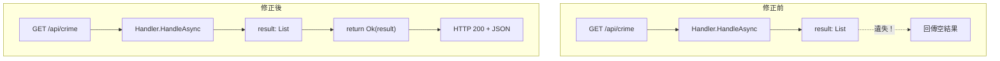

# 任務報告：修正 GetCrimes 端點回傳空結果 — 2026-06-03

1. **主要解決什麼問題？**
   `GET /api/crime` 回傳空陣列 `[]`，雖然資料庫確實有資料；原因是 Controller 沒有把 Handler 的查詢結果回傳給呼叫端（`return Ok(result)` 漏寫或回傳了錯誤變數）。

2. **如何證明是否執行正確？**
   - Integration Test `GetCrimes_WithValidFilter_ShouldReturnResults` 驗證匯入資料後查詢回傳非空結果
   - `GET /api/crime` 直接呼叫回傳正確的 JSON 陣列，筆數與 DB 一致

3. **怎樣才是好的作法？**
   Integration Tests 覆蓋 happy path（有資料 → 回傳資料）和 edge case（空 DB → 回傳空陣列），避免這類回傳邏輯錯誤被漏掉；Controller 的 return 值應明確（`return Ok(result)` 而非只 `await handler.HandleAsync(query)` 不回傳）。

4. **最重要的知識或概念（最多三個）**
   - **Integration Test 的價值**：Unit Test 只測 Handler 邏輯，不測 Controller 到 Handler 的串接；Integration Test 從 HTTP 請求到 DB 全走一遍，才能抓到這類「各自正確但串接出錯」的 bug。
   - **Controller return 常見錯誤**：`await handler.HandleAsync(query);` 和 `return Ok(await handler.HandleAsync(query));` 差一個 `return Ok()`，前者結果直接被丟棄。
   - **Null vs Empty**：`return null` 讓 ASP.NET Core 回傳 HTTP 204 No Content，`return Ok([])` 回傳 HTTP 200 with 空陣列，語意不同，前端需要不同處理。

5. **核心的變數是什麼？**

   | 問題 | 原因 |
   |------|------|
   | `GET /api/crime` 回傳 `[]` | Controller Action 忘記 `return Ok(result)` |
   | Integration Test 驗證 | `response.Content.ReadAsStringAsync()` 後 deserialize 驗證筆數 |

6. **新手可能常犯的誤區？**
   - `await handler.HandleAsync(...)` 忘記把結果存到變數就直接 `return Ok()`，回傳 null。
   - 只用 Unit Test 測 Handler，沒有 Integration Test 驗證 Controller 串接，讓這類 bug 悄悄進 production。
   - Controller 回傳 `return Ok(handler)` 而非 `return Ok(result)`，回傳了 Handler 物件而非查詢結果。

7. **流程圖與結構圖**

8. **分支與部署記錄**
   - 開發分支：feature/fix-get-crimes-response
   - PR 編號：#16
   - Merge 到：uat
   - Merge 時間：2026-06-03 17:41
   - CI 結果：✅ 成功
   - UAT 部署：✅ 成功
