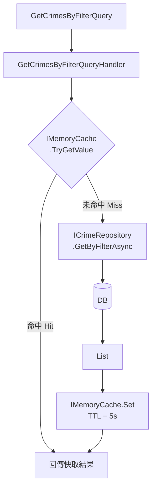

# 任務報告：IMemoryCache 查詢快取 — 2026-06-03

1. **主要解決什麼問題？**
   `GET /api/crime` 每次都呼叫 Stored Procedure，相同條件的重複查詢會重複打 DB；加入 IMemoryCache，相同篩選條件的查詢結果快取 5 秒，降低 DB 壓力。

2. **如何證明是否執行正確？**
   - `HandleAsync_SecondCallWithSameQuery_ShouldReturnCachedResult` 測試驗證第二次相同查詢不呼叫 Repository
   - `HandleAsync_DifferentQueries_ShouldCallRepositoryTwice` 驗證不同條件各自查 DB
   - Application Tests 全數通過

3. **怎樣才是好的作法？**
   Cache Key 包含所有篩選條件（`crimes:filter:{CaseType}:{District}:...`），確保不同條件不共用快取；TTL 設 5 秒（後升級為 30 分鐘）平衡新鮮度與效能；快取邏輯封裝在 Handler，Controller 完全不知道有快取存在。

4. **最重要的知識或概念（最多三個）**
   - **IMemoryCache**：程式記憶體內的暫存區，就像計算機的 M+ 按鍵，算過的結果先存起來，下次直接取用，不需要重算。
   - **Cache Key 設計**：快取的門牌號碼，要包含所有影響結果的參數，少了一個就可能用錯快取（如 A 地區的結果被當成 B 地區回傳）。
   - **TTL（Time To Live）**：快取的保存期限，就像便當的賞味期限，太短 = 每次都重煮（沒省到），太長 = 吃到壞掉的（資料過期）。

5. **核心的變因是什麼？（影響結果的關鍵因素）**

   | 變因 | 影響 |
   |------|------|
   | Cache Key 包含的篩選條件 | 決定不同查詢是否誤用同一份快取（回傳錯誤資料） |
   | TTL 長短 | 決定資料新鮮度與 DB 壓力之間的平衡 |
   | 快取的物件型別（DTO vs Entity） | 決定快取是否與 Domain 層產生不必要的耦合 |

6. **新手可能常犯的誤區？**
   - Cache Key 用 `crimes:all` 而非包含篩選條件，導致所有查詢共用同一快取（回傳錯誤資料）。
   - 忘記在 DI 容器呼叫 `services.AddMemoryCache()`，注入 `IMemoryCache` 時拋出 InvalidOperationException。
   - 快取 Domain Entity（`TheftCase`）而非 DTO（`TheftCaseDto`），導致 Controller 層和 Cache 層耦合 Domain 物件。

7. **流程圖與結構圖**

8. **分支與部署記錄**
   - 開發分支：feature/memory-cache
   - PR 編號：#11
   - Merge 到：uat
   - Merge 時間：2026-06-03 12:41
   - CI 結果：✅ 成功
   - UAT 部署：✅ 成功
