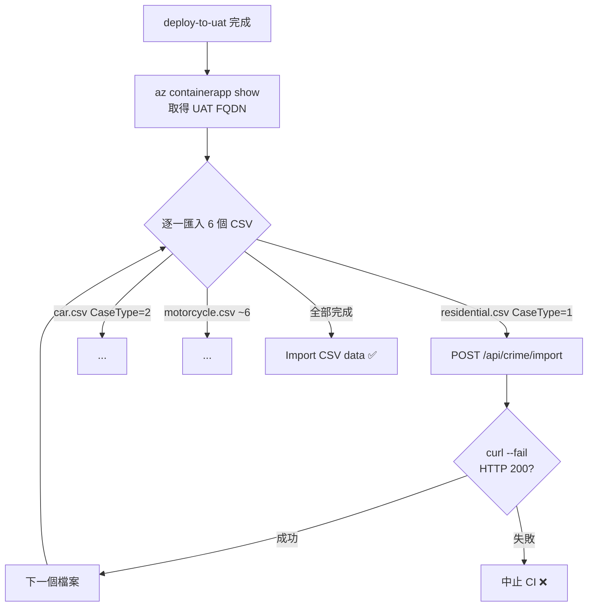

# 任務報告：自動匯入 CSV 資料 — 2026-06-04

1. **主要解決什麼問題？**
   每次部署 UAT 後，6 個 CSV 資料檔需要人工呼叫 API 匯入；改為 CI pipeline 在 deploy 完成後自動逐一匯入，確保資料與程式碼版本同步。

2. **如何證明是否執行正確？**
   CI `Import CSV data` 步驟對 6 個檔案各印出 `curl` 回應，確認 HTTP 200 且 `SuccessCount > 0`；`Send email report` 寄出的郵件 body 包含本報告內容。

3. **怎樣才是好的作法？**
   用 `az containerapp show` 動態取得 UAT URL 而非寫死，避免 URL 變動時需改 YAML；CSV 以 `--chown` 複製進容器，確保 appuser 可讀；`curl --fail` 讓任一匯入失敗就中止 CI，不靜默忽略。

4. **最重要的知識或概念（最多三個）**
   - **Docker multi-stage COPY**：最終 image 只從 runtime stage 複製，build stage 的中間產物不會留在裡面，就像做菜用完鍋碗不會全裝進便當盒。
   - **`.gitignore` 例外規則**：`data/raw/*` 先全部忽略，再用 `!data/raw/*.csv` 把 CSV 撿回來，順序不能反。
   - **`az containerapp show --query`**：用 JMESPath 直接撈 FQDN，不需要解析整份 JSON，就像只問地址不用看整張戶籍謄本。

5. **核心的變因是什麼？（影響結果的關鍵因素）**
   - **UAT URL 取得方式**（az containerapp show 動態取得 vs 寫死）：決定 URL 變動時是否需要人工修改 CI
   - **`curl --fail` 選項**：決定 API 匯入失敗時 CI 是否靜默繼續而非中止
   - **`.gitignore` 例外規則順序**：決定 CSV 是否被正確 track 進 git，供 Docker COPY 使用

6. **新手可能常犯的誤區？**
   - `.gitignore` 例外規則 `!data/raw/*.csv` 必須在 `data/raw/*` **之後**，寫在前面無效。
   - Dockerfile COPY CSV 放在 `USER appuser` 之後需加 `--chown`，否則 appuser 可能沒有讀取權限（Alpine 預設 umask）。
   - `az containerapp show` 需要 Azure login 步驟先完成，若順序錯誤會報未認證錯誤。

7. **流程圖與結構圖**

8. **分支與部署記錄**
   - 開發分支：feature/data-import-pipeline
   - PR 編號：#15
   - Merge 到：uat
   - Merge 時間：2026-06-03 17:25
   - CI 結果：✅ 成功
   - UAT 部署：✅ 成功
