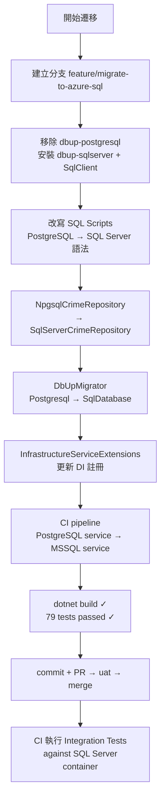
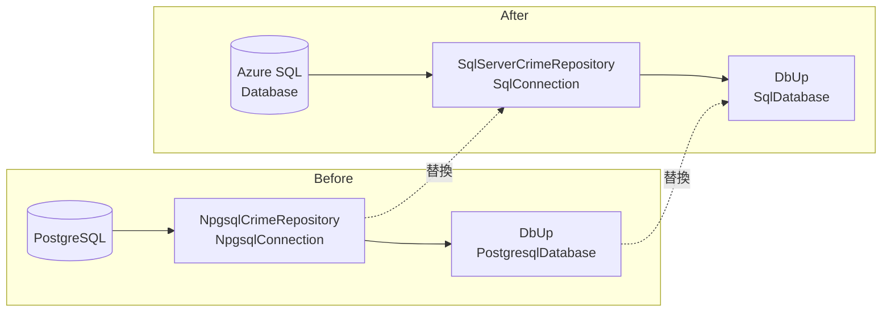

### 任務報告：從 PostgreSQL 遷移到 Azure SQL Database — 2026-06-06

1. **主要解決什麼問題？**
   將資料庫從 PostgreSQL 換成 Azure SQL Database（SQL Server），以使用 Azure 免費層，降低雲端成本。

2. **如何證明是否執行正確？**
   - `dotnet build` 零錯誤
   - 79 個 Unit/Infrastructure Tests 全數通過
   - CI pipeline 會在 PR merge 後以 SQL Server Docker 容器執行 Integration Tests

3. **怎樣才是好的作法？**
   - SQL Scripts 使用 `IF NOT EXISTS`、`CREATE OR ALTER` 確保冪等性，可安全重複執行
   - 使用 Dapper `CommandType.StoredProcedure` 呼叫 SP，比組字串更安全
   - CI 使用本機 SQL Server 容器而非依賴 Azure SQL 帳密，讓測試環境獨立可重現

4. **最重要的知識或概念（小學生版）**
   - **Stored Procedure 叫法不同**：PostgreSQL 用函式呼叫法 `SELECT * FROM sp_xxx()`，SQL Server 用 `EXEC sp_xxx` 或 Dapper 的 `CommandType.StoredProcedure`，就像用筷子還是叉子吃飯，工具不同做法不同。
   - **動態 SQL 參數化**：PostgreSQL 用 `$1, $2`，SQL Server 用具名參數 `@Param` + `sp_executesql`，這樣才能防止 SQL Injection（有人偷塞壞指令的攻擊）。
   - **套件版本要對齊**：`dbup-sqlserver 7.1.0` 要求 `Microsoft.Data.SqlClient 6.1.4`，版本不對 NuGet restore 就會失敗，就像零件規格要符合才鎖得進去。

5. **核心的變數是什麼？**
   - `_connectionString`：決定連哪個資料庫的字串，格式從 `Host=...` 換成 `Server=...,1433;Database=...;`
   - `CommandType.StoredProcedure`：告訴 Dapper 這是呼叫 SP 而非 SQL 查詢
   - `sp_executesql @sql, @params, @Param = @Param`：SQL Server 動態 SQL 的安全執行方式

6. **新手可能常犯的誤區？**
   - `CREATE PROCEDURE` 在 SQL Server 必須是 batch 第一行，不能直接接在 DROP 後面（需要 `GO` 或用 `CREATE OR ALTER`）
   - SQL Server 的 `UNIQUEIDENTIFIER` 對應 C# `Guid`，不是 `string`
   - Azure SQL 的 `DateTimeOffset` 欄位，Dapper 需要 `DateOnlyTypeHandler` 才能正確對應 `DateOnly` 屬性

7. **流程圖與結構圖**

