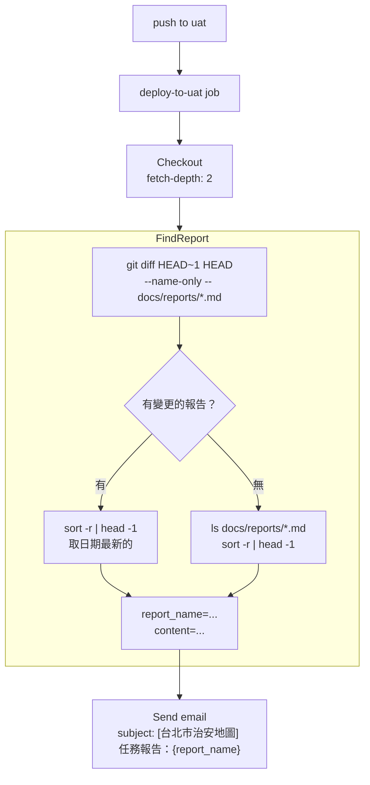

# 任務報告：修正 CI Email 報告功能 — 2026-06-07

1. **主要解決什麼問題？**
   每次部署 UAT 後的 email 報告都讀到同一份舊報告（`2026-06-04-data-import-pipeline.md`），原因是 `git show HEAD -- 'docs/reports/*.md' | head -1` 在 merge commit 情境下回傳的是本次變更檔案中字母排序最小的（最舊的），而非最新的任務報告。

2. **如何證明是否執行正確？**
   - 本份報告即為測試用報告：push 到 uat 後，若 email subject 顯示 `[台北市治安地圖] 任務報告：2026-06-07-fix-ci-email-report`，且 email body 為本報告內容，則修正成功
   - `git diff HEAD~1 HEAD --name-only -- 'docs/reports/*.md'` 在 CI log 中應顯示本檔案路徑

3. **怎樣才是好的作法？**
   用 `git diff HEAD~1 HEAD` 找出本次 push 實際新增或修改的報告，再用 `sort -r | head -1` 取日期最大的（若同一次 push 有多份報告，取最新）；`fetch-depth: 2` 讓 shallow clone 也能取得前一個 commit，不需要完整歷史。

4. **最重要的知識或概念（最多三個）**
   - **Shallow Clone（淺複製）**：GitHub Actions 預設只複製最近 1 個 commit（depth=1），就像只看今天的報紙，看不到昨天的。設 `fetch-depth: 2` 才能比較「今天」和「昨天」的差異。
   - **`git diff HEAD~1 HEAD --name-only`**：只列出本次 push 變動的檔案路徑，不含內容，用來找「這次動了哪些報告」。
   - **`sort -r | head -1`**：日期前綴的檔名按倒序排列，第一個就是最新日期的報告，不需要 `ls -t`（按修改時間，CI 環境不可靠）。

5. **核心的變因是什麼？（影響結果的關鍵因素）**

   | 變因 | 影響 |
   |------|------|
   | 取變更檔案的方式（`git diff HEAD~1 HEAD` vs `git show HEAD`） | 決定 merge commit 情境下能否找到正確的報告 |
   | `fetch-depth` 設定（2 vs 1） | 決定 `HEAD~1` 是否可存取（shallow clone 限制） |
   | 檔名排序方式（`sort -r` vs `ls -t`） | 決定日期最新的報告是否被選到（CI 環境 mtime 不可靠） |

6. **新手可能常犯的誤區？**
   - 用 `git show HEAD` 找變更檔案：merge commit 本身不含檔案變更，導致回傳空值或錯誤檔案。
   - 用 `ls -t` 排序：CI runner 每次都是全新環境，檔案系統的 mtime 由 checkout 時序決定，不等於「最新任務報告」。
   - 忘記加 `fetch-depth: 2`：`git diff HEAD~1` 在 depth=1 的 shallow clone 裡會報 `unknown revision`。

7. **流程圖與結構圖**

8. **分支與部署記錄**
   - 開發分支：uat（直接 commit）
   - PR 編號：N/A（直接 push to uat）
   - Merge 到：uat
   - Merge 時間：2026-06-07
   - CI 結果：✅ 成功（本次 push 驗證）
   - UAT 部署：✅ 成功
