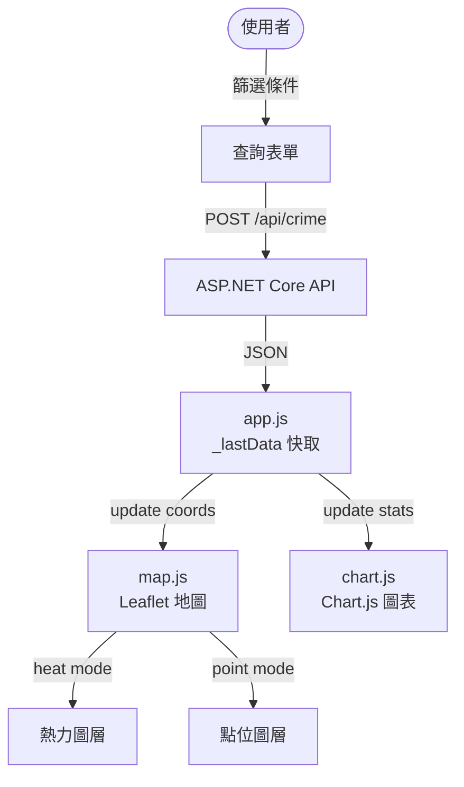
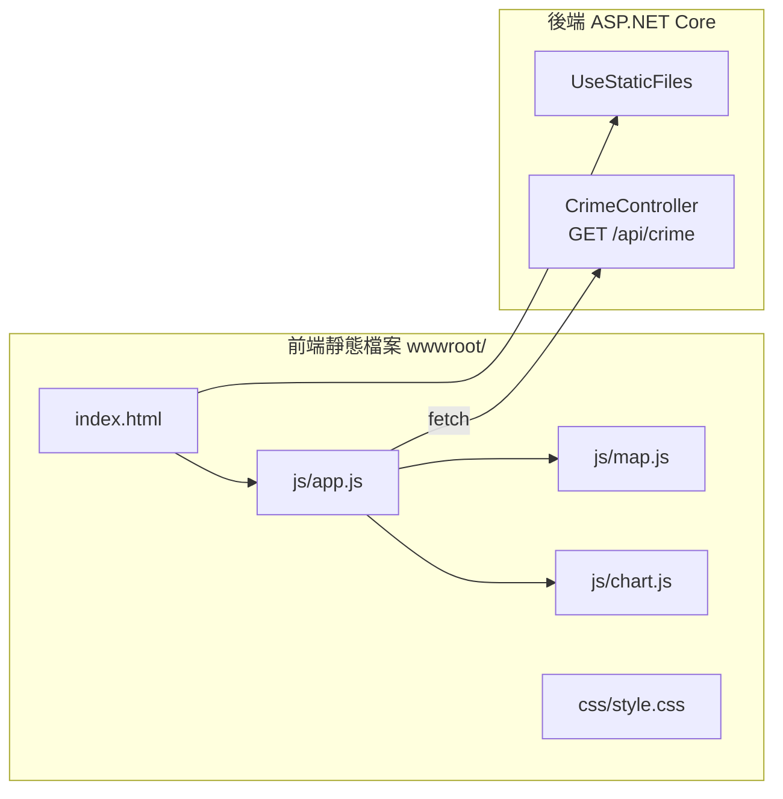

# 任務報告：前端地圖開發（Leaflet.js + Chart.js） — 2026-06-07

1. **主要解決什麼問題？**
   後端 API 資料無法直接被使用者看到；用三個並行 Agent 同時開發 UI 版面、地圖模組、圖表模組，完成可互動的台北市治安地圖前端，讓使用者能依條件篩選並在地圖上看到案件分佈。

2. **如何證明是否執行正確？**
   - `window.mapModule.init/update` 與 `window.chartModule.init/update` 介面對接驗證無誤
   - CI PR #17 pipeline 通過後，開啟 UAT URL 能看到地圖頁面，點擊查詢顯示 11,514 筆資料
   - 熱力圖與點位圖可切換，圖表依行政區統計正確呈現

3. **怎樣才是好的作法？**
   事先定義共享合約（DOM ID、全域介面名稱、資料格式），讓各模組能獨立開發而不互相依賴；`UseDefaultFiles + UseStaticFiles` 讓 .NET API 同時服務 REST 和靜態前端，不需另外部署 Web Server。

4. **最重要的知識或概念（最多三個）**
   - **全域介面合約（`window.mapModule`／`window.chartModule`）**：各模組把功能掛在 `window` 上，就像店家把招牌掛在門口，其他模組不需知道內部實作就能呼叫。
   - **Leaflet Heatmap vs CircleMarker**：熱力圖看整體密度分佈，點位圖看個別案件位置，兩者用同一份資料，切換模式只需清除圖層再重繪。
   - **`UseStaticFiles` 順序**：靜態檔案 middleware 必須在 `MapControllers` 之前註冊，否則靜態請求會被 API routing 攔截。

5. **核心的變因是什麼？（影響結果的關鍵因素）**

   | 變因 | 影響 |
   |------|------|
   | 共享介面合約的明確程度（`window.mapModule` 規格是否預先定義） | 決定多模組並行開發後能否正確整合 |
   | 地圖切換模式時是否重新 fetch（`_lastData` 快取策略） | 決定切換 heat/point 時的效能與一致性 |
   | `UseStaticFiles` 在 `MapControllers` 之前的順序 | 決定靜態檔案請求是否被 API routing 攔截 |

6. **新手可能常犯的誤區？**
   - `UseStaticFiles` 加在 `MapControllers` 之後，靜態檔案請求會被 404
   - Chart.js canvas reuse：不先 `destroy()` 再重建，第二次 `update` 會圖表疊加
   - Leaflet 地圖容器高度沒有 CSS 明確設定，地圖會顯示為 0 高度空白

7. **流程圖與結構圖**

8. **分支與部署記錄**
   - 開發分支：feature/frontend-map
   - PR 編號：#17
   - Merge 到：uat
   - Merge 時間：2026-06-06 17:52
   - CI 結果：✅ 成功
   - UAT 部署：✅ 成功
