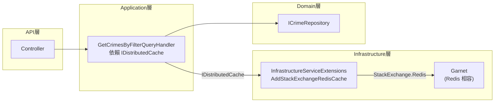
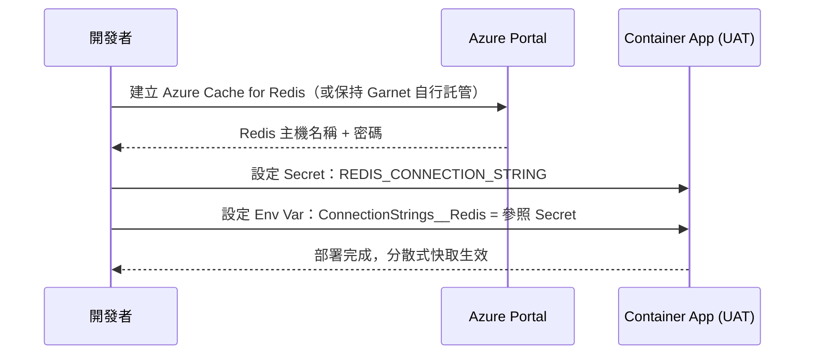

# 任務報告：Garnet 分散式快取 — 2026-06-07

## 1. 主要解決什麼問題？

原本的 `IMemoryCache` 是單機記憶體快取，當 Azure Container Apps 有多個副本（replica）時，每個副本各自有獨立的快取，導致相同查詢在不同副本上重複打 DB。

改用 **Garnet（Redis 相容）分散式快取**後，所有副本共用同一份快取，資料一致、DB 壓力降低。

---

## 2. 如何證明是否執行正確？

- `dotnet test` 11 個 Application 測試全數通過（含 6 個快取相關測試）
- CI pipeline 通過：`build-and-test`（含 Garnet service container）、`push-to-acr`、`deploy-to-uat` 全綠
- 測試 `HandleAsync_SecondCallWithSameQuery_ShouldReturnCachedResult` 驗證第二次相同查詢不打 DB
- 測試 `HandleAsync_WhenCacheHit_ShouldReturnDeserializedData` 驗證 JSON 序列化/反序列化往返正確

---

## 3. 怎樣才是好的作法？

- **Application 層只依賴介面**：`GetCrimesByFilterQueryHandler` 使用 `IDistributedCache`，不直接引用 Redis 或 Garnet
- **Infrastructure 層負責實作細節**：`AddStackExchangeRedisCache` 的連線設定集中在 `InfrastructureServiceExtensions`
- **序列化用 `System.Text.Json`**：比 Newtonsoft 更輕量，是 .NET 9 的標準選擇
- **測試用 Mock 而非真實 Redis**：單元測試快速、可離線執行，不依賴基礎設施

---

## 4. 最重要的知識或概念（以小學生能聽得懂的方式說明，最多三個）

1. **分散式快取 vs 記憶體快取**
   - 記憶體快取像每個同學各自的抽屜，找東西很快但每個人的抽屜不一樣。
   - 分散式快取像班級的公共書架，所有同學共用，東西放一次大家都能拿到。

2. **介面隔離（Dependency Inversion）**
   - 不要跟「Redis」這個廠牌綁死，只跟「我需要能存/取資料」這件事說好（`IDistributedCache`）。
   - 以後換成 Memcached 或其他產品，只需改 Infrastructure 層，Application 層完全不動。

3. **JSON 序列化/反序列化**
   - Redis 只能存位元組（0 和 1 的字串），無法直接存 C# 物件。
   - 先把物件「翻譯」成 JSON 文字再存進去，取出來再「翻譯」回物件。

---

## 5. 核心的變數是什麼？

| 變數 | 說明 |
|------|------|
| `cacheKey` | `crimes:filter:{CaseType}:{DistrictName}:{YearFrom}:{YearTo}:{RawTimeSlot}`，決定哪些查詢共用快取 |
| `CacheDuration` | `TimeSpan.FromMinutes(30)`，快取存活時間 |
| `cachedBytes` | `byte[]?`，從 Redis 取回的序列化資料；`null` 代表快取未命中 |
| `ConnectionStrings__Redis` | 連線字串，格式為 `host:port`（如 `localhost:6379`） |

---

## 6. 新手可能常犯的誤區？

1. **忘記 `GetAsync` 回傳 `null` 表示未命中**，需要明確的 `if (cachedBytes is not null)` 判斷
2. **序列化型別要一致**：`SetAsync` 存 `List<TheftCaseDto>`，`GetAsync` 必須反序列化成同樣的型別，若用 `IReadOnlyList<>` 可能出錯
3. **把 Redis 連線字串放在 Application 層**：正確做法是只放在 Infrastructure 或 appsettings，Application 層只知道 `IDistributedCache`
4. **CI 忘記加 Garnet service**：Integration Tests 啟動 Web App 時 `AddStackExchangeRedisCache` 會連線失敗

---

## 7. 流程圖與結構圖

### 快取查詢流程

```mermaid
flowchart TD
    A[GET /api/crime] --> B[GetCrimesByFilterQueryHandler]
    B --> C{IDistributedCache\n.GetAsync 快取命中？}
    C -- 命中 byte[] --> D[JSON 反序列化]
    D --> E[回傳 List<TheftCaseDto>]
    C -- null 未命中 --> F[ICrimeRepository\n.GetByFilterAsync]
    F --> G[SQL Server\nStored Procedure]
    G --> H[List<TheftCase>]
    H --> I[MapToDto]
    I --> J[JSON 序列化 → byte[]]
    J --> K[IDistributedCache\n.SetAsync TTL=30min]
    K --> E
```

### 元件依賴結構



### Azure Container Apps 手動設定步驟


