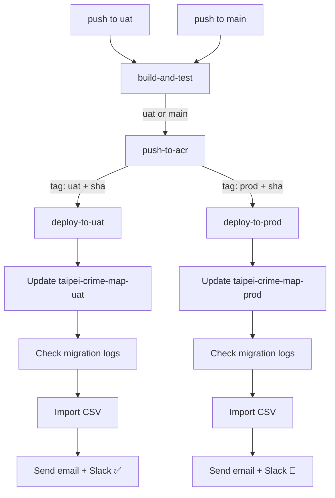
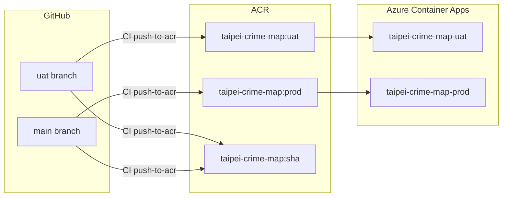

### 任務報告：Prod 環境部署 CI/CD — 2026-06-07

1. **主要解決什麼問題？**
   建立 Prod 環境的 CI/CD pipeline：push 到 main 分支後自動 build image（標記 `prod`）、部署到 `taipei-crime-map-prod` Container App、匯入資料並寄送報告與 Slack 通知。

2. **如何證明是否執行正確？**
   從 uat 開 PR merge 進 main，CI pipeline 觸發後四個 job 全部綠燈（build-and-test → push-to-acr → deploy-to-prod），Slack 收到 `:rocket: Prod 部署成功` 通知，email 收到任務報告。

3. **怎樣才是好的作法？**
   - `push-to-acr` 用 GitHub Actions 表達式 `github.ref == 'refs/heads/main' && 'prod' || 'uat'` 動態決定 image tag，避免重複 job。
   - `deploy-to-uat` 加上明確的 `if: github.ref == 'refs/heads/uat'`，防止 `push-to-acr` 擴大觸發範圍後誤觸。
   - `deploy-to-prod` 與 `deploy-to-uat` 結構對稱，差異只在 Container App 名稱與 Slack emoji。

4. **最重要的知識或概念（最多三個）**
   - **job 的 `if` 條件彼此獨立**：`needs` 只決定執行順序，不會繼承上游 job 的 `if` 條件，所以每個 job 都要自己寫 `if`。
   - **GitLab Flow 雙環境**：uat 是「驗證區」，main 是「正式區」，feature → uat → main，每層都有 CI 守門。
   - **Azure 資源需手動建立**：CI pipeline 只能部署，Container App 本身必須先在 Portal 建好，Container App 不存在時 deploy-action 會失敗。

5. **核心的變因是什麼？**
   `github.ref` 的值決定整條 pipeline 走 UAT 路徑還是 Prod 路徑。

6. **新手可能常犯的誤區？**
   - 以為 `needs: push-to-acr` 就繼承了 `push-to-acr` 的 `if` 條件，導致 `deploy-to-uat` 在 main 也跑起來。
   - 忘記在 Azure Portal 建立 `taipei-crime-map-prod` Container App，CI deploy step 會報 404。
   - image tag 固定寫死成 `:uat`，導致 Prod 部署的是 UAT 的 tag（功能上一樣，但語意混淆、回溯追蹤困難）。

7. **流程圖與結構圖**

8. **分支與部署記錄**
   - 開發分支：uat（直接在 uat 修改 CI，不建 feature 分支）
   - PR 編號：待建立（uat → main）
   - Merge 到：main
   - Merge 時間：待執行
   - CI 結果：待驗證
   - Prod 部署：待驗證（需先在 Azure Portal 建立 taipei-crime-map-prod）

---

## 需要在 Azure Portal 手動建立的資源

### 1. Garnet Container App（taipei-crime-map-prod-garnet）

在資源群組 `taipei-crime-map-rg` 建立新的 Container App：

| 設定 | 值 |
|------|----|
| 名稱 | taipei-crime-map-prod-garnet |
| Image | ghcr.io/microsoft/garnet:latest |
| CPU / Memory | 0.25 vCPU / 0.5 Gi（最低規格）|
| Ingress | 僅限內部，TCP Port 6379 |
| Environment | 與 taipei-crime-map-prod 同一個 Container Apps Environment |

### 2. Azure SQL Database（Prod）

在既有的邏輯伺服器上建立新資料庫，或建立新的邏輯伺服器：

| 設定 | 值 |
|------|----|
| 資料庫名稱 | taipei_crime_map_prod |
| 計費模式 | Serverless（自動暫停，低頻使用成本低）|
| vCore 最小值 | 0.5（可調低以節省成本）|
| 自動暫停延遲 | 60 分鐘 |

> 注意：Azure SQL Database 免費層每訂閱僅限一個 database。若 UAT 已使用免費層，Prod 請改用 Serverless 計費（超低流量下費用極低）。

### 3. Prod Container App（taipei-crime-map-prod）

| 設定 | 值 |
|------|----|
| 名稱 | taipei-crime-map-prod |
| Image | taipeicrimemap.azurecr.io/taipei-crime-map:prod |
| CPU / Memory | 0.5 vCPU / 1 Gi（或與 UAT 相同）|
| Ingress | 外部，HTTPS Port 443 → 8080 |
| Min replicas | 0（節省成本，可依需求調整）|

**環境變數：**

| 名稱 | 值 |
|------|----|
| ASPNETCORE_ENVIRONMENT | Production |
| ASPNETCORE_URLS | http://+:8080 |
| ConnectionStrings__DefaultConnection | （Prod SQL 連線字串，存為 Secret）|
| ConnectionStrings__Redis | （Prod Garnet 內部 FQDN:6379）|

> Garnet 的內部 FQDN 格式：`taipei-crime-map-prod-garnet.internal.<env-name>.<region>.azurecontainerapps.io:6379`

---

## GitHub Secrets 確認

Prod 部署使用與 UAT **完全相同** 的 Secrets，不需新增：

| Secret | 用途 |
|--------|------|
| ACR_LOGIN_SERVER | Azure Container Registry 登入位址 |
| ACR_USERNAME | ACR 使用者名稱 |
| ACR_PASSWORD | ACR 密碼 |
| AZURE_CREDENTIALS | Azure Service Principal（需有 Prod Container App 的部署權限）|
| GMAIL_USERNAME | 寄送 email 報告 |
| GMAIL_APP_PASSWORD | Gmail App 密碼 |
| SLACK_WEBHOOK_URL | Slack 通知 |
