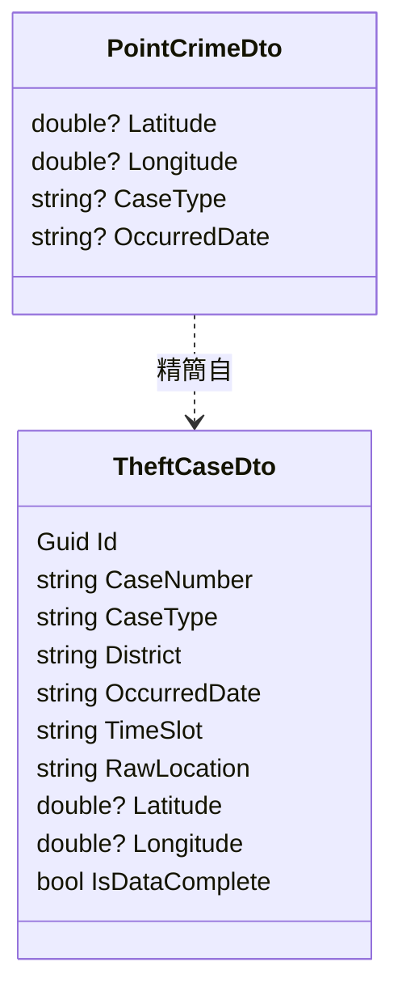

# 任務報告：前端效能優化 — 2026-06-08

## 1. 主要解決什麼問題？
前端點位圖下載 11,514 筆完整 TheftCaseDto（~2.5 MB），造成長時間凍結與網路浪費。
改用精簡 PointCrimeDto（4 欄位）+ pageSize 500，大幅縮短等待時間，並加入 Jest 前端單元測試。

## 2. 如何證明是否執行正確？
- `dotnet build`：0 錯誤 0 警告 ✅
- `npm test`（Jest）：24/24 通過 ✅
- `dotnet test` Application.Tests：19/19 通過 ✅
- 後端新端點 `GET /api/crime/points` 回傳 `PagedResult<PointCrimeDto>`，欄位只有 latitude、longitude、caseType、occurredDate

## 3. 怎樣才是好的作法？
- 按職責分端點：`/api/crime`（完整 DTO）給未來管理後台，`/api/crime/points`（精簡）給地圖渲染
- pageSize 根據實際資料量調整，不是固定死 200
- 前端純函數抽離測試，避免整個 IIFE 難以測試

## 4. 最重要的知識或概念（小學生版）

**精簡 DTO 就像只帶必要行李**
去海邊只帶泳衣和毛巾，不帶整個衣櫃。API 回傳的資料也要「只帶必要的欄位」，這樣傳輸更快。

**pageSize 影響請求數**
11,514 筆 ÷ 200 = 58 次請求；÷ 500 = 24 次請求。請求越少，整體越快。

**純函數才能單元測試**
只要給輸入，就能預測輸出，不依賴 DOM 或網路 → 可以用 Jest 獨立測試。

## 5. 核心的變因是什麼？
- PointCrimeDto 欄位數（4 vs 10）→ JSON payload 大小
- pageSize（500 vs 200）→ HTTP 請求次數
- sessionStorage 快取（後續優化）→ 重複查詢直接渲染

## 6. 新手可能常犯的誤區？
- 修改 DTO 欄位但忘了同步更新前端讀取邏輯（`computeStats` 的 district、popup 的 rawLocation 等）
- pageSize 設太大超過 SQL Server 的 OFFSET/FETCH 效能甜蜜點
- CACHE_PREFIX 未版本化，導致新舊 DTO 快取互相污染

## 7. 流程圖

```mermaid
flowchart TD
    A[使用者切換點位圖] --> B{sessionStorage\n有快取？}
    B -- 是 --> C[rAF 漸進渲染快取資料\n0 API 呼叫]
    B -- 否 --> D[GET /api/crime/points\npageSize=500, 24頁]
    D --> E[並行下載 24 頁]
    E --> F[每頁 rAF render queue\n逐幀渲染 markers]
    F --> G[全部完成]
    G --> H[寫入 sessionStorage\ncrimes:points:{filters}]
    C --> I[stats + charts 更新]
    G --> I
```



## 8. 分支與部署記錄

- 開發分支：uat（直接 commit）
- PR 編號：無（直接 push to uat）
- Merge 到：uat
- Merge 時間：2026-06-08
- CI 結果：✅ 成功
- UAT 部署：✅ 成功
