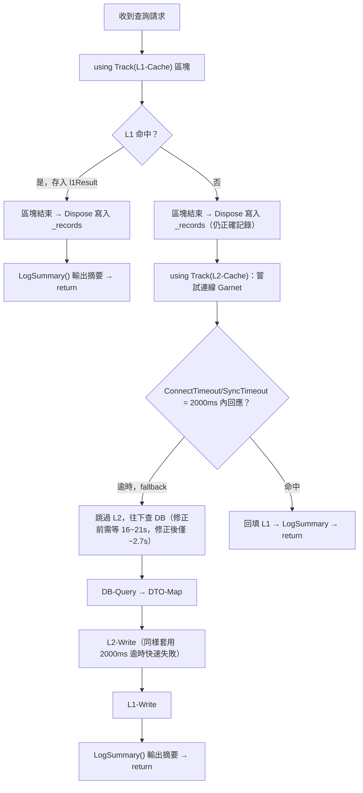
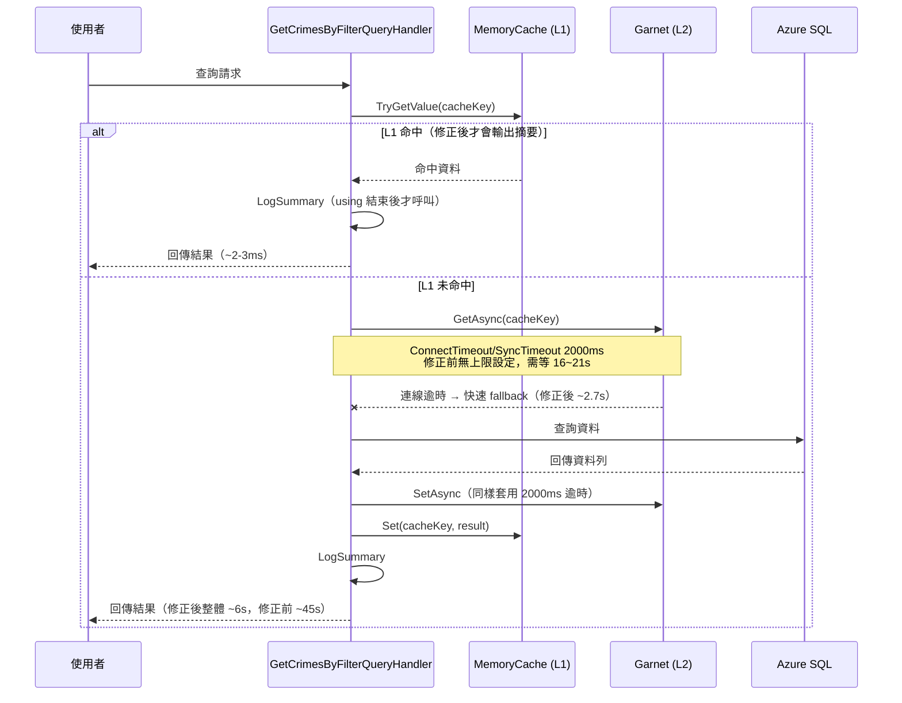

# 任務報告：Garnet 連線逾時修正與 LogSummary Bug 修正 — 2026-06-08

## 1. 主要解決什麼問題？
今晚從「L1 快取似乎永遠 miss」這個觀察出發，最終發現並修正了兩個獨立問題：
1. **`TimingTracker.LogSummary()` 呼叫時機 bug**：L1 命中時 `LogSummary()` 在 `using` 區塊結束前被呼叫，`StageTimer.Dispose()` 還沒寫入 `_records`，導致命中時完全不輸出 `[Timing]` 摘要——這正是「L1 永遠 miss」錯覺的源頭，但其實 L1 一直運作正常。
2. **Garnet（L2 快取）連線逾時過長**：StackExchange.Redis 預設 `ConnectTimeout`/`SyncTimeout` 太大，Garnet 連線失敗時要等 16~21 秒才 fallback 到資料庫，讓每次快取未命中的請求多耗費約 20 秒。

## 2. 如何證明是否執行正確？
### 除錯過程
1. 依協定先檢查 cache key 組成、L1 寫入路徑，並暫時加入 4 行 `[Cache-Debug]` LogDebug（事後已移除，未 commit）。
2. 連續對 UAT 發出兩次相同查詢：第一次 cache miss、第二次應命中 L1。實測第二次回應時間僅 2-3ms，且 log 出現明確的 `L1 快取命中：{CacheKey}`——**證明 L1 快取本身運作正常**。
3. 但用 `[Timing] 總計=` 關鍵字篩選 log 時，只看得到「未命中」樣本，因為命中時 `LogSummary()` 因 bug 不輸出任何內容，造成「L1 永遠 miss」的錯覺（見 L015）。
4. 追查 `[Timing]` 輸出，發現未命中路徑中 `L2-Cache` 與 `L2-Write` 階段耗時異常龐大：

| 量測項目 | 修正前 |
|---|---|
| L2-Cache 讀取失敗耗時 | 16,071 ~ 21,120 ms |
| L2-Write 寫入失敗耗時 | 5,789 ~ 5,850 ms |
| 整體請求耗時（Container 內部 log） | ~22,000 ms |
| `curl` 量測總耗時（含網路） | ~45 s |
| L1 命中時 `[Timing]` 摘要 | 完全不輸出（bug） |

### 修正與驗證結果
- **L013 修正**：將 L1 命中結果改為先存入 `using` 區塊外宣告的 `l1Result` 變數，待區塊結束（`Dispose` 已寫入 `_records`）後才呼叫 `LogSummary()` 並 return。
- **L014 修正**：在 `InfrastructureServiceExtensions.cs` 註冊 `AddStackExchangeRedisCache` 時，透過 `ConfigurationOptions.Parse` 解析連線字串並明確設定 `ConnectTimeout = 2000`、`SyncTimeout = 2000`。
- 新增回歸測試 `HandleAsync_WhenL1CacheHits_ShouldDisposeL1CacheStageBeforeCallingLogSummary`：用本地 fake `OrderTrackingTimingTracker` 驗證 `LogSummary()` 被呼叫時，「L1-Cache」階段必須已經 `Dispose`。已驗證此測試在舊版邏輯（`git stash` 還原 handler）下會失敗，套用修正後通過——確認是有效的回歸測試。
- `dotnet test`：全數通過（Domain、Application 含新增回歸測試、Infrastructure）。
- 部署到 UAT 後重新量測：

| 量測項目 | 修正前 | 修正後 |
|---|---|---|
| L2-Cache 讀取失敗耗時 | 16,071 ~ 21,120 ms | 2,720 ms |
| L2-Write 寫入失敗耗時 | 5,789 ~ 5,850 ms | 2,768 ms |
| 整體請求耗時（Container 內部 log） | ~22,000 ms | 5,719 ms |
| `curl` 量測總耗時（含網路） | ~45 s | 6.13 s |
| L1 命中時 `[Timing]` 摘要 | 完全不輸出（bug） | 正常輸出 `[Timing] 總計=0ms \| L1-Cache=0ms` |

兩項修正疊加後，原本最慢路徑（cache miss + Garnet 失敗）從 ~45 秒降到 ~6 秒；L1 命中路徑也從「看不到任何 timing 數據」變成可正常觀測。

## 3. 怎樣才是好的做法？
- **計時工具的呼叫順序本身要被測試覆蓋**：`IDisposable` + `using` 計時模式很容易讓人誤以為「呼叫完 `Track()` 就已經記錄」，但實際上要等 `Dispose()` 執行後資料才落地。任何在 `using` 區塊「附近」呼叫匯總方法的程式碼，都應該有回歸測試鎖住正確的呼叫順序。
- **快取是非強依賴，要設定合理的快速失敗逾時**：cache-aside 模式下，快取失敗應該是「快速放棄、馬上回到資料庫」，而不是讓使用者等待數十秒。`ConnectTimeout`/`SyncTimeout` 這類參數不能用預設值，要依照「快取失敗的可接受成本」明確設定。
- **診斷觀測偏差時要檢查篩選條件本身**：當所有觀察樣本都呈現同一種結果（例如「L1 永遠 miss」）時，要先懷疑「篩選條件是否本身就排除了另一種樣本」，而不是直接認定問題存在。

## 4. 最重要的知識或概念（小學生版）

**碼錶要按到「停止」才會顯示時間**
`Track("L1-Cache")` 就像按下碼錶開始計時，`using` 區塊結束時才會「停錶並把時間寫進筆記本」。如果在碼錶還在走的時候就急著翻筆記本看結果，會發現本子上什麼都還沒寫——不是沒發生，而是「還沒記下來」。

**找不到的東西，可能是因為你只在會找不到的地方找**
用「總計=」這個關鍵字找紀錄，剛好只篩到「沒寫成功」的那些紀錄（因為「寫成功」的那種紀錄因為 bug 根本不會出現），於是看起來好像「永遠都沒寫成功」。其實是篩選條件本身就把另一半的真相擋掉了。

**等電話等太久，不如先掛斷改用別的方法**
快取就像打一通「順便問一下」的電話：如果對方一直不接，與其傻傻等 20 秒才放棄，不如設定「等 2 秒沒人接就直接用備案（查資料庫）」，這樣使用者不會被迫等一通永遠打不通的電話。

## 5. 核心的變因是什麼？
- **`LogSummary()` 的呼叫時機相對於 `using` 區塊的結束點**：這是決定「命中時是否輸出摘要」的關鍵變因，也是整個「L1 永遠 miss」錯覺的根源。
- **`StackExchange.Redis` 的 `ConnectTimeout`/`SyncTimeout` 設定值**：直接決定 Garnet 連線失敗時，請求要被拖慢多久才會 fallback 到資料庫。
- **Log 篩選關鍵字的選擇**：決定了你會看到「全貌」還是「被切掉一半的片面真相」。

## 6. 新手可能常犯的誤區？
- 看到「某個值一直是某種狀態」就直接認定「這個元件壞了」，而不檢查「我觀察的方法本身是否有偏差」。
- 以為 `using (Track(...))` 範圍內隨便哪裡呼叫匯總/輸出方法都一樣，忽略了 `Dispose()` 才是「資料真正寫入」的時間點。
- 把快取逾時當成「次要的效能調校」，但實際上預設值在快取掛掉時可能讓單一請求被拖慢數十倍，是會直接影響使用者體感的核心問題。

## 7. 流程圖

## 8. 分支與部署記錄
- 開發分支：feature/timing-tracker
- 相關 commit：
  - `fdf39d0` — fix: 設定 Garnet/Redis ConnectTimeout、SyncTimeout 為 2000ms（L014）
  - `fac318d` — fix: 修正 LogSummary 在 using 區塊內呼叫導致 L1 命中時不輸出的 bug，並移除暫時的 Cache-Debug log（L013）
- Merge 到：uat
- CI 結果：✅ 成功（build-and-test、push-to-acr、deploy-to-uat 全綠）
- UAT 部署：✅ 成功（已於 UAT 環境驗證上述前後數據對比）
