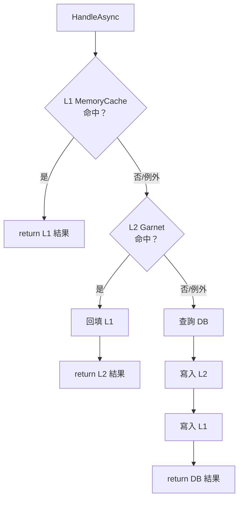
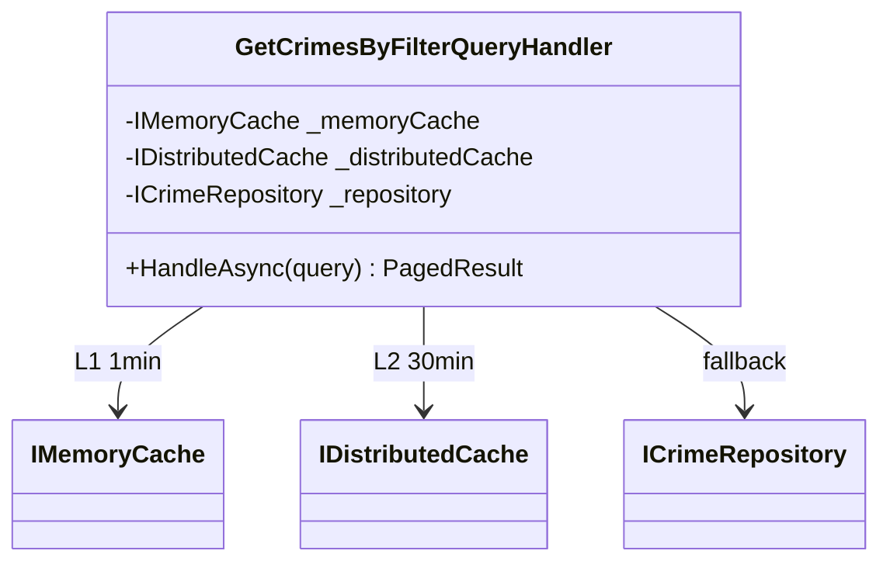

# 任務報告：MemoryCache L1 快取 — 2026-06-08

## 1. 主要解決什麼問題？
在現有 Garnet（L2）分散式快取前，加入一層進程內 MemoryCache（L1，1 分鐘），讓同一台實例的重複查詢在毫秒內回應，不需走網路到 Garnet。

## 2. 如何證明是否執行正確？
- `HandleAsync_WhenL1Hit_ShouldNotCallRepository`：預填 L1 後呼叫 handler，確認 Repository 從未被呼叫。
- `HandleAsync_WhenL1MissAndGarnetFails_SecondCallShouldHitL1AndCallRepositoryOnce`：Garnet 拋出例外，第一次走 DB 並回填 L1，第二次命中 L1，Repository 只被呼叫一次。
- `HandleAsync_WhenBothL1AndGarnetFail_ShouldFallbackToRepository`：兩層快取都拋出例外，仍能正常走 DB 回傳結果。
- 全部 15 個 Application 測試通過，54 個 Domain 測試無回歸。

## 3. 怎樣才是好的做法？
L1（本機）→ L2（分散式）→ DB 三層結構；任何一層命中都回填上層；每層都加 try/catch，確保快取失敗不影響核心業務。

## 4. 最重要的知識或概念（小學生版）

**L1/L2 快取就像書包和圖書館**
書包（L1）拿東西最快，但只放得進最近用的；圖書館（L2）放很多，但要走路去；資料庫（DB）最完整，但最慢。

**命中就回填上層**
在圖書館找到書，要順手放一本在書包，下次就不用再走路了。

**快取要能失敗不崩潰**
書包壞了或圖書館關門，你還是可以直接去資料庫找，不能因此整個服務停擺。

## 5. 核心的變因是什麼？
- L1 TTL（1 分鐘）：越長命中率越高，但資料新鮮度越低；是否回填 L1（L2 命中時）決定後續查詢能否受益。

## 6. 新手可能常犯的誤區？
- 忘記「L2 命中時也要回填 L1」：導致 L1 永遠是空的，白白浪費了 L1。
- IMemoryCache.Set 是擴充方法（from Microsoft.Extensions.Caching.Memory），直接用 IMemoryCache interface 無法呼叫，需要加套件引用。
- 測試共用同一個 MemoryCache 實例：xUnit 每個 test method 都會 new 一個 class 實例，所以在 constructor 建立 MemoryCache 即可保證獨立。

## 7. 流程圖

## 8. 分支與部署記錄

- 開發分支：feature/memory-cache-l1
- PR 編號：#24
- Merge 到：uat
- Merge 時間：2026-06-07 19:56
- CI 結果：✅ 成功
- UAT 部署：✅ 成功
