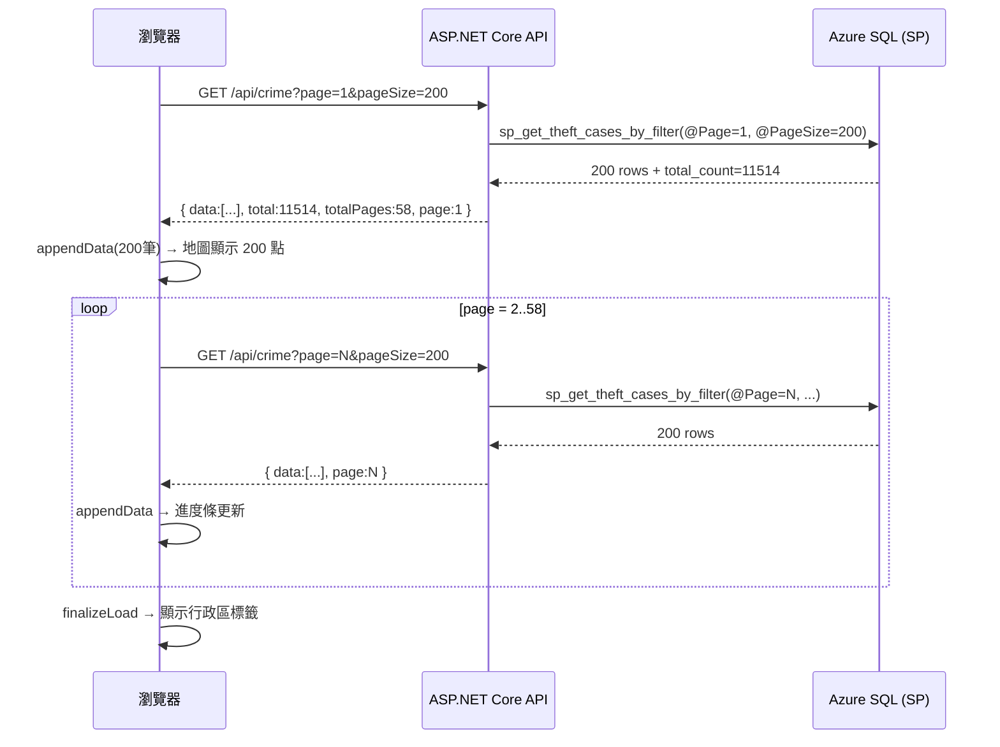
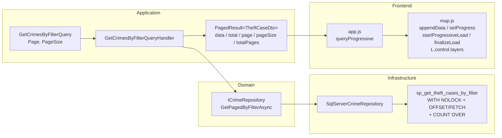

### 任務報告：漸進式地圖載入 + SP WITH (NOLOCK) — 2026-06-08

1. **主要解決什麼問題？**
   - 一次載入 11,514 筆資料造成頁面卡頓；改為每次取 200 筆分頁，回傳後立即顯示在地圖，使用者不需等全部載完。
   - SP 的 SELECT 未加 `WITH (NOLOCK)`，在高並發時容易被寫入鎖阻塞；加上後讀取不等待鎖。
   - 前端底圖固定為 Dark 色調；新增 L.control.layers 讓使用者切換四種底圖。

2. **如何證明是否執行正確？**
   - 單元測試 80/80 通過（Domain 54 + Application 11 + Infrastructure 15）。
   - `GET /api/crime?page=1&pageSize=200` 回傳 `{ data: [...], total: 11514, page: 1, pageSize: 200, totalPages: 58 }`。
   - 地圖左上角顯示「載入中 200/11514」→ 逐頁更新 → 全部完成後消失。
   - 右上角出現底圖切換控制項，四個選項皆可切換。

3. **怎樣才是好的作法？**
   - 後端用 `COUNT(*) OVER()` 一次 SQL 同時取分頁資料和總筆數，避免兩次查詢。
   - 前端用 generation counter 防止舊查詢的結果覆蓋新查詢的地圖。
   - `appendData` 熱力圖用 `_heatLayer.addLatLng` 逐筆追加，點位圖直接 `addLayer`，避免每頁重建整個 layer。

4. **最重要的知識或概念（最多三個）**
   - **分頁查詢的 total count**：`COUNT(*) OVER()` 是 SQL Server 的 Window Function，在 `OFFSET/FETCH` 截斷資料之前計算全部符合條件的筆數，不需第二次 COUNT 查詢。
   - **WITH (NOLOCK)**：告訴 SQL Server 讀取時不要等待寫入鎖（髒讀），適合分析用的地圖查詢。不要用在需要精確一致性的交易中。
   - **前端 generation counter**：使用者快速多次點擊查詢時，每次查詢都有編號；非最新編號的回應會被靜默丟棄，防止地圖顯示混亂。

5. **核心的變因是什麼？**
   `pageSize`：數值越大，每次請求越慢但請求次數越少；200 是在「每頁 < 1s」和「快速顯示初始資料」之間的平衡點。

6. **新手可能常犯的誤區？**
   - 以為 `WITH (NOLOCK)` 完全沒風險：它可能讀到未提交的中間狀態（「髒讀」），對帳務、庫存等嚴格一致性場景不適用。
   - 不加 `ORDER BY` 就用 `OFFSET/FETCH`：SQL Server 不保證沒有 ORDER BY 的結果集順序，可能每頁都重複或漏掉資料。
   - 前端 appendData 每次都 `clearLayers` 再重建：這會造成地圖閃爍，正確做法是用 `addLatLng` / `addLayer` 增量追加。

7. **流程圖與結構圖**

8. **分支與部署記錄**
   - 開發分支：feature/progressive-map-loading
   - PR 編號：待建立
   - Merge 到：uat
   - Merge 時間：待執行
   - CI 結果：待驗證
   - UAT 部署：待驗證
