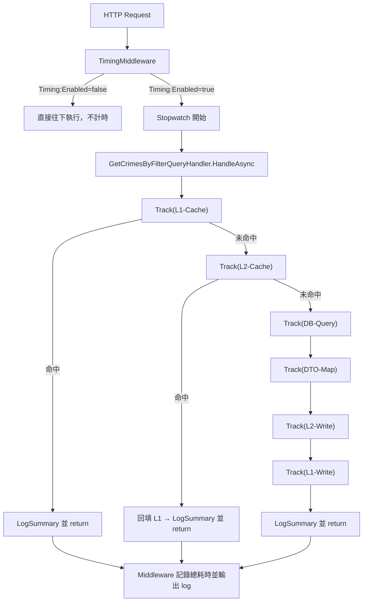
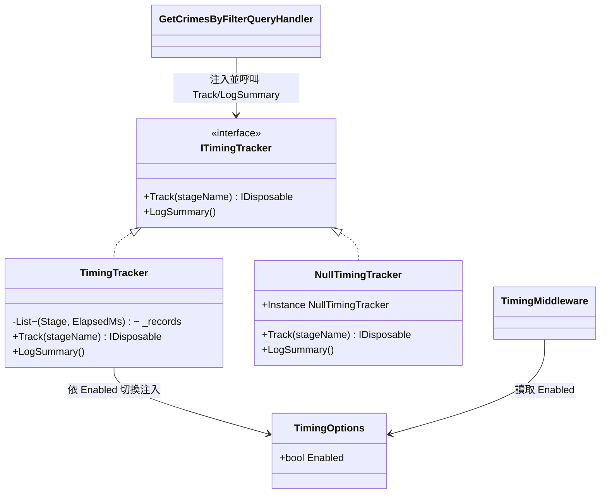

# 任務報告：執行時間追蹤機制（TimingMiddleware + ITimingTracker）— 2026-06-08

## 1. 主要解決什麼問題？
在不修改現有業務邏輯的前提下，加入「可開關」的執行時間追蹤機制：Middleware 層記錄每個 HTTP 請求總耗時，Handler 層記錄 L1 快取、L2 快取、DB 查詢、DTO 轉換、L2/L1 寫入各階段耗時，透過 `appsettings.json` 的 `Timing:Enabled` 一鍵開關，關閉時零效能損耗。

## 2. 如何證明是否執行正確？
- 新增 `GetCrimesByFilterQueryHandlerTimingTests`（3 項）：
  - `HandleAsync_WhenTimingEnabled_ShouldCallLogSummary`：驗證 `LogSummary()` 被呼叫一次
  - `HandleAsync_WhenTimingEnabled_ShouldTrackL1CacheStage`：驗證 `Track("L1-Cache")` 有被呼叫
  - `HandleAsync_WhenTimingDisabled_NullTracker_ShouldNotThrow`：模擬空追蹤器，驗證流程不拋例外
- `dotnet build`：0 錯誤、0 警告
- `dotnet test`：Domain（54）、Application（22，含上述 3 項新測試）、Infrastructure（15）全數通過
- Integration.Tests 13 項失敗為環境問題（本機未連 Azure SQL，`ConnectionString 屬性尚未初始化`），用 `git stash` 比對前後失敗數一致，確認與本次改動無關
- **本機 Runtime 驗證（GET /api/crime/points 觀察 [Timing] log）因本機無法連線 Azure SQL Database 而略過**，詳見第 6 點

## 3. 怎樣才是好的做法？
用介面 + 開關切換實作（`ITimingTracker` → `TimingTracker` / `NullTimingTracker`），讓「測量」與「業務邏輯」解耦：Handler 只管呼叫 `Track("階段名")`，不需要知道 Timing 是否啟用；關閉時注入空實作，連 `if` 判斷都省了，達到零開銷。

## 4. 最重要的知識或概念（小學生版）

**用「碼錶」量每一段路，不是量整趟旅程**
`Track("L1-Cache")` 就像在每一段路口按碼錶，`using` 結束時自動停錶並記下時間，最後 `LogSummary()` 把所有段落的時間加總印出來，就知道哪一段最慢。

**開關不是 if/else，是「換一顆零件」**
`Timing:Enabled = false` 時，系統直接裝上「什麼都不做」的 `NullTimingTracker`，而不是每次都判斷 `if (enabled)`。就像拆掉碼錶換成一個假殼，車子照跑，但不再耗電去計時。

**IDisposable + using = 自動收尾**
`Track()` 回傳一個「會自己停錶」的物件，搭配 `using` 寫法，就算中途出例外也會自動停錶記錄，不用自己記得「呼叫結束」。

## 5. 核心的變因是什麼？
- `Timing:Enabled` 開關決定注入 `TimingTracker`（真實計時）或 `NullTimingTracker`（空實作）；這個切換發生在 DI 註冊階段（`Program.cs`），而非執行期判斷，是達成「關閉時零損耗」的關鍵。
- `ITimingTracker` 為 Scoped 生命週期：每個 HTTP 請求各自獨立累積階段紀錄，互不干擾。

## 6. 新手可能常犯的誤區？
- 以為「先寫好類別」就等於「功能完成」：本次接手時 `Program.cs` 只加了 `using`，DI 註冊與 middleware 掛載都還沒做，`ITimingTracker` 完全沒被任何地方呼叫，是「半成品」。
- 在 return 前漏掉 `LogSummary()`：本 handler 有三個出口（L1 命中、L2 命中、完整流程），三處都要呼叫，否則某些路徑永遠不會輸出統計。
- 誤以為本機 `docker-compose.yml` 反映目前架構：本專案已於 2026-06-04 從 PostgreSQL 遷移到 Azure SQL Database，但 compose 檔仍是舊的 postgres 設定，啟動它並不能讓 API 連上資料庫（詳見 `docs/lessons-learned.md` L008）。

## 7. 流程圖

## 8. 分支與部署記錄
- 開發分支：feature/timing-tracker
- PR 編號：#26
- Merge 到：uat
- Merge 時間：2026-06-08 20:08（squash merge，commit b806c1b）
- CI 結果：✅ 成功（build-and-test、push-to-acr、deploy-to-uat 全綠）
- UAT 部署：✅ 成功（taipei-crime-map-uat Container App 已更新）

## 補充：本機驗證限制
驗收條件第 3、4 項要求啟動 API 並觀察 `[Timing]` log 的真實輸出，需要連線到 Azure SQL Database。本機環境未設定 `ConnectionStrings:DefaultConnection`，且 `docker-compose.yml` 仍是已棄用的 PostgreSQL 設定（架構已於 2026-06-04 遷移至 Azure SQL，見 `docs/decisions.md`），故與使用者確認後，本次略過本機 Runtime 驗證，改以單元測試（已涵蓋 `Track`/`LogSummary` 呼叫時機與空實作不拋例外）作為正確性證明。建議在 UAT 部署後，透過 Container App 的 log stream 觀察 `[Timing]` 輸出格式是否符合預期。
