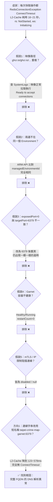

# 任務報告：Garnet 連線逾時根因調查與短名稱修復 — 2026-06-09

## 1. 主要解決什麼問題？
前一份報告（`2026-06-08-garnet-timeout-fix.md`）已將 `ConnectTimeout`/`SyncTimeout` 調整為 2000ms，讓快取失敗時能快速 fallback，但 UAT 仍然**每次都會** `RedisConnectionException ... ConnectTimeout`——連線從未真正建立成功。本次任務追查並解決了「連線本身建立不起來」的根本原因：**內部連線字串使用完整 FQDN 會導致 DNS 解析異常，改用短名稱後恢復正常**。

## 2. 如何證明是否執行正確？
依序提出六個假說，逐一用具體證據排除，最後鎖定根因：

| # | 假說 | 驗證方式 | 結果 |
|---|---|---|---|
| 1 | 映像路徑 `ghcr.io/ghcr.io/microsoft/garnet:latest` 重複導致拉取/啟動異常 | 查 `ContainerAppSystemLogs`：映像確實 Successfully pulled（92MB, 6.51s），console log 顯示 `Ready to accept connections` | 排除 ❌ |
| 2 | UAT 與 Garnet 不在同一個 Container Apps Environment | ARM REST API 比對兩個 App 的 `managedEnvironmentId`，完全相同 | 排除 ❌ |
| 3 | `exposedPort: 0` 與 `targetPort: 6379` 不一致 | 使用者實際修正為 `exposedPort: 6379`，8 分鐘後重新測試，仍出現一模一樣的 `ConnectTimeout` | 排除 ❌ |
| 4 | Garnet 容器本身不健康 | 查狀態：`runningState: Running`、`restartCount: 0`，自啟動後從未重啟 | 排除 ❌ |
| 5 | mTLS / IP 限制阻擋連線 | 查設定：`peerAuthentication.mtls.enabled = false`、`ipSecurityRestrictions = null` | 排除 ❌ |
| 6 | **連線字串使用完整 FQDN 導致 DNS 解析異常** | 改為短名稱 `taipei-crime-map-garnet:6379` 後重新測試 | **✅ 找到根因** |

### 修復後驗證數據（兩次獨立測試，皆使用避開 L1 快取命中的新篩選條件）

| 量測項目 | 修正前（FQDN） | 修正後 #1（2022年資料） | 修正後 #2（2023年資料） |
|---|---|---|---|
| L2-Cache 耗時 | 16,071 ~ 21,120 ms | 578 ms | 123 ms |
| L2-Write 耗時 | 5,789 ~ 5,850 ms | 121 ms | 34 ms |
| 容器內總耗時 | ~22,000 ms | 781 ms | 211 ms |
| `RedisConnectionException` | 必定出現 | 無 | 無 |

兩次測試的 L2 階段耗時都從原本的「萬毫秒級」降到「三位數毫秒級」，且完全沒有再出現連線例外，證明短名稱解決了連線問題。

> 附註：修正後測試 #2 的 `Invoke-WebRequest` 量到 22 秒，但查證後確認是「容器冷啟動」造成的（log 顯示請求進來前 3 秒容器才剛 `Application started`），與 Garnet 連線無關——容器內實際處理只花了 271ms（`[Timing] 總計=211ms`，HTTP middleware 量到 `271ms`）。

## 3. 怎樣才是好的做法？
- **排查連線逾時時，優先嘗試「換一種更簡單的定址方式」**：短名稱 vs 完整 FQDN、IP vs 主機名稱，這是低成本、高訊息量的排查手段，應該在懷疑平台限制、考慮更換服務之前先試。本案例正是如此——前五個假說都指向「Garnet 那一端有問題」，但真正的問題出在「我們撥號的方式」。
- **同一個 Container Apps Environment 內部呼叫應使用短名稱**：這不只是 Microsoft 文件中的「建議」，在本案例中是「FQDN 會直接失敗、短名稱才能用」的關鍵差異。短名稱由環境內的 Envoy proxy 直接路由，少一層額外的 FQDN DNS 解析。
- **系統性、按部就班逐一排除假說**：每個假說都搭配具體證據（log、ARM API 查詢結果）驗證「是」或「不是」，而不是憑感覺跳著猜——這讓我們在五次「不是」之後，仍然有信心提出第六個方向，而它正好就是答案。

## 4. 最重要的知識或概念（小學生版，最多三個）

**地址有「完整地址」和「暱稱」兩種寫法，在自己社區裡用暱稱比較準**
完整 FQDN 就像寫一長串地址（縣市鄉鎮路名門牌號），短名稱就像直接喊「隔壁老王」。在同一個社區（Container Apps Environment）裡，喊暱稱反而比查完整地址更容易找到人——因為社區內部有自己的「對講機系統」（Envoy proxy），不需要繞去翻地址簿（DNS 解析）。

**電話一直占線，不代表「對方壞了」，可能是「撥號方式有問題」**
原本一直以為是 Garnet（被打電話的那一方）出問題，檢查了它的健康狀態、所在環境、連接埠設定，結果通通正常。最後發現問題出在「撥號方式」本身——照著完整地址查出來的號碼打不通，換成內部分機簡碼一撥就通了。

**找根因要像剝洋蔥，一層一層排除，不要跳著猜**
這次依序檢查了「映像路徑」「是否同環境」「連接埠設定」「容器健康狀態」「安全限制」「定址方式」六種可能性，前五種都用證據確認「不是這個」，才換到第六種，而第六種正好是答案。按部就班一層一層剝開，比起到處亂猜更快找到真相。

## 5. 核心的變因是什麼？
**內部服務間連線使用的「定址方式」**——完整 FQDN vs 短名稱，是決定連線能否建立的關鍵變因。同樣的 Garnet 服務、同樣的網路環境、同樣的連接埠設定，唯一的差異只是連線字串裡主機名稱的寫法，結果卻天差地遠：永遠 `ConnectTimeout`（16~21 秒）vs 正常運作（100~600 毫秒）。

## 6. 新手可能常犯的誤區？
- 看到連線逾時，直覺認為「對方服務壞了」，把所有精力都花在檢查「被連線的那一方」（容器健康狀態、設定），卻沒想到要懷疑「連線字串本身的格式」。
- 以為「完整 FQDN 一定比短名稱更保險、更明確」，殊不知在雲端平台的內部網路中，完整 FQDN 反而可能要多繞過一層 DNS 解析，更容易踩到平台層的異常。
- 排除假說時不夠徹底——只檢查「設定值對不對」，卻沒有「改了之後重新測試、拿到新證據」就急著下結論（例如 `exposedPort` 假說，若沒有實際修正並重新測試，可能會誤以為「改了就會好」而停在錯誤的方向上）。

## 7. 流程圖與結構圖



```mermaid
sequenceDiagram
    participant API as taipei-crime-map-uat
    participant DNS as 內部 FQDN DNS 解析
    participant Envoy as Envoy Proxy（環境內部路由）
    participant Garnet as taipei-crime-map-garnet:6379

    rect rgb(255, 224, 224)
    Note over API,Garnet: 修正前：完整 FQDN<br/>taipei-crime-map-garnet.internal.&lt;env-domain&gt;.azurecontainerapps.io:6379
    API->>DNS: 解析完整 FQDN
    DNS--xAPI: 解析 / 路由異常，封包未送達
    API->>API: 等待 ConnectTimeout（16~21 秒）
    API->>API: RedisConnectionException<br/>rs: NotStarted, ws: Initializing
    end

    rect rgb(224, 255, 224)
    Note over API,Garnet: 修正後：短名稱<br/>taipei-crime-map-garnet:6379
    API->>Envoy: 直接以 app name 連線
    Envoy->>Garnet: 環境內部直接路由（免 FQDN 解析）
    Garnet-->>API: 連線成功並回應（123~578ms）
    end
```

## 8. 分支與部署記錄
- 操作分支：`uat`（純設定變更 + 文件記錄，無程式碼異動，直接於 `uat` 分支進行）
- 關鍵設定變更：使用者於 Azure Portal 手動修改 UAT Container App 環境變數
  `ConnectionStrings__Redis`，從完整 FQDN
  `taipei-crime-map-garnet.internal.ambitioussand-7326440b.japaneast.azurecontainerapps.io:6379`
  改為短名稱 `taipei-crime-map-garnet:6379`（`lastModifiedAt: 2026-06-08T16:38:26Z`）
- 文件異動：本報告 + `docs/lessons-learned.md`（新增 L016）+ `docs/decisions.md`（補充連線字串格式警示）+ `PROGRESS.md`
- CI 結果：N/A（純設定 + 文件變更，無程式碼異動觸發 build/test pipeline）
- UAT 部署：✅ 已驗證（兩次新查詢請求皆顯示 L2-Cache/L2-Write 恢復正常、無連線例外）
