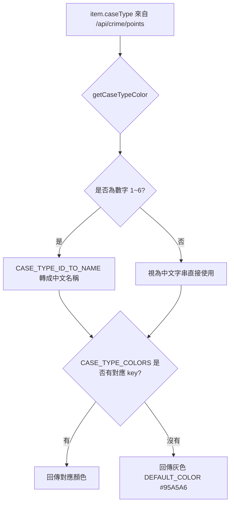
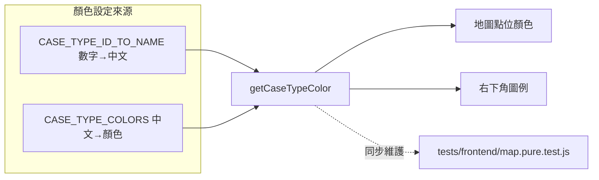

### 任務報告：抽取 getCaseTypeColor 純函數並補上單元測試 — 2026-06-11

1. 主要解決什麼問題？
   - 調查「篩選後地圖點位顏色仍混雜」的回報：實際呼叫 UAT API
     `/api/crime/points?caseType=3&pageSize=500` 確認回傳 2580 筆全部
     `caseType` 欄位皆為「機車竊盜」（中文字串），與 map.js 的
     `CASE_TYPE_COLORS` key 逐 byte 比對一致，**未發現格式不一致的
     問題**（API 回傳的是中文字串，不是數字代碼）。
   - 仍依需求把顏色查表邏輯抽成可測試的純函數 `getCaseTypeColor(caseType)`，
     同時支援中文字串與數字代碼（1~6），找不到對應時回傳灰色 `#95A5A6`，
     並補上 11 項 Jest 測試。

2. 如何證明執行正確？
   - `npx jest tests/frontend/`：35/35 通過（含新增 11 項
     `getCaseTypeColor` 測試：案類 1~6 各回傳對應顏色、未知數字/字串/
     null/undefined 皆回傳灰色 fallback）。
   - 對 UAT 即時呼叫 `/api/crime/points?caseType=3&pageSize=500`，
     確認 500 筆資料的 `caseType` 欄位唯一值為「機車竊盜」，
     對應 `getCaseTypeColor('機車竊盜')` = `#1ABC9C`（青色），
     可推斷選擇「機車竊盜」查詢後地圖上應只出現青色點位。
   - PR #30 squash merge 後，CI（build-and-test 含 Frontend tests、
     push-to-acr、deploy-to-uat）全綠，UAT 部署成功。

3. 怎樣才是好的作法？
   - 懷疑「顏色顯示錯誤」前，先用 curl 直接檢查 API 回傳欄位的實際格式
     （字串或數字、逐 byte 比對），避免在錯誤的假設下修改程式碼。
   - 把「資料欄位 → 顯示顏色」的對照邏輯抽成單一純函數，
     並用測試把所有案類代碼與未知值都覆蓋到，
     之後 API 格式或顏色表異動時，CI 能立即抓到不一致。

4. 最重要的知識或概念（最多三個）：
   - 「先量測再下結論」：畫面看起來不對，不代表程式碼一定有 bug，
     先用簡單指令確認資料本身的格式。
   - 「一個函數，多種輸入」：`getCaseTypeColor` 同時能吃中文字串和
     數字代碼，未來不管 API 回傳哪種格式都不會壞掉。
   - 「找不到答案時要有預設值」：查不到對應顏色就回傳灰色，
     畫面不會因為意外資料而整個壞掉。

5. 核心的變因是什麼？
   - `CASE_TYPE_ID_TO_NAME`（數字→中文）與 `CASE_TYPE_COLORS`
     （中文→顏色）兩份對照表是否與後端實際回傳的 `caseType` 格式一致，
     決定了點位顏色是否正確。

6. 新手可能常犯的誤區？
   - 看到「畫面顏色不對」就直接假設「key 格式不一致」並大改資料結構，
     沒有先用 API 實測確認假設是否成立。
   - 視覺對照表（顏色、圖示）常被當作「設定」而非「邏輯」，
     因此沒有測試覆蓋，格式不一致時 CI 不會發現。

7. 流程圖與結構圖

8. 分支與部署記錄
   - 開發分支：feature/case-type-color-pure-function
   - PR 編號：#30
   - Merge 到：uat
   - Merge 時間：2026-06-11 01:15（squash merge）
   - CI 結果：✅ 成功
   - UAT 部署：✅ 成功
