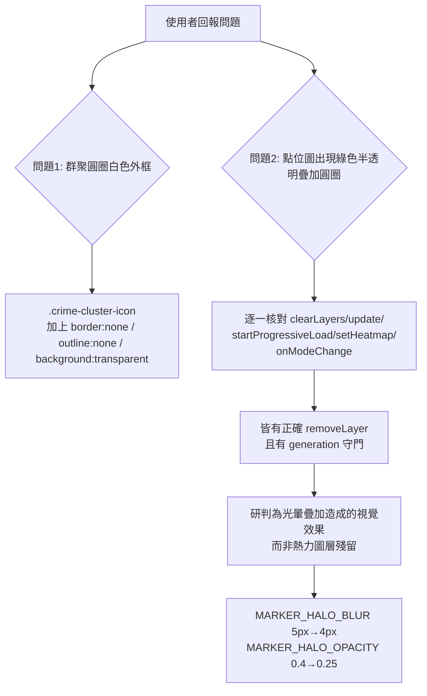

### 任務報告：群聚圖示白色外框與點位光暈密集度修正 — 2026-06-11

1. 主要解決什麼問題？
   - MarkerCluster 群聚圓圈出現白色外框
   - 點位圖模式下，密集綠色點位的光暈疊加看起來像熱力圖殘留的半透明圓圈

2. 如何證明是否執行正確？
   - `npx jest tests/frontend`：56/56 全數通過（同步更新光暈參數的測試斷言）
   - `node --check map.js`：語法正確
   - PR #37 squash-merge 到 uat 後，CI（build-and-test、push-to-acr、deploy-to-uat）皆 success

3. 怎樣才是好的作法？
   - 收到「圖層切換/殘留」類回報時，先逐一核對所有 `removeLayer`/`clearLayers`
     呼叫點與非同步 `generation` 守門機制，確認程式邏輯本身是否真的有缺陷
   - 視覺效果（如光暈）的模糊半徑/透明度，應以「大量同色資料密集重疊」的
     最壞情境選取規格範圍內較保守的數值，而非上限值
   - 自訂 Leaflet `divIcon` 的 `className` 仍可能受瀏覽器預設焦點外框
     （`outline`）影響，建議明確加上 `outline: none; border: none;`

4. 最重要的知識或概念（最多三個）：
   - 圖示元素即使邏輯上沒有邊框樣式，瀏覽器點擊後可能自動顯示一圈「焦點外框」，
     要手動關閉
   - 很多顏色相同的「光暈」疊在一起，看起來會變成一大片半透明色塊，
     容易被誤認成另一種圖層
   - 修 bug 前先「核對程式碼邏輯」，確認是真的程式錯誤，還是視覺效果造成的誤判

5. 核心的變因是什麼？
   - `.crime-cluster-icon` 是否明確設定 `border: none; outline: none`，
     決定群聚圖示是否會顯示瀏覽器預設外框
   - 光暈 `MARKER_HALO_BLUR`／`MARKER_HALO_OPACITY` 的數值大小，
     決定密集同色點位疊加後的視覺色塊強度

6. 新手可能常犯的誤區？
   - 看到「圖層好像沒清掉」就直接動手改 `removeLayer`/`clearLayers` 邏輯，
     卻沒先確認程式碼邏輯是否真的有缺陷
   - 設計光暈/陰影參數時只用單一個點測試，沒考慮上千筆資料密集重疊的情境

7. 流程圖與結構圖

8. 分支與部署記錄
   - 開發分支：fix/cluster-icon-border-and-halo-density
   - PR 編號：#37
   - Merge 到：uat（squash, delete-branch）
   - Merge 時間：2026-06-10 21:17
   - CI 結果：✅ 成功
   - UAT 部署：✅ 成功
