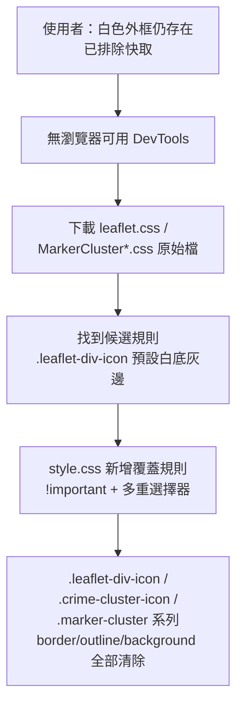

### 任務報告：群聚圖示白色外框 — style.css 高權重覆蓋 — 2026-06-11

1. 主要解決什麼問題？
   - 上一輪修正後，群聚圓圈白色外框在 Brave、Edge 兩個瀏覽器仍然存在
     （已排除快取因素）

2. 如何證明是否執行正確？
   - `npx jest tests/frontend`：56/56 全數通過
   - PR 直接 push 到 uat 後，CI（build-and-test、push-to-acr、deploy-to-uat）皆 success

3. 怎樣才是好的作法？
   - 本環境無圖形化瀏覽器可用 DevTools 即時 Inspect，改用下載
     leaflet.css / MarkerCluster.css / MarkerCluster.Default.css 原始檔，
     逐條比對哪些選擇器可能命中群聚圖示
   - 找到候選規則 `.leaflet-div-icon { background:#fff; border:1px solid #666; }`
     （Leaflet DivIcon 預設 className）後，在 `style.css`（載入順序晚於
     第三方 CSS）以 `!important` + 多重選擇器一次性覆蓋，避免單一選擇器
     在不同瀏覽器的樣式合併順序下失效

4. 最重要的知識或概念（最多三個）：
   - 第三方函式庫（如 Leaflet）的元件即使你給了自訂的 class，
     它原本內建的 class 樣式有時還是會偷偷生效
   - 想要「一定要蓋過去」的時候，CSS 可以用 `!important` 加大絕招的力量
   - 沒有瀏覽器可以打開檢查時，可以直接把對方的 CSS 檔案下載下來，
     用眼睛逐條比對找線索

5. 核心的變因是什麼？
   - `style.css` 的載入順序在 leaflet.css / MarkerCluster*.css 之後，
     加上 `!important`，決定覆蓋規則一定能蓋過第三方預設樣式

6. 新手可能常犯的誤區？
   - 以為「我有指定 className 就一定會取代掉函式庫的預設 className」，
     而忽略不同瀏覽器/版本可能有差異
   - 修第三方樣式時只改一個選擇器，沒有同時涵蓋該函式庫所有可能用到的
     class 名稱

7. 流程圖與結構圖

8. 分支與部署記錄
   - 開發分支：uat（直接提交）
   - PR 編號：無（直接 push 到 uat，承前一任務的延伸修正）
   - Merge 到：uat
   - Merge 時間：2026-06-10 21:38
   - CI 結果：✅ 成功
   - UAT 部署：✅ 成功
