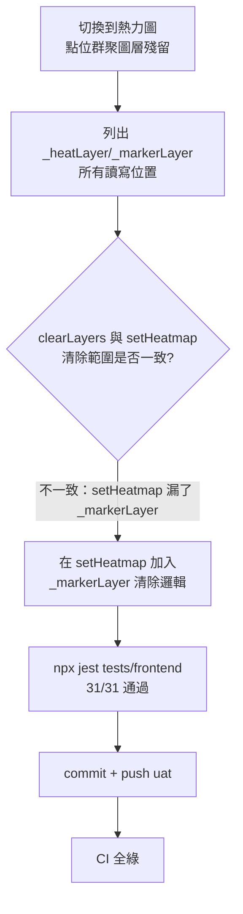

### 任務報告：修正 setHeatmap() 切換熱力圖時殘留點位群聚圖層 — 2026-06-11

1. 主要解決什麼問題？
   - 切換到熱力圖模式時，舊的點位群聚圖層（`_markerLayer`）未被清除，
     與熱力圖混在一起顯示

2. 如何證明是否執行正確？
   - 使用者用 Chrome DevTools 直接列出 `_heatLayer`／`_markerLayer` 在 map.js
     的所有讀寫位置，確認 `clearLayers()` 會清除三個圖層
     （`_heatLayer`、`_markerLayer`、`_fallbackLayer`），
     但獨立的 `setHeatmap()` 只清除了 `_heatLayer` 與 `_fallbackLayer`，
     遺漏 `_markerLayer`
   - 只在 `setHeatmap()` 加入一行 `_markerLayer` 清除邏輯，其餘不動
   - `npx jest tests/frontend`：2 個測試檔、31/31 通過
   - push 後 CI（build-and-test / push-to-acr / deploy-to-uat）全部 success

3. 怎樣才是好的作法？
   - 先完整列出所有相關狀態變數的讀寫位置（架構盤點），
     確認兩條清除邏輯（`clearLayers()` vs `setHeatmap()`）涵蓋的圖層是否一致，
     再做最小範圍的修正，而不是逐一症狀盲目加 `removeLayer`

4. 最重要的知識或概念（最多三個）：
   - 同一個東西如果有兩個「清除」的入口，要確認兩邊清的範圍一樣，
     不然就會有東西忘記清掉
   - 修 bug 前先把所有相關的程式碼位置列出來看一遍，比直接亂改更快找到根因
   - 改一行就能解決的問題，不需要大範圍重構

5. 核心的變因是什麼？
   - `setHeatmap()` 內部清除的圖層集合（原本只有 `_heatLayer`/`_fallbackLayer`）
     是否與 `clearLayers()` 清除的集合（`_heatLayer`/`_markerLayer`/`_fallbackLayer`）一致

6. 新手可能常犯的誤區？
   - 看到「圖層殘留」就直接在很多地方加 `removeLayer`，
     沒有先確認到底是哪個函式漏掉清除邏輯

7. 流程圖與結構圖

8. 分支與部署記錄
   - 開發分支：uat（直接提交，依使用者指示）
   - PR 編號：無（直接 push 到 uat）
   - Merge 到：uat
   - Merge 時間：2026-06-11 08:04
   - CI 結果：✅ 成功（build-and-test / push-to-acr / deploy-to-uat 全綠）
   - UAT 部署：✅ 成功
   - Commit：`4894352` fix: clear leftover marker layer when switching to heatmap mode
