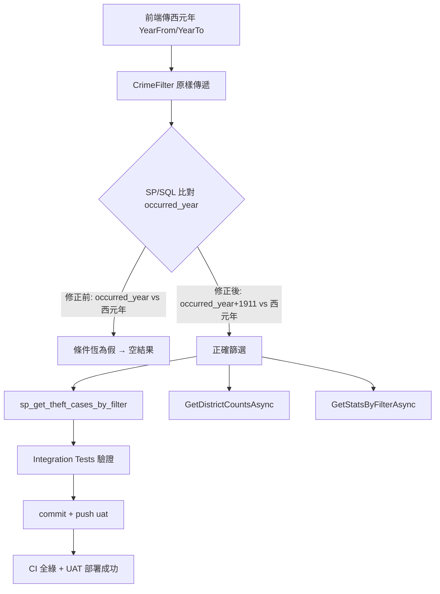

### 任務報告：修正年份篩選 ROC/西元年單位不一致 bug — 2026-06-11

1. 主要解決什麼問題？
   - UAT 發現只要在「起始年份」輸入任何數字查詢，結果就變成空資料。
     根本原因是資料庫 `occurred_year` 欄位儲存民國年（如 113），
     但前端與 API 傳遞的 `YearFrom`/`YearTo` 是西元年（如 2024），
     SP 與統計查詢直接比對導致條件恆為假。

2. 如何證明是否執行正確？
   - `dotnet test`：Domain/Application/Infrastructure 共 108 個測試全數通過。
   - 新增/更新 Integration Tests（需真實 DB，CI 內執行）：
     - `GetByFilterAsync_WithYearRange_ShouldReturnMatchingCases`
       （改用西元年 2024/2023，驗證範圍篩選）
     - `GetByFilterAsync_WithYearFrom2018_ShouldReturnMatchingCases`
       （yearFrom=2018 應有資料）
     - `GetByFilterAsync_WithYearFrom2030_ShouldReturnEmptyResult`
       （yearFrom=2030 應為空）
   - push 到 uat 後 CI（build-and-test / push-to-acr / deploy-to-uat）全部綠燈
     （run 27343669285）。

3. 怎樣才是好的作法？
   - 在「資料庫欄位（民國年）」與「對外 API 參數（西元年）」的邊界上，
     選定唯一一層做轉換（本次選在 SP / SQL 層），避免每層各自假設。
   - 修正既有測試時要連帶檢查測試資料是否仍與新行為一致
     （原本用民國年 113 當篩選值的測試，修正後需改為西元年 2024）。

4. 最重要的知識或概念（小學生也能懂）：
   - 「民國年 + 1911 = 西元年」：113 年就是西元 2024 年。
   - 「兩邊單位要一樣才能比大小」：資料庫存的是民國年，但前端問的是
     西元年，沒換算就比較，結果永遠「對不上」。
   - 「在同一個地方換算一次就好」：把換算放在 SP 裡面，所有查詢都統一，
     不用每個地方都記得換算。

5. 核心的變因是什麼？
   - `occurred_year + 1911 >= @YearFrom` / `<= @YearTo` 是否正確套用到
     SP（`sp_get_theft_cases_by_filter`）以及 `GetDistrictCountsAsync`、
     `GetStatsByFilterAsync` 的所有 SQL 區塊。

6. 新手可能常犯的誤區？
   - 只修一個查詢（例如只修 SP），忘記統計圖表用的另外兩段 SQL
     （`GetDistrictCountsAsync`、`GetStatsByFilterAsync`）也有相同問題。
   - 修正後沒有檢查既有測試的篩選值單位，導致舊測試用民國年篩選值
     在新行為下變成錯誤。
   - `InMemoryCrimeRepository` 也有同樣的 ROC/西元年混用問題，
     但目前未被 DI 註冊（僅供其自身單元測試使用），本次視為範圍外，
     未一併修正。

7. 流程圖與結構圖

8. 分支與部署記錄
   - 開發分支：直接於 uat 分支進行（無 PR）
   - PR 編號：無
   - Merge 到：uat
   - Merge 時間：2026-06-11 11:30
   - CI 結果：✅ 成功（build-and-test / push-to-acr / deploy-to-uat 全綠，run 27343669285）
   - UAT 部署：✅ 成功
