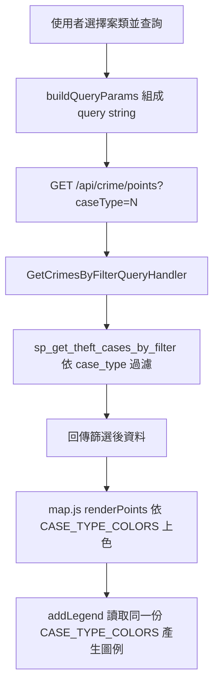
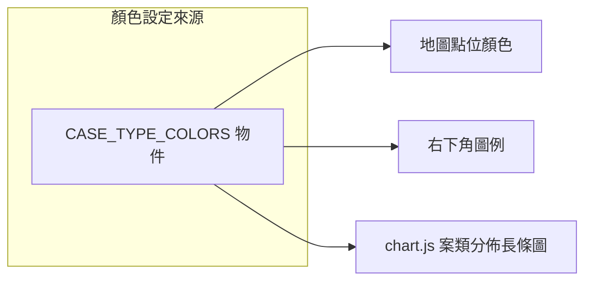

### 任務報告：前端案類篩選檢查與點位/圖例配色調整 — 2026-06-11

1. 主要解決什麼問題？
   - 檢查「選擇住宅竊盜後地圖仍顯示全部案類」的問題：逐層檢查 app.js、index.html、
     CrimeController、Handler、SQL 預存程序、map.js，並用 curl 直接打 UAT API
     驗證 `caseType=1` 篩選正確（points 回傳 4363/11514，heatmap 各區數量相符）。
     結論：程式碼無缺陷，不需修改。
   - 將地圖點位與右下角圖例配色改為依嚴重性排序：
     住宅竊盜紅、強盜橙、搶奪黃、汽車竊盜綠、機車竊盜青、自行車竊盜紫、其他灰，
     圖例會自動依新色彩物件渲染，與點位顏色一致。chart.js 的案類分佈圖同步更新。

2. 如何證明是否執行正確？
   - 對 UAT 即時呼叫 `/api/crime/points?caseType=1` 與 `/api/crime/heatmap?caseType=1`，
     確認回傳結果僅含住宅竊盜資料，數量與篩選條件相符。
   - PR #29 squash merge 後，CI（build-and-test、push-to-acr、deploy-to-uat）全綠，
     UAT 部署成功。

3. 怎樣才是好的作法？
   - 懷疑「篩選沒生效」時，先用 curl 直接測 API，排除「資料本身稀疏（多數案件當時還沒座標）
     造成視覺上看不出篩選差異」的可能性，再去改程式碼。
   - 顏色設定集中在一個物件（CASE_TYPE_COLORS），圖例與圖表都從同一份物件讀取，
     之後要再調色只需改一處。

4. 最重要的知識或概念（最多三個）：
   - 「先驗證再修改」：覺得程式有 bug 時，先用簡單指令證明真的有問題，免得改錯地方。
   - 「一份顏色表，多處使用」：地圖點位、圖例、長條圖都讀同一份顏色設定，畫面才會一致。
   - 「外部服務暫時故障不等於我們的錯」：CI 失敗訊息若來自外部映像倉庫（如 mcr.microsoft.com）
     回傳 403，通常重新執行就會恢復。

5. 核心的變因是什麼？
   - 圖例與點位顏色是否一致，取決於兩者是否讀取同一份 CASE_TYPE_COLORS 物件；
     本次修改只調整這份物件的內容與順序，渲染邏輯本身不變。

6. 新手可能常犯的誤區？
   - 看到畫面結果跟預期不同，直接懷疑篩選邏輯錯誤，卻沒考慮「資料本身就稀疏」這種情境。
   - CI 失敗就直接開始改程式碼，沒有先看錯誤訊息是否來自外部依賴（如 base image 倉庫）。

7. 流程圖與結構圖

8. 分支與部署記錄
   - 開發分支：feature/map-legend-severity-colors
   - PR 編號：#29
   - Merge 到：uat
   - Merge 時間：2026-06-11 00:48（squash merge）
   - CI 結果：✅ 成功（首次因 mcr.microsoft.com 403 暫時性錯誤失敗，rerun 後成功）
   - UAT 部署：✅ 成功
