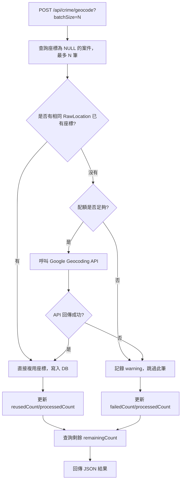
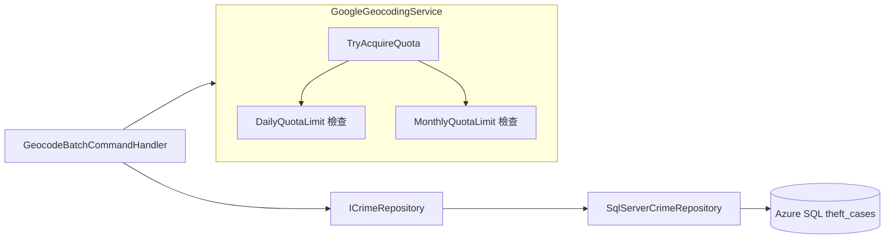

### 任務報告：Geocoding 批次補齊座標 — 2026-06-11

1. 主要解決什麼問題？
   - 對共用的 Azure SQL Database（UAT/Prod 共用）補齊全部 11,514 筆案件的經緯度座標。
   - 新增「相同 RawLocation 複用座標」優化，減少 Google Maps API 呼叫量與費用。
   - 新增 POST /api/crime/geocode 批次端點，可重複呼叫直到補齊所有座標。
   - 新增 MonthlyQuotaLimit（每月配額上限），與 DailyQuotaLimit 邏輯相同但按月重置，
     並將兩者都調整為 20000 以避免 11,514 筆一次補齊時受限。

2. 如何證明是否執行正確？
   - 單元測試：GeocodeBatchCommandHandlerTests（5 項）、GoogleGeocodingServiceTests（10 項，
     含新增的 Monthly 配額測試）全部通過。
   - 在 UAT 環境連續呼叫 23 次 `/api/crime/geocode?batchSize=500`，
     `remainingCount` 從 11,514 穩定遞減至 0，最後一批 `failedCount=0`。
   - 全程 reusedCount 累計超過 1,500 筆透過「相同 RawLocation 複用」節省 API 呼叫，
     實際 apiCallCount 總和遠小於 11,514。

3. 怎樣才是好的作法？
   - 寫入座標前先查詢是否有相同地址（RawLocation）已有座標，能重複利用就不要呼叫外部 API。
   - 批次處理時每筆成功立即寫入 DB，失敗只記錄 warning 並跳過，不中止整批。
   - 修改雲端環境變數/Secret 後，先用小批次重試確認設定已生效，再執行大批次（見 L017）。

4. 最重要的知識或概念（最多三個）：
   - 「重複利用」：同一個地址查過一次座標後，其他案件用同個地址就直接抄答案，不用再問一次。
   - 「配額」：跟 Google 借用查地址的服務有每天/每月的次數上限，用完就要等下次才能再用。
   - 「設定生效要等一下」：改了雲端的設定（像金鑰）不會馬上全部生效，要等一下下再試。

5. 核心的變因是什麼？
   - Google Maps API Key 的環境變數設定是否正確生效，是整個流程能否成功的關鍵；
     程式邏輯（reuse、quota、批次寫入）在設定生效前後都正確無誤。

6. 新手可能常犯的誤區？
   - 看到 API 呼叫全部失敗就立刻認定程式碼或金鑰有誤，沒有考慮「設定剛部署、尚未完全生效」的情況。
   - 一次設定過小的配額上限，導致大量資料無法一次補齊，需要反覆手動呼叫。
   - 忽略「相同地址可複用座標」這種低成本優化，導致 API 配額被不必要地快速耗盡。

7. 流程圖與結構圖

8. 分支與部署記錄
   - 開發分支：feature/geocoding-monthly-quota（前一個批次端點功能於 PR #27 完成）
   - PR 編號：#28
   - Merge 到：uat
   - Merge 時間：2026-06-10 22:55（squash merge）
   - CI 結果：✅ 成功
   - UAT 部署：✅ 成功
   - 後續執行：在 UAT 連續呼叫 geocode 端點 23 次（batchSize=500），
     remainingCount 11,514 → 0，未再變更程式碼（無新分支）
