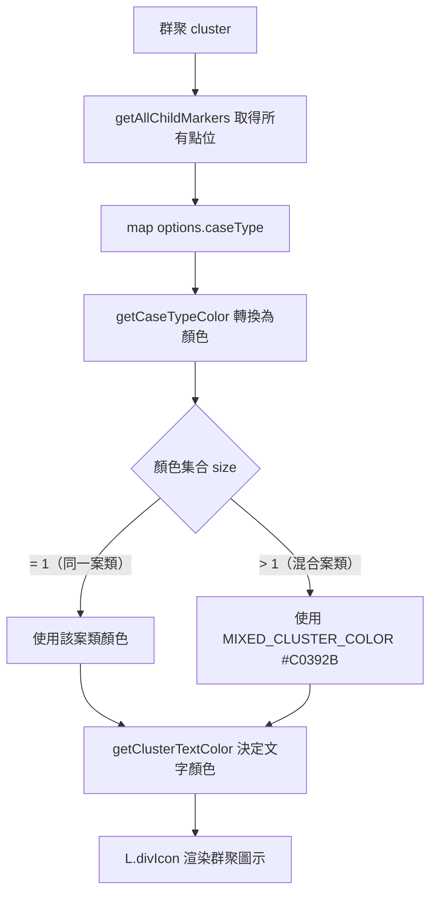
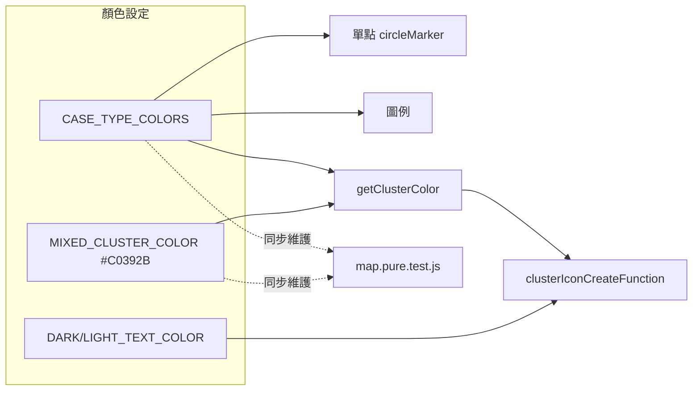

### 任務報告：案類顏色對應與 MarkerCluster 群聚顏色邏輯 — 2026-06-11

1. 主要解決什麼問題？
   - 重新設計地圖案類顏色對應表，並針對 MarkerCluster 群聚圖示新增顏色邏輯：
     群聚內所有點位同一案類 → 該案類顏色；混合多種案類 → 統一警示色。
   - 搶奪（黃底 #D4A017）群聚文字改為深色 #333333，避免黃底白字看不清。
   - 依使用者第二輪回饋，將「住宅竊盜」「機車竊盜」「混合群聚」三色加深，
     與底圖中的山脈綠、河流藍、高速公路橙紅做出區隔。

2. 如何證明是否執行正確？
   - `npx jest tests/frontend/`：44/44 通過，涵蓋 `getCaseTypeColor`、
     `getClusterColor`、`getClusterTextColor` 三個純函數的所有案類組合。
   - `node --check` 對 map.js / chart.js 語法檢查通過。
   - PR #31 squash merge 到 uat 後，CI（build-and-test 含 Frontend tests、
     push-to-acr、deploy-to-uat）全綠（6m4s 完成）。

3. 怎樣才是好的作法？
   - 視覺對照表（顏色）抽成純函數並寫測試，之後任何顏色微調都能在
     1 分鐘內完成「改值 → 跑測試 → 確認全綠」的循環，不需要肉眼比對地圖。
   - 圖例（legend）直接從 `CASE_TYPE_COLORS` 物件動態產生，改顏色不需要
     額外維護圖例程式碼。

4. 最重要的知識或概念（最多三個）：
   - 「群聚顏色 = 內容物顏色」：群聚圖示的顏色不是固定的，而是依照
     裡面包含的點位案類動態計算出來的。
   - 「對比要看底圖」：選顏色不能只看色票本身好不好看，要跟地圖底圖
     （山、河、馬路）的顏色一起比較，避免混在一起分不清。
   - 「深色字配淺色底」：黃色背景配白字幾乎看不到字，這時要把文字
     改成深色或黑色才看得清楚。

5. 核心的變因是什麼？
   - `getClusterColor` 依賴 `cluster.getAllChildMarkers()` 取得群聚內
     所有點位的 `caseType`，再透過 `getCaseTypeColor` 換算顏色集合，
     集合大小（1 種 vs 多種）決定顯示單一案類色或混合警示色。

6. 新手可能常犯的誤區？
   - 改顏色值時忘記同步更新 Jest 測試裡寫死的色碼，導致測試失敗或
     測試與實際顯示不一致卻沒被發現。
   - 只在地圖上目視確認顏色「看起來差不多」，沒有跑測試確認所有
     案類組合（含未知案類、空陣列、混合案類）都有正確 fallback。

7. 流程圖與結構圖

8. 分支與部署記錄
   - 開發分支：feature/marker-cluster-color-logic
   - PR 編號：#31
   - Merge 到：uat
   - Merge 時間：2026-06-10 18:57（squash merge）
   - CI 結果：✅ 成功（6m4s）
   - UAT 部署：✅ 成功
