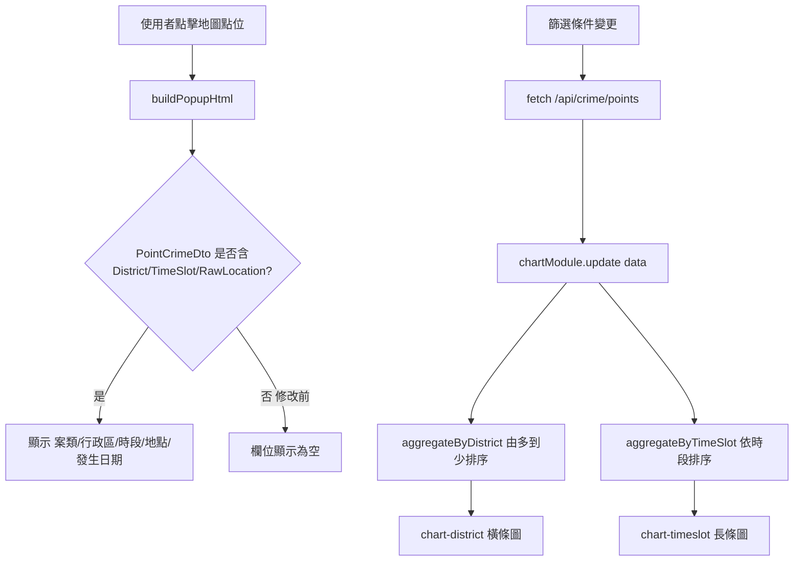
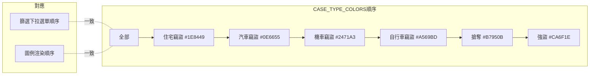

### 任務報告：點位顏色／圖例排序／年份輸入框／popup 欄位／統計圖表改版 — 2026-06-11

1. 主要解決什麼問題？
   - 調整 6 種案類的點位顏色，提高在深色地圖與小縮放層級下的辨識度
   - 統一左上篩選下拉選單與右下圖例的案類排序
   - 起始/結束年份輸入框文字改為淺色，提升深色背景下的可讀性
   - popup 補上行政區、時段、地點欄位
   - 移除「案類分佈」「年度案件趨勢」圖表，改為「行政區分布」（橫條圖）與「時段分布」（長條圖），皆隨篩選條件動態更新

2. 如何證明是否執行正確？
   - Jest 前端測試 51/51 全數通過（含顏色斷言、新圖表聚合函式測試）
   - `dotnet build` 與 Application.Tests 全數通過
   - PR #32 squash-merge 到 uat 後 CI 在 Integration Test 失敗，修正後以 PR #33 squash-merge，CI 三項 job（build-and-test、push-to-acr、deploy-to-uat）全部成功
   - Integration Test `GetCrimePoints_ShouldIncludeDistrictTimeSlotAndRawLocation` 直接斷言 API 回傳的 `PointCrimeDto` 中 District、TimeSlot、RawLocation 三欄位皆非空白，CI 通過即代表 popup 所需欄位已正確由後端回傳

3. 怎樣才是好的作法？
   - 顏色調整需同步更新來源檔案（map.js）與其 Jest 測試（map.pure.test.js），避免測試與實作不同步
   - 擴充 DTO 前先確認上游是否已有資料（本例 TheftCaseDto 已含 District/TimeSlot/RawLocation，故不需修改 Stored Procedure）
   - 對含真實種子資料的資料庫寫 Integration Test，斷言應以篩選條件 + `Contain` 縮小到自己控制的資料範圍（見 [[L020]]）

4. 最重要的知識或概念：
   - 顏色不只是好看，要在「縮小成小點」「深色背景」下都看得清楚
   - 圖例的順序跟下拉選單的順序要一樣，使用者才不會搞混
   - 測試資料庫裡可能已經有很多舊資料，寫測試時不能假設「第一筆」一定是乾淨的

5. 核心的變因是什麼？
   - `CASE_TYPE_COLORS` 物件的 key 順序同時決定圖例渲染順序與顏色對應，必須與 `<select>` option 順序一致
   - `PointCrimeDto` 是否包含 District/TimeSlot/RawLocation 三欄位，直接決定 popup 能否顯示
   - Integration Test 查詢條件（是否過濾、pageSize、斷言用 First 或 Contain）決定測試在含大量既存資料的 CI 資料庫上是否穩定

6. 新手可能常犯的誤區？
   - 改了 map.js 的顏色常數卻忘了同步更新 map.pure.test.js，導致測試與實作不一致
   - 以為前端顯示不出欄位是 SQL/SP 問題，實際上只是 DTO 沒有對應屬性
   - 對含大量既存資料的資料庫寫測試時用 `.First()` 斷言，CI 環境資料量與本機不同導致間歇性失敗

7. 流程圖與結構圖

8. 分支與部署記錄
   - 開發分支：feature/marker-color-legend-popup-charts
     - PR 編號：#32
     - Merge 到：uat（squash）
     - Merge 時間：2026-06-10 19:45
     - CI 結果：❌ 失敗（Integration Test `GetCrimePoints_ShouldIncludeDistrictTimeSlotAndRawLocation`）
     - UAT 部署：❌ 未執行（build-and-test 失敗，後續 job 未執行）
   - 修正分支：fix/points-integration-test-assertion
     - PR 編號：#33
     - Merge 到：uat（squash, delete-branch）
     - Merge 時間：2026-06-10 19:57
     - CI 結果：✅ 成功（build-and-test、push-to-acr、deploy-to-uat 全部 success）
     - UAT 部署：✅ 成功
