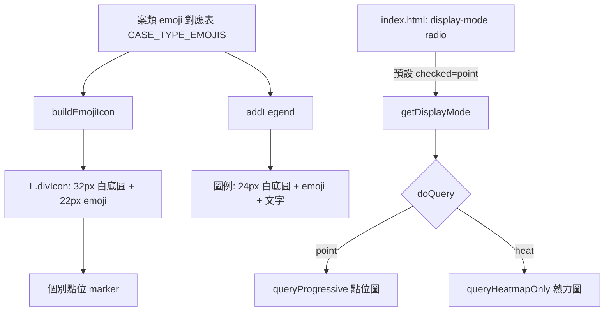

### 任務報告：點位 emoji 樣式調整、年份輸入框可讀性修正、預設顯示模式 — 2026-06-11

1. 主要解決什麼問題？
   - 地圖個別點位改用案類對應的 emoji 顯示（住宅竊盜🏠、汽車竊盜🚗、機車竊盜🏍️、
     自行車竊盜🚲、搶奪👜、強盜⚡、其他📍），並經多輪視覺調整定案為
     白色圓底（32px）+ 22px emoji；右下角圖例同步更新。
   - 修正起始/結束年份輸入框 placeholder 在深色背景下不易閱讀的問題。
   - 將地圖預設顯示模式從熱力圖改為點位圖。

2. 如何證明是否執行正確？
   - 每次調整後執行 `npx jest tests/frontend`，29/29 測試全數通過。
   - 每個項目各自 commit + push 到 uat，CI（build-and-test /
     push-to-acr / deploy-to-uat）全部綠燈，並由使用者於 UAT
     實機確認視覺效果與預設行為皆符合預期。

3. 怎樣才是好的作法？
   - 視覺樣式類需求拆成最小單位逐步調整、逐步部署確認，
     而不是一次做完整套規格再整批 revert（詳見 L021）。
   - CSS 與 JS 中不再使用的常數（如 `MARKER_BG_COLOR`、`colorForType`）
     在每次重構時同步移除，避免死碼累積。

4. 最重要的知識或概念（小學生也能懂）：
   - 「畫圖要一步一步來」：先畫一點點給大人看，喜歡再繼續畫，
     不要一次畫完整張才給人看，不喜歡就要全部擦掉重畫。
   - 「文字顏色要跟背景對比夠大」：深色底配深色字會看不到，
     所以提示文字要用淺色（#EEEEEE）。
   - 「預設值就是大家一打開就看到的樣子」：把預設模式從熱力圖
     改成點位圖，代表使用者一進頁面就先看到個別案件的位置點。

5. 核心的變因是什麼？
   - 點位 emoji 的「底色顏色」與「尺寸」是影響可視度的關鍵變因，
     深色地圖底圖上白底圓圈搭配較大 emoji 對比度最高、最易辨識。

6. 新手可能常犯的誤區？
   - 修改預設值（如 `checked` 屬性）時忘記同步修正程式中對應的
     fallback 預設值（`getDisplayMode()` 的預設回傳），導致
     UI 與程式邏輯預設值不一致。
   - 移除某個樣式用的常數後，忘記檢查是否還有其他地方（如圖例）
     仍引用該常數，造成 CSS/JS 殘留無用程式碼或執行錯誤。

7. 流程圖與結構圖

8. 分支與部署記錄
   - 開發分支：直接於 uat 分支進行（小步迭代，無 PR）
   - PR 編號：無
   - Merge 到：uat
   - Merge 時間：2026-06-11
   - CI 結果：✅ 成功（每次 push 皆全綠：build-and-test / push-to-acr / deploy-to-uat）
   - UAT 部署：✅ 成功（commit d8f0500 → 9d5589c → 125ffd9 → 7d9ff0a → 71d8231，
     皆已部署並由使用者於 UAT 確認）
