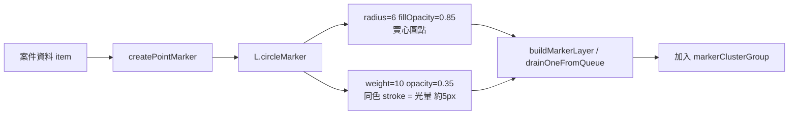

### 任務報告：點位光暈效果（Halo） — 2026-06-11

1. 主要解決什麼問題？
   - 為地圖上每個案件點位的圓點，加上半透明同色光暈效果，讓點位在各種底圖（含深色地圖）與所有縮放層級下都更容易辨識

2. 如何證明是否執行正確？
   - 新增 `buildPointMarkerOptions` pure-function 測試，確認光暈顏色與主色相同、stroke 寬度 10px（向外露出約 5px，落在需求 4~6px 範圍）、透明度 0.35
   - `npx jest tests/frontend`：54/54 全數通過
   - `node --check` 確認 map.js 語法正確
   - PR #34 squash-merge 到 uat 後 CI（build-and-test、push-to-acr、deploy-to-uat）全部 success

3. 怎樣才是好的作法？
   - 用 `L.circleMarker` 的 SVG `weight`（stroke 寬度）+ `opacity`（stroke 透明度）+ 與 `fillColor` 相同的 `color`，即可在不額外增加 marker 數量的情況下做出光暈，效能成本低
   - radius/weight/opacity 都是固定像素值，不受地圖縮放比例影響，自然滿足「所有縮放層級都保留」的需求
   - 抽出共用的 `createPointMarker(item)` 工廠函式，讓兩處建立 marker 的程式碼共用同一份樣式設定，避免未來修改時遺漏其中一處

4. 最重要的知識或概念（最多三個）：
   - 光暈不是另外畫一個圈，而是把點位的「邊框」加粗、調淡，邊框會自然往外暈開
   - 邊框粗細是固定像素，所以不管地圖放大縮小，光暈看起來都一樣大
   - 同樣的程式邏輯如果有兩個地方要用，抽成一個共用函式比較不會漏改

5. 核心的變因是什麼？
   - `weight`（stroke 寬度）值決定光暈的可見寬度（向外露出約為 weight/2）
   - `opacity`（stroke 透明度）決定光暈的透明程度
   - `color` 與 `fillColor` 是否相同，決定光暈是否為「同色」光暈

6. 新手可能常犯的誤區？
   - 誤以為要額外疊加一個更大的 circleMarker 才能做出光暈，這會讓 marker 數量翻倍，在 1 萬多筆資料下造成效能負擔
   - 以為 CSS box-shadow 可以直接套用在 Leaflet 的 SVG circleMarker 上（circleMarker 渲染為 `<path>`，box-shadow 對其無效，需改用 SVG stroke 或 filter）
   - 把光暈寬度設太大導致內圈被光暈蓋過，視覺上看不出實心點與光暈的區隔

7. 流程圖與結構圖

8. 分支與部署記錄
   - 開發分支：feature/marker-halo-effect
   - PR 編號：#34
   - Merge 到：uat（squash, delete-branch）
   - Merge 時間：2026-06-10 20:14
   - CI 結果：✅ 成功（build-and-test、push-to-acr、deploy-to-uat 全部 success）
   - UAT 部署：✅ 成功

備註：經搜尋 git 歷史（halo / glow / pointToLayer / box-shadow 等關鍵字），
未找到先前版本有實作過此光暈效果，本次為全新實作。
