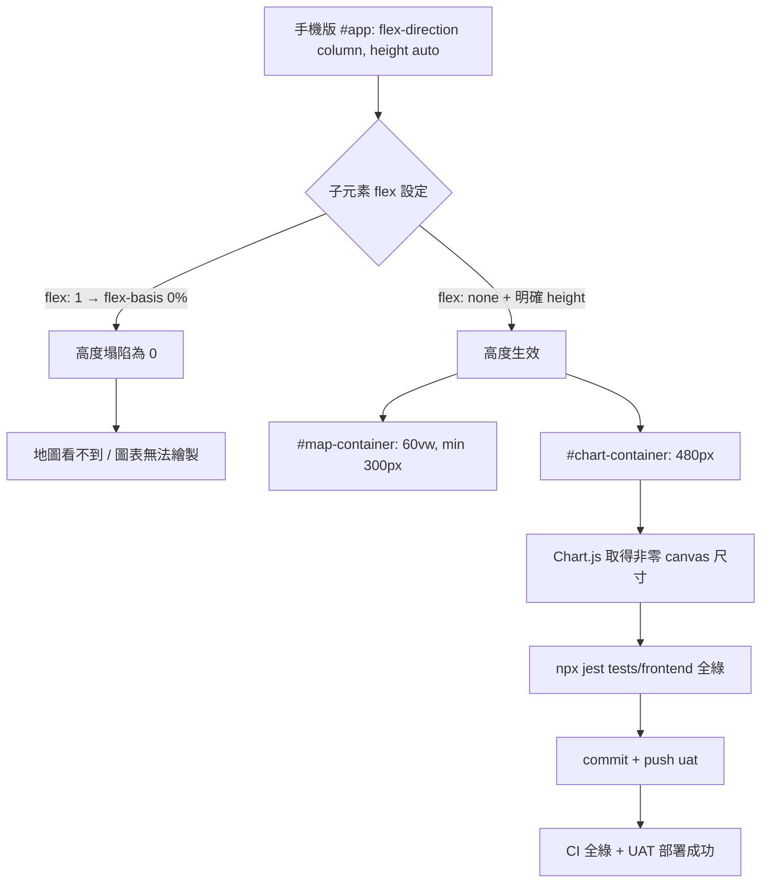

### 任務報告：修正手機版地圖/圖表顯示與年份篩選最小值 — 2026-06-11

1. 主要解決什麼問題？
   - 手機版（≤768px）看不到地圖、統計圖表無資料：
     `#map-container`、`#chart-container` 在桌面版用 `flex: 1` 撐滿，
     但手機版 `#app` 改為 `flex-direction: column; height: auto`，
     `flex: 1`（flex-basis: 0%）使兩者高度塌陷為 0；`#chart-container`
     原本還直接 `display: none` 整個隱藏。
   - 起始年份的 placeholder/最小值由 2018 改為 2015，結束年份維持
     當前西元年不變。

2. 如何證明執行正確？
   - `npx jest tests/frontend/`：29 個前端測試全數通過。
   - push 到 uat 後 CI（build-and-test / push-to-acr / deploy-to-uat）
     全部綠燈（run 27345104760）。

3. 怎樣才是好的作法？
   - RWD 斷點中若需要「明確高度」生效，flex 子項目要搭配 `flex: none`，
     否則 `flex: 1` 的 `flex-basis: 0%` 會在 `height: auto` 父層下
     讓元素塌陷為 0。
   - 圖表容器（Chart.js + `maintainAspectRatio: false`）必須有非零的
     容器高度，否則 canvas 尺寸為 0、無法繪製。

4. 最重要的知識或概念（小學生也能懂）：
   - 「`flex: 1` 不是萬能撐滿」：在某些排版下，`flex: 1` 反而會把元素
     縮成 0，要看父層有沒有「固定的空間」可以分配。
   - 「圖表需要看得見的盒子」：畫圖表的方框如果是 0 大小（被隱藏或塌陷），
     圖表畫不出來。
   - 「篩選範圍要跟著資料變」：起始年份改成 2015，是因為資料涵蓋的
     年份範圍變了，篩選條件要對齊。

5. 核心的變因是什麼？
   - 手機版媒體查詢中 `#map-container`/`#chart-container` 是否設定
     `flex: none` 並搭配明確高度。

6. 新手可能常犯的誤區？
   - 以為 `display: none` 改成顯示就好，忽略容器在 `flex:1 +
     height:auto` 父層下仍會塌陷為 0。
   - 只改 HTML 的 `min`/`placeholder`，忘記 JS（`populateYearSelects`）
     裡也寫死了相同的數字。

7. 流程圖與結構圖

8. 分支與部署記錄
   - 開發分支：直接於 uat 分支進行（無 PR）
   - PR 編號：無
   - Merge 到：uat
   - Merge 時間：2026-06-11 11:58
   - CI 結果：✅ 成功（build-and-test / push-to-acr / deploy-to-uat 全綠，run 27345104760）
   - UAT 部署：✅ 成功
