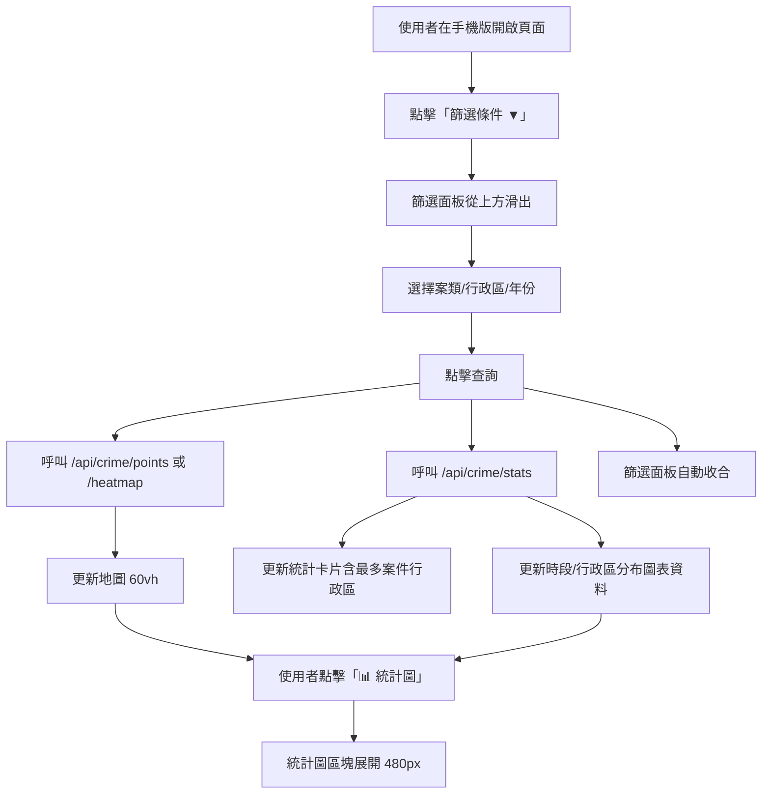
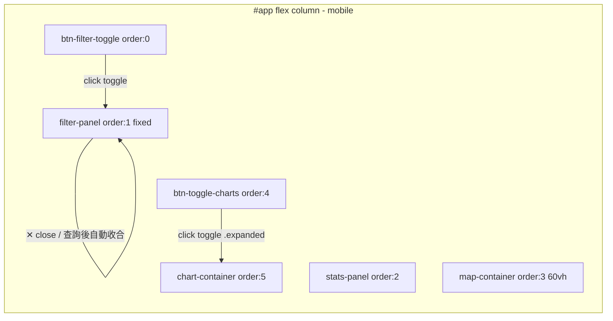

### 任務報告：手機版 UI/UX 五項改善 — 2026-06-11

1. 主要解決什麼問題？
   手機版（< 768px）使用體驗不佳：地圖太扁、篩選條件占用過多版面、
   「最多案件行政區」永遠顯示「—」、圖例遮擋底圖切換、統計圖預設展開
   占用大量空間。共完成五項改善：
   - 地圖容器高度改為 `60vh`（直向長方形）
   - 篩選條件改為頂部「篩選條件 ▼」按鈕，點擊滑出面板，查詢後自動收合，
     右上角 ✕ 可手動收合
   - 修正「最多案件行政區」恆為「—」的 bug
   - 圖例縮小至 12px 並移到地圖右上角（底圖切換控制項下方）
   - 統計圖預設隱藏，新增「📊 統計圖」按鈕展開/收合

2. 如何證明是否執行正確？
   - `npx jest tests/frontend/`：每次 commit 後執行，2 suites / 29 tests 全數通過
   - `dotnet test tests/TaipeiCrimeMap.Domain.Tests --no-build -c Debug`：54 通過、0 失敗（無 C# 變更，作為 sanity check）
   - GitHub Actions CI run 27347548572：build-and-test、push-to-acr、deploy-to-uat 皆 ✅，deploy-to-prod 因 uat 分支正確跳過
   - 手動程式碼追蹤確認「最多案件行政區」改為使用 `/api/crime/stats` 的 `districtDistribution` 計算

3. 怎樣才是好的作法？
   - 跨元件版面重排（讓 DOM 巢狀結構不變但視覺順序改變）使用
     `display: contents` + flex `order`，比重寫 DOM 結構更安全
   - 後端「精簡 DTO」省略欄位時，前端統計邏輯應改用涵蓋完整欄位的彙總
     API（`/api/crime/stats`），而非依賴精簡資料自行運算
   - Leaflet 控制項可利用同角落（`topright`）自動垂直堆疊的特性，避免
     圖例與底圖切換重疊

4. 最重要的知識或概念（小學生也能懂）：
   - 「display: contents」就像把一個盒子變透明，裡面的東西直接排到外面去，
     方便用「order」決定先後順序
   - 「精簡資料」省略了一些欄位來變快，但如果剛好需要那個欄位，就要換一份
     完整的資料來算
   - Leaflet 地圖的小工具（圖例、圖層切換）放在同一個角落時會自動疊好，
     不會互相遮住

5. 核心的變因是什麼？
   - CSS `order` 屬性 + `display: contents`：決定手機版各區塊的視覺排列順序
   - `PointCrimeDto` 是否包含 `district` 欄位：決定「最多案件行政區」能否正確計算
   - `window.innerWidth < 768` 判斷：決定圖例位置（topright vs bottomright）
   - `.expanded` / `.open` class 切換：控制統計圖與篩選面板的展開/收合狀態

6. 新手可能常犯的誤區？
   - 以為要重排版面就必須搬動 DOM 結構，其實用 CSS `order` 即可
   - 以為「最多案件行政區」沒資料是 API 沒被呼叫，但其實是前端用錯了
     資料來源（精簡 DTO 缺欄位）
   - 忘記桌面版也要保持原行為，手機版專屬樣式應放在 `@media (max-width: 768px)` 內

7. 流程圖與結構圖

8. 分支與部署記錄
   - 開發分支：uat（直接於 uat 分支開發，依使用者指示）
   - 相關 commits：33b7589、c34f362、2ed7427、b85e6cc、45f9ab6
   - Merge 到：uat（已 push）
   - Merge 時間：2026-06-11
   - CI 結果：✅ 成功（run 27347548572）
   - UAT 部署：✅ 成功
