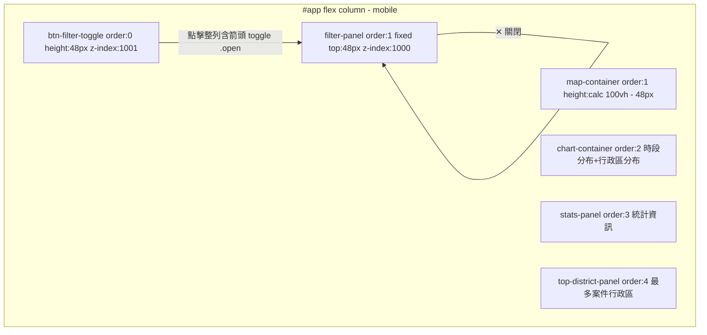
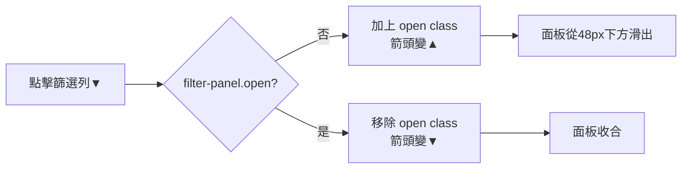

### 任務報告：手機版 UI/UX 六項修正 — 2026-06-11

1. 主要解決什麼問題？
   延續上一輪手機版改善，修正六個體驗問題：
   - 統計資訊與最多案件行政區搬到頁面最下方，順序為時段分布圖、行政區
     分布圖、統計資訊、最多案件行政區，且統計圖直接顯示
   - 篩選列點擊整列（含箭頭）皆可開合，修正開合邏輯看似相反的問題
   - 地圖高度改為 `calc(100vh - 48px)`，扣除頂部篩選列高度後盡量滿版
   - 底圖切換控制項縮小（11px、padding 縮小、寬度 ≤ 130px）
   - 案件類型圖例再縮小（11px、行高更緊湊）
   - 移除「📊 統計圖」展開/收合按鈕及相關程式碼

2. 如何證明是否執行正確？
   - `npx jest tests/frontend/`：每個 commit 後執行，2 suites / 29 tests 全數通過
   - `dotnet test tests/TaipeiCrimeMap.Domain.Tests --no-build -c Debug`：54 通過、0 失敗
   - GitHub Actions CI run 27353641898：build-and-test、push-to-acr、deploy-to-uat 皆 ✅

3. 怎樣才是好的作法？
   - 拆分 `#stats-panel` 與 `#top-district-panel` 兩個區塊，搭配 CSS
     `order` 即可達成「統計圖→統計資訊→最多案件行政區」的視覺順序，
     不需更動既有 DOM 巢狀結構
   - `position: fixed` 的滑出面板若與觸發按鈕在同一頁首區域，按鈕需設
     `position: relative` 並給予比面板更高的 `z-index`，確保按鈕永遠
     可點擊
   - 移除功能時，連同 HTML 元素、CSS 規則、JS 變數/函式/事件綁定一併
     清除，避免殘留死碼

4. 最重要的知識或概念（小學生也能懂）：
   - CSS 的「order」可以讓畫面上的順序跟程式碼裡的順序不一樣，不用搬動
     程式碼結構
   - 兩個疊在一起的東西，`z-index` 數字大的會蓋住數字小的；如果按鈕被
     蓋住，點下去就點到上面的東西，按鈕會「失靈」
   - 不用的功能要整組刪乾淨（畫面、樣式、程式邏輯都要刪），不然以後容易
     搞混

5. 核心的變因是什麼？
   - CSS `order` 數值：決定 `#chart-container`、`#stats-panel`、
     `#top-district-panel`、`#map-container` 的視覺排列順序
   - `#btn-filter-toggle` 與 `#filter-panel` 的 `position` / `z-index` /
     `top` 關係：決定篩選列是否永遠可點擊
   - `calc(100vh - 48px)`：地圖高度 = 視窗高度扣除篩選列固定高度
   - `.leaflet-control-layers` / `.crime-legend` 的 `font-size` 與
     `padding`：決定底圖切換與圖例的視覺大小

6. 新手可能常犯的誤區？
   - 以為 `position: fixed` 元素一定要從 `top: 0` 開始，忽略了它可能蓋住
     同樣固定在頂部的其他元素
   - 刪除 UI 按鈕時只刪 HTML，忘記同步刪除 CSS 規則與 JS 事件綁定，留下
     永遠不會執行的死碼
   - 修改 `order` 後忘記檢查桌面版（`@media` 外）是否受影響

7. 流程圖與結構圖

8. 分支與部署記錄
   - 開發分支：uat（直接於 uat 分支開發，依使用者指示）
   - 相關 commits：dc28b8f、4fc7aa0、9022919、28e5156、565dbb9、409785e
   - Merge 到：uat（已 push）
   - Merge 時間：2026-06-11
   - CI 結果：✅ 成功（run 27353641898）
   - UAT 部署：✅ 成功
