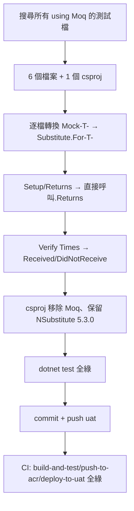

### 任務報告：統一測試框架，Moq 改為 NSubstitute — 2026-06-11

1. 主要解決什麼問題？
   - `TaipeiCrimeMap.Application.Tests` 專案原本混用測試替身框架（僅 Moq），
     將其全部改寫為 NSubstitute，並移除 Moq 套件參照，統一測試框架。

2. 如何證明是否執行正確？
   - `dotnet test` 全專案執行：Domain/Application/Infrastructure 共
     108 個測試全數通過（Application.Tests 34/34）。
   - Integration.Tests 13 個失敗為既有問題（本機缺少 SQL Server 連線字串），
     經 `git stash` 驗證為改動前即存在，與本次重構無關。
   - push 到 uat 後 CI（build-and-test / push-to-acr / deploy-to-uat）全部綠燈。

3. 怎樣才是好的作法？
   - 逐檔轉換並維持原有測試語意，特別是 `IMemoryCache.TryGetValue`（out 參數）
     與 `ICacheEntry.Value`（setter 攔截）等複雜情境，改用 NSubstitute 的
     `Arg.Any<T>() out` 與 `.When(...).Do(...)` 寫法精準對應原本的
     `SetupSet`/`Callback` 行為，避免 L011 的快取容錯測試語意跑掉。

4. 最重要的知識或概念（小學生也能懂）：
   - 「假裝的小幫手要長一樣」：把舊的假裝物件（Moq）換成新的（NSubstitute），
     但它們要「裝出一樣的行為」，測試結果才不會變。
   - 「`.Object` 不見了」：以前要用 `mock.Object` 才是真正的假物件，
     NSubstitute 的假物件本身就能直接用，少打一個字。
   - 「驗證有沒有被叫到」：以前用 `Verify(..., Times.Once)`，
     現在改成 `Received(1).方法()`，意思一樣。

5. 核心的變因是什麼？
   - `IMemoryCache`/`ICacheEntry` 的 out 參數與屬性 setter 攔截寫法是
     轉換正確與否的關鍵變因，寫錯會讓 L1/L2 快取容錯測試失去原本意義。

6. 新手可能常犯的誤區？
   - 忘記把 `mock.Object` 改成替身變數本身，造成建構子型別不符。
   - `ThrowsAsync` 需額外 `using NSubstitute.ExceptionExtensions;`，
     漏掉會編譯失敗。
   - `Times.Never` 對應 `DidNotReceive()`，而非 `Received(0)`（兩者等價但
     `DidNotReceive()` 較常用、可讀性較高）。

7. 流程圖與結構圖

8. 分支與部署記錄
   - 開發分支：直接於 uat 分支進行（無 PR）
   - PR 編號：無
   - Merge 到：uat
   - Merge 時間：2026-06-11 11:03
   - CI 結果：✅ 成功（build-and-test / push-to-acr / deploy-to-uat 全綠，commit b199950）
   - UAT 部署：✅ 成功
