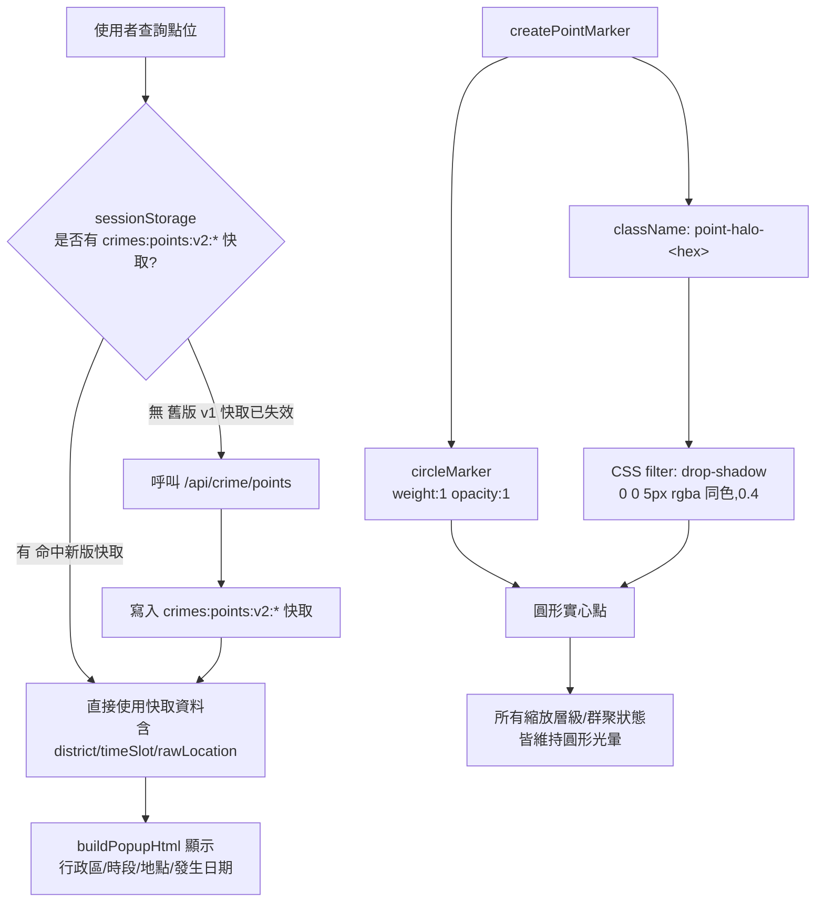

### 任務報告：popup 欄位顯示「—」修正、光暈方形問題、年份輸入框文字色 — 2026-06-11

1. 主要解決什麼問題？
   - popup 的行政區/時段/地點顯示為「—」：修正前端 sessionStorage 快取版本問題
   - 點位光暈在非最大縮放層級顯示為方形色塊：改用 `filter: drop-shadow` 取代加粗 SVG stroke
   - 起始/結束年份輸入框文字（含 placeholder）顏色仍偏深：補上 `::placeholder` 規則並提高對比度

2. 如何證明是否執行正確？
   - `npx jest tests/frontend`：56/56 全數通過
     - 新增/更新 `buildCacheKey` 測試，確認快取 key 已升級為 `crimes:points:v2:`
     - 新增 `buildPointHaloCss` 測試，確認使用 `filter: drop-shadow` 而非 `box-shadow`，blur 半徑 5px、透明度 0.4、每個案類顏色皆有對應 class
   - `node --check` 確認 map.js 語法正確
   - PR #35、#36 squash-merge 到 uat 後，CI（build-and-test、push-to-acr、deploy-to-uat）皆 success

3. 怎樣才是好的作法？
   - 後端 DTO 欄位擴充時，要連同前端 client-side 快取（sessionStorage）的版本一併檢查並升版（見 [[L021]]）
   - SVG 元素（Leaflet circleMarker）的光暈/陰影效果用 `filter: drop-shadow`，`box-shadow` 對 `<path>` 無效（見 [[L022]]）
   - 文字顏色可讀性修正要連同 `::placeholder` 一併處理，因為 `color` 不會自動套用到 placeholder

4. 最重要的知識或概念（最多三個）：
   - 瀏覽器快取的資料如果「形狀」變了（多了新欄位），要靠改變快取的名字（版本號）讓舊資料失效
   - 光暈效果用「陰影濾鏡」做，圓形的東西套用陰影濾鏡還是圓形；用「加粗邊框」做，邊框太粗在某些情況會變形
   - 輸入框裡的「提示文字」（placeholder）和使用者「打的文字」是兩種顏色設定，要分開調整

5. 核心的變因是什麼？
   - sessionStorage 快取 key 是否包含版本號，決定瀏覽器是否會用到擴充欄位前的舊資料
   - circleMarker 光暈用 stroke（邊框）還是 filter（濾鏡）實作，決定在群聚/縮放情境下是否變形
   - `::placeholder` 是否有獨立的顏色規則，決定空白輸入框文字是否清楚可讀

6. 新手可能常犯的誤區？
   - 以為後端 DTO 改完、前端程式碼改完就一定會顯示新欄位，忽略瀏覽器端快取仍是舊資料
   - 用加粗 SVG stroke 做光暈，忽略 Leaflet 在群聚/不同縮放層級下的渲染差異
   - 只改 `input` 的 `color`，以為 placeholder 文字會跟著變色

7. 流程圖與結構圖

8. 分支與部署記錄
   - 開發分支：fix/points-cache-version
     - PR 編號：#35
     - Merge 到：uat（squash, delete-branch）
     - Merge 時間：2026-06-10 20:38
     - CI 結果：✅ 成功
     - UAT 部署：✅ 成功
   - 開發分支：fix/marker-halo-square-and-year-input-color
     - PR 編號：#36
     - Merge 到：uat（squash, delete-branch）
     - Merge 時間：2026-06-10 20:48
     - CI 結果：✅ 成功
     - UAT 部署：✅ 成功
