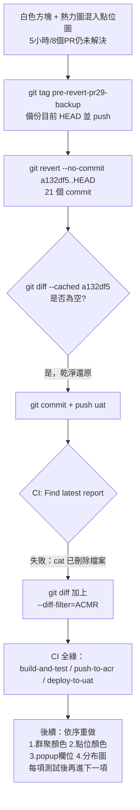

### 任務報告：Revert PR #29 之後版本並修正 CI 報告步驟 — 2026-06-11

1. 主要解決什麼問題？
   - UAT 上「點位旁白色小方塊」與「熱力圖群聚圓圈混入點位圖」兩個問題，
     經 5 小時、8 個 PR 仍無法解決，決定整批 revert 回 PR #29 之前的版本
   - revert 後發現 CI 的「Find latest report」步驟因抓到「被刪除」的報告檔案
     導致 deploy-to-uat job 失敗，已一併修正
   - 同時更新 `.claude/settings.json` 的 Bash 權限白名單

2. 如何證明是否執行正確？
   - revert 前以 `git tag pre-revert-pr29-backup` 備份目前 HEAD 並 push 到遠端
   - `git revert --no-commit a132df5..HEAD`（PR #29 之後共 21 個 commit）
     未發生衝突，`git diff --cached a132df5` 結果為空，
     確認還原後的 tree 與 PR #29 之前完全一致
   - `npx jest tests/frontend`：24/24 通過（PR #29 之前的測試集）
   - push 到 uat 後，第一次 CI 因「Find latest report」抓到已刪除的報告檔失敗
     （但 deploy-to-uat 的 Update Container App / migration / CSV import 皆成功）
   - 修正 `git diff --diff-filter=ACMR` 後，第二次 CI
     （build-and-test、push-to-acr、deploy-to-uat）全部 success

3. 怎樣才是好的作法？
   - 多輪小修正仍無法解決同一個視覺問題時，應考慮整批 revert 回已知良好版本，
     而不是持續疊加修正
   - revert 大範圍 commit 前，先打備份 tag 並 push，確保隨時可找回
   - CI script 用 `git diff --name-only` 取檔案清單後若會 `cat`/讀取內容，
     需加 `--diff-filter=ACMR` 排除已刪除的檔案

4. 最重要的知識或概念（最多三個）：
   - 改了很多次都沒修好時，先「倒帶」回到還沒壞掉的版本，比繼續硬改更快
   - 倒帶之前先做一個記號（標籤），這樣想要的話還能找回原本的東西
   - 自動化腳本去讀「這次改了哪些檔案」時，要記得有些檔案可能是「被刪掉」的，
     不能直接打開來讀

5. 核心的變因是什麼？
   - `git revert --no-commit a132df5..HEAD` 後的 tree 是否與 `a132df5` 完全一致，
     決定 revert 是否乾淨
   - CI 的 `git diff --diff-filter` 是否排除刪除的檔案，
     決定「Find latest report」步驟是否會因讀取不存在的檔案而失敗

6. 新手可能常犯的誤區？
   - 一直在壞掉的程式碼基礎上小修小補，越改越複雜，反而找不到根因
   - revert 大量 commit 前沒有備份，一旦發現 revert 錯了就難以復原
   - CI script 用 `git diff --name-only` 時忘記檔案可能被刪除，直接 `cat` 導致失敗

7. 流程圖與結構圖

8. 分支與部署記錄
   - 開發分支：uat（直接提交）
   - PR 編號：無（直接 push 到 uat，revert 操作）
   - Merge 到：uat
   - Merge 時間：2026-06-10 22:48
   - CI 結果：✅ 成功（第一次因 CI script 缺陷失敗，已修正後重新 push 成功）
   - UAT 部署：✅ 成功
   - 備份標籤：`pre-revert-pr29-backup`（指向 revert 前的 HEAD，含 PR #30~#37 全部內容）
