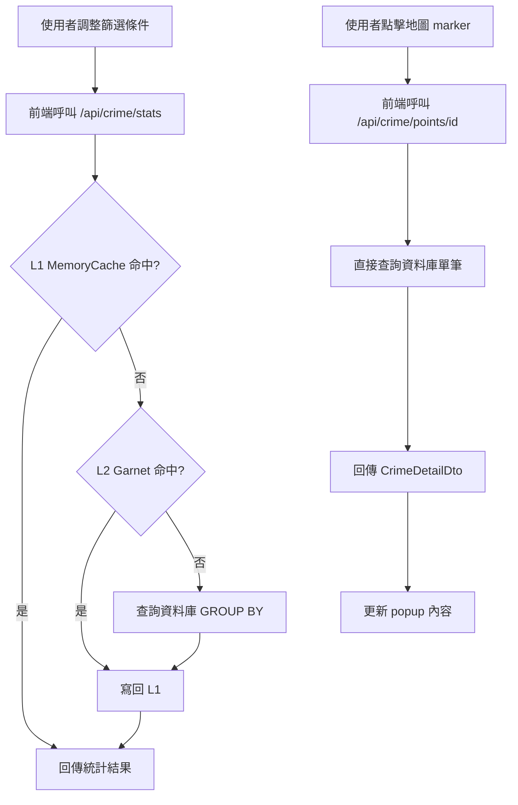
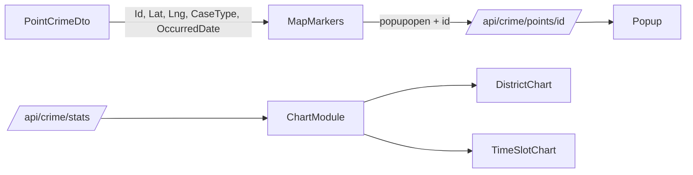

### 任務報告：統計圖表 API 與 popup 單筆詳細資料 L1/L2 快取 — 2026-06-11

1. 主要解決什麼問題？
   - 新增 `GET /api/crime/stats`，由後端先做行政區/時段彙總並走 L1(MemoryCache 1分鐘)/L2(Garnet 30分鐘) 快取，前端不再自行下載全部資料來算圖表。
   - 新增 `GET /api/crime/points/{id}`，popup 點擊時才查詢單筆詳細資料（district、timeSlot、rawLocation、occurredDate），不再一開始就把這些欄位放進每筆點位資料中。

2. 如何證明是否執行正確？
   - `dotnet test`：Domain 54、Application 34（含新增 6 個）、Infrastructure 20（含新增 3 個）全數通過；Integration.Tests 13 個失敗為本機無 Azure SQL 連線字串的既有環境限制（L008），與本次變更無關。
   - `npx jest tests/frontend`：24 個測試全數通過。
   - PR #38 的 GitHub Actions `build-and-test` 為綠燈，merge 後 `deploy-to-uat` 成功。

3. 怎樣才是好的作法？
   - 統計用的彙總計算放在資料庫端（GROUP BY），不要把整批資料抓到前端再算，可大幅降低流量與前端負擔。
   - 非必要、低命中率的單筆查詢（如 popup 詳細資料）不快取，避免快取塞滿大量低重用率的 key。

4. 最重要的知識或概念（小學生也能懂）：
   - 「先算好再給」：圖表要的數字讓資料庫先算好彙總，瀏覽器拿到的就是現成答案，不用自己重新數一遍。
   - 「點了才拿」：地圖上的小點被點到時才去問詳細資料，沒點到的點就不用先準備。
   - 「兩層記憶」：常被問的統計資料先放在「快記憶」（1分鐘）和「慢一點但比較持久的記憶」（30分鐘），下次問同樣問題就不用重算。

5. 核心的變因是什麼？
   - cache key 是否能正確反映篩選條件（caseType/district/yearFrom/yearTo），key 不對會拿到錯的快取資料。
   - `PointCrimeDto` 是否正確帶上 `Id`，這是前端能否成功做單筆查詢的關鍵。

6. 新手可能常犯的誤區？
   - 忘記在 cache key 中包含所有篩選條件，導致不同條件查到同一份快取結果。
   - 對低命中率的單筆查詢也加上快取，反而浪費快取空間。
   - 前端圖表邏輯仍殘留舊的「前端聚合」程式碼，造成資料來源不一致。

7. 流程圖與結構圖

8. 分支與部署記錄
   - 開發分支：feature/crime-stats-and-popup-detail-api
   - PR 編號：#38
   - Merge 到：uat
   - Merge 時間：2026-06-11 02:44
   - CI 結果：✅ 成功
   - UAT 部署：✅ 成功
