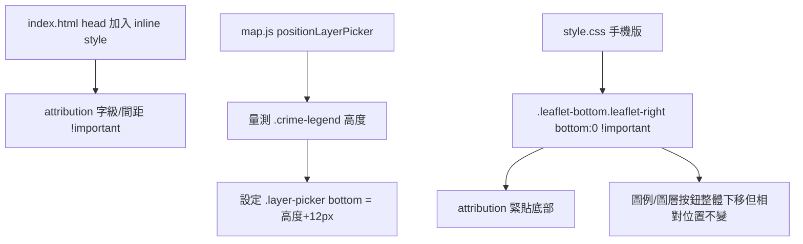

### 任務報告：OpenStreetMap attribution 與圖層按鈕定位修正 — 2026-06-12

1. 主要解決什麼問題？
   - OpenStreetMap attribution 列在地圖上顯示過高、手機版有多餘留白
   - 圖層切換按鈕（`.layer-picker`）位置用寫死的 px 估算，無法準確貼齊
     案件類型圖例（`.crime-legend`）正上方

2. 如何證明是否執行正確？
   - `npx jest tests/frontend/`：38/38 通過
   - `dotnet test tests/TaipeiCrimeMap.Domain.Tests --no-build -c Debug`：54/54 通過
   - 三次 commit 皆 push 到 uat，CI（build-and-test → push-to-acr →
     deploy-to-uat）全部 ✅ success
   - 使用者實機測試手機版確認 attribution 已貼齊底部

3. 怎樣才是好的作法？
   - 修改 Leaflet 控制項版面前，先確認該角落容器
     （`.leaflet-bottom.leaflet-right` 等）內還承載哪些其他控制項，
     避免一條 CSS 規則同時影響不相關的元件
   - 動態量測元素高度（`getBoundingClientRect()`）取代寫死的 px 估算值，
     並在 `resize` 時重新計算，避免內容變動後位置跑掉

4. 最重要的知識或概念（最多三個）
   - Leaflet 地圖四個角落各有一個共用容器，框架內建控制項（attribution、
     縮放按鈕）和我們自己加的控制項（圖例、圖層按鈕）可能放在同一個容器裡
   - CSS `!important` 只解決「誰贏」的問題，解決不了「規則本身綁錯了
     不該一起調整的元素」
   - 用 JS 量測真實高度再設定位置，比用固定數字猜測更穩定

5. 核心的變因是什麼？
   - `.leaflet-bottom.leaflet-right` 容器的 `bottom` 偏移量，會同時影響
     attribution、圖例、圖層按鈕三者的最終位置

6. 新手可能常犯的誤區？
   - 看到樣式沒生效就一直加 `!important`，卻沒檢查選到的元素範圍是否
     包含了不該動的東西
   - 用「目測估算高度」寫死在 CSS 裡，元件內容（如圖例項目數）一改就
     全部跑版

7. 流程圖

8. 分支與部署記錄
   - 開發分支：uat（直接提交）
   - PR 編號：無（直接 commit 至 uat）
   - Merge 到：uat
   - Merge 時間：2026-06-12 03:51
   - CI 結果：✅ 成功（27370795649 / 27371996772 / 27373309525）
   - UAT 部署：✅ 成功
