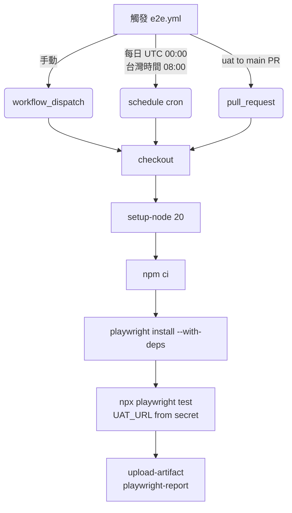
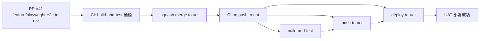

### 任務報告：Playwright E2E CI Workflow — 2026-06-12

#### 1. 主要解決什麼問題？
將先前建立的 Playwright E2E 測試專案接上 CI：新增獨立的
`.github/workflows/e2e.yml`，並把 `playwright.config.ts` 的
`baseURL` 改為從 GitHub Secret `UAT_URL` 讀取，避免將 UAT 網址寫死。

#### 2. 如何證明是否執行正確？
- PR #41（`feature/playwright-e2e` → `uat`）的既有 `CI` workflow
  `build-and-test` 全綠通過。
- Merge 後 push 到 `uat` 觸發的 `CI` workflow 三個 job
  （`build-and-test`、`push-to-acr`、`deploy-to-uat`）全部成功，
  UAT 部署完成。
- 新增的 `e2e.yml` 不會在這次 push 觸發（其條件僅限
  `workflow_dispatch`、每日排程、以及 `uat → main` 的 PR），
  屬預期行為，待下次手動觸發或排程時驗證。

#### 3. 怎樣才是好的作法？
- 設定檔中的環境相依設定（如 UAT URL）應改為讀取環境變數，
  並保留本機開發用的預設值（`process.env.UAT_URL ?? '<原網址>'`），
  兩種情境都能運作。
- 測試報告改用 `html` reporter 並輸出至 `playwright-report/`，
  方便 CI 用 `actions/upload-artifact` 上傳供事後查看。

#### 4. 最重要的知識或概念（最多三個）
1. **密碼不要寫在程式裡**：網址或機密資訊改放到 GitHub Secrets，
   程式只在執行時去讀取，這樣比較安全。
2. **排程時間要換算時區**：GitHub Actions 的 cron 都是 UTC，
   台灣時間早上 8 點要寫成 UTC 0 點。
3. **測試完要留證據**：把測試報告打包成 artifact 上傳，
   之後不用重跑就能看到當時的結果。

#### 5. 核心的變因是什麼？
`e2e.yml` 的觸發條件設計：`workflow_dispatch`、`schedule`（cron）、
以及 `pull_request` 限定 `uat → main`，三者互不影響，
是本次新增 workflow 是否會在錯誤時機被觸發的關鍵。

#### 6. 新手可能常犯的誤區？
- 以為 cron 的時間就是當地時間，忘記 GitHub Actions 一律用 UTC。
- 在 `pull_request` 觸發條件只寫 `branches: [main]`，
  忘記同時限制來源分支（`head_ref`），導致任何 PR 到 main
  都會誤觸發只該給 `uat → main` 用的 E2E 測試。
- 新增 secret 後忘記在 workflow 的 `env` 區塊實際引用，
  造成設定形同虛設。

#### 7. 流程圖與結構圖

#### 8. 分支與部署記錄
- 開發分支：`feature/playwright-e2e`
- Commit：`9f140a2`（ci: add Playwright E2E workflow for UAT smoke checks）
- PR 編號：#41
- Merge 到：`uat`
- Merge 時間：2026-06-12 12:51（squash merge，刪除分支）
- CI 結果：✅ 成功（build-and-test、push-to-acr、deploy-to-uat 全綠）
- UAT 部署：✅ 成功
