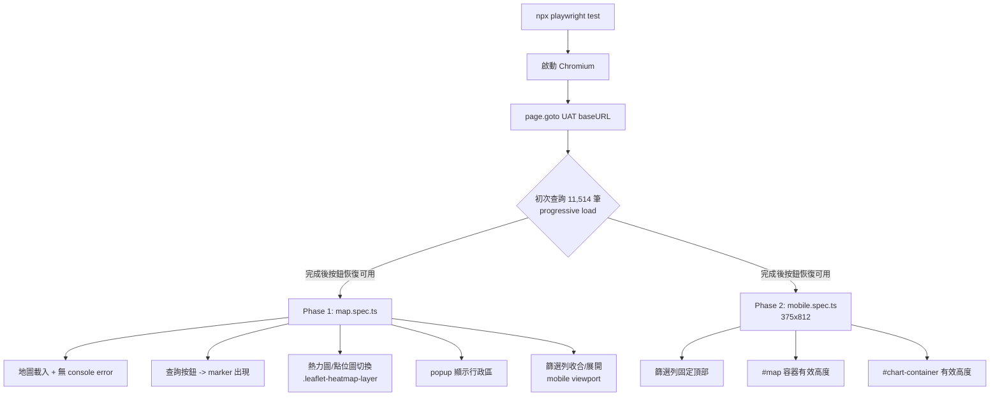
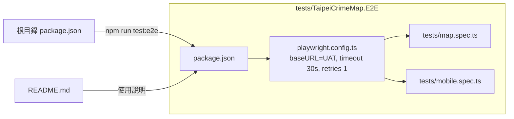

### 任務報告：建立 Playwright E2E 測試專案 — 2026-06-12

#### 1. 主要解決什麼問題？
台北市治安地圖目前缺乏對 UAT 環境的瀏覽器端自動化測試。本次在
`tests/TaipeiCrimeMap.E2E/` 建立 Playwright + TypeScript 測試專案，
針對 UAT 即時環境驗證地圖核心功能（Phase 1，5 項）與手機版 RWD
版面（Phase 2，3 項），共 8 項測試。

#### 2. 如何證明是否執行正確？
於 `tests/TaipeiCrimeMap.E2E/` 執行 `npx playwright test`，
8 項測試全數通過：
```
Running 8 tests using 8 workers
  8 passed (6.8s)
```
另外執行 `dotnet test TaipeiCrimeMap.slnx` 確認本次未影響既有 .NET 測試：
Domain/Application/Infrastructure 三個專案共 108 項全數通過；
Integration.Tests 15 項失敗為既有環境限制（本機無 Azure SQL 連線字串，
與 [[L008]] 相同根因），與本次變更無關。

#### 3. 怎樣才是好的作法？
- 對「智慧切換 / 快取」類前端邏輯，E2E 斷言應驗證 DOM 最終狀態
  （例如熱力圖圖層是否出現），而非假設一定會發出特定 API 請求。
- 自訂樣式表單元件（`display:none` 的原生 input）應透過使用者可見的
  元素互動，而非直接操作隱藏的原生控制項。
- 針對會打到真實 UAT、可能冷啟動的測試，個別放寬逾時並先等待
  操作元件恢復可用，再進行互動。

#### 4. 最重要的知識或概念（最多三個）
1. **看得到才能點**：網頁上「看起來」可以點的按鈕，背後可能是被
   CSS 藏起來的另一個元素，要點「看得到的那個」。
2. **快取會讓事情變少**：網站為了變快會記住上次抓過的資料，
   切換畫面時可能不會再去要新資料，所以不能假設「每次操作都會
   重新連線」。
3. **冷開機要多等一下**：UAT 環境如果一陣子沒人用會「睡著」，
   第一次打開網頁要多等幾十秒它才會醒過來。

#### 5. 核心的變因是什麼？
`.gitignore` 中 `*.e2e`（Visual Studio Trace Files 規則）在 Windows
不分大小寫，會把以 `.E2E` 結尾的目錄整個忽略，是本次新增測試專案
能否被 git 追蹤到的關鍵變因。

#### 6. 新手可能常犯的誤區？
- 以為 `locator.check({ force: true })` 可以對任何 `display:none`
  的元素生效，實際上仍可能卡到逾時。
- 以為切換 UI 模式一定會發送對應的 API 請求，忽略前端可能已有快取。
- 新增檔案後 `git status` 沒反應就以為沒存檔，沒檢查是否被
  `.gitignore` 規則誤擋。

#### 7. 流程圖與結構圖





#### 8. 分支與部署記錄
- 開發分支：`feature/playwright-e2e`
- Commit：`9e77b3f`（test: add Playwright E2E test project for UAT smoke checks）
- PR 編號：尚未建立（依使用者指示，先完成本機測試，CI 整合留待後續討論）
- Merge 到：尚未 merge
- Merge 時間：N/A
- CI 結果：N/A（本次未加入 CI，依使用者指示待討論）
- UAT 部署：N/A（本次未變更應用程式程式碼，僅新增測試專案）
