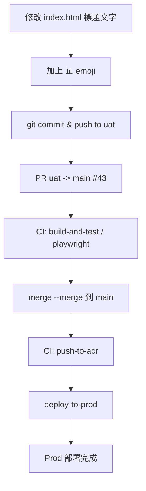

### 任務報告：統計圖表標題加上 emoji — 2026-06-12

1. 主要解決什麼問題？
   - 統計圖表區塊標題「時段分布」「行政區分布」加上 📊 emoji，提升視覺辨識度。

2. 如何證明是否執行正確？
   - 確認 index.html 中該兩個標題的所有出現位置（共2處，手機版/桌面版共用同一組 DOM）皆已加上 emoji。
   - CI（build-and-test、Playwright）全部通過。
   - PR #43 成功 merge 進 main，Prod CI 全部成功。

3. 怎樣才是好的作法？
   - 只改標題文字，不動圖表內部渲染邏輯（chart.js）。
   - 修改前先用 grep 確認所有出現位置，避免漏改。

4. 最重要的知識或概念：
   - 網頁標題文字直接寫在 HTML 裡，改文字不影響程式邏輯。
   - 響應式網頁（手機/桌面）常共用同一份 HTML，由 CSS 決定顯示方式，所以改一次就兩邊都生效。
   - emoji 也是文字字元，可以直接貼到網頁裡顯示。

5. 核心的變因是什麼？
   - index.html 中 `<h3 class="chart-title">` 的文字內容。

6. 新手可能常犯的誤區？
   - 誤以為手機版和桌面版是兩份不同的 HTML，分別去找、結果改重複或漏改。
   - 改到圖表內部（chart.js 的 label）而非標題文字。

7. 流程圖：

8. 分支與部署記錄
   - 開發分支：uat（直接修改，未開新 feature 分支）
   - PR 編號：#43
   - Merge 到：main
   - Merge 時間：2026-06-12 05:34 UTC
   - CI 結果：✅ 成功
   - UAT 部署：✅ 成功（push to uat 時已部署）
   - Prod 部署：✅ 成功
