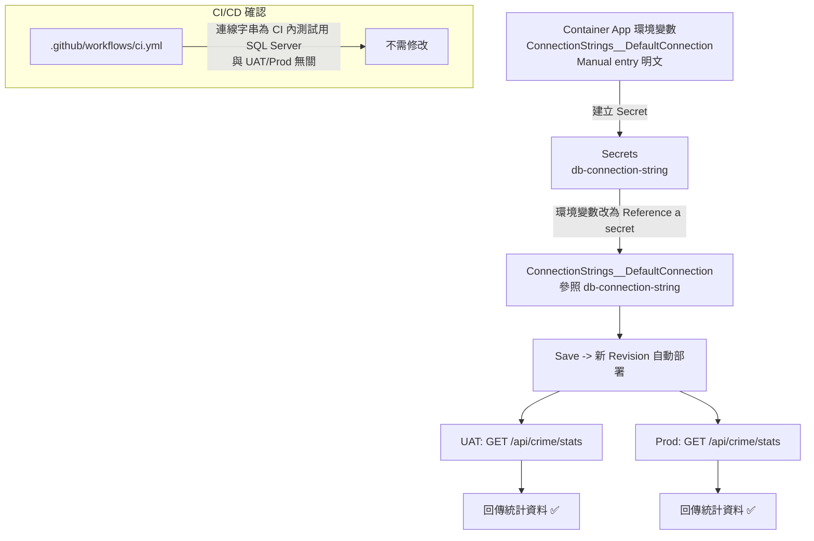

### 任務報告：UAT/Prod DB 連線字串改用 Container App Secret — 2026-06-13

1. 主要解決什麼問題？
   - UAT 與 Prod Container App 的 `ConnectionStrings__DefaultConnection`
     原以明文環境變數儲存（含資料庫密碼），改為使用 Azure Container App
     的 Secret 機制，環境變數改為「參照 Secret」，密碼不再以明文形式
     出現在 Container App 設定畫面上。

2. 如何證明是否執行正確？
   - 使用者於 Azure Portal 完成兩個環境的 Secret 建立與環境變數參照設定，
     Save 後 Azure 自動建立新 Revision 並重新部署。
   - 重新部署後呼叫：
     - UAT：`https://taipei-crime-map-uat.ambitioussand-7326440b.japaneast.azurecontainerapps.io/api/crime/stats`
     - Prod：`https://taipei-crime-map-prod.ambitioussand-7326440b.japaneast.azurecontainerapps.io/api/crime/stats`
   - 兩者皆正常回傳 `districtDistribution` / `timeSlotDistribution` 統計資料，
     確認 API 仍可正常連線資料庫。

3. 怎樣才是好的作法？
   - 含密碼的設定值應一律存放在平台提供的 Secret 機制（Azure Container App
     Secrets），環境變數只存「Secret 參照」，不存明文值。
   - 變更後務必呼叫一個會實際打到 DB 的 API（如 `/api/crime/stats`）驗證，
     不能只看 Revision 狀態是 Running 就判定成功。

4. 最重要的知識或概念（最多三個）：
   - Secret 就像把密碼鎖進保險箱，環境變數只記錄「保險箱的編號」，
     不直接寫密碼本身。
   - 改設定後，平台會自動換一個新版本（Revision）重新啟動，
     換完要實際打 API 確認資料庫還連得上。
   - CI/CD 設定本來就不存放這組連線字串，所以這次改動不需要動
     GitHub Actions。

5. 核心的變因是什麼？
   - 環境變數 `ConnectionStrings__DefaultConnection` 的「Source」
     （Manual entry vs. Reference a secret）決定了密碼是否以明文形式
     存在於 Container App 設定中。

6. 新手可能常犯的誤區？
   - 以為改完 Secret 設定後不需要重新驗證，跳過呼叫 API 確認的步驟。
   - 誤以為連線字串也存在 GitHub Secrets / CI workflow 裡，
     花時間去改 `.github/workflows/*.yml`（實際上 CI 內的連線字串只是
     測試用的本機 SQL Server，與 UAT/Prod 無關）。

7. 流程圖（Mermaid）：

8. 分支與部署記錄
   - 開發分支：無（純 Azure Portal 手動設定，無程式碼變更）
   - PR 編號：無
   - Merge 到：不適用
   - Merge 時間：不適用
   - CI 結果：不適用（無程式碼變更）
   - UAT 部署：✅ 成功（Secret 參照生效，`/api/crime/stats` 正常回傳）
   - Prod 部署：✅ 成功（Secret 參照生效，`/api/crime/stats` 正常回傳）

## 補充：本次遇到的環境問題
- az CLI 因本機 AVG 防毒軟體的 SSL 攔截憑證無法驗證，無法直接查詢/設定
  Container App，改由使用者於 Azure Portal 手動完成 Secret 設定。
- curl 驗證 API 時遇到 schannel `CRYPT_E_NO_REVOCATION_CHECK`，
  加上 `--ssl-no-revoke` 後正常。
- 詳見 `docs/lessons-learned.md` L033。
