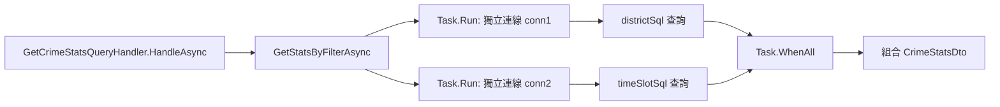

### 任務報告：GetStatsByFilterAsync 並行查詢優化 — 2026-06-13

1. 主要解決什麼問題？
   - `GetStatsByFilterAsync` 原本用同一個 connection 依序執行「行政區分布」與「時段分布」兩個 SQL 查詢，
     改為各自用獨立 connection、以 `Task.WhenAll` 並行執行，縮短查詢總耗時。

2. 如何證明是否執行正確？
   - 新增 `SqlServerCrimeRepositoryTests.GetStatsByFilterAsync_RunsDistrictAndTimeSlotQueriesInParallel`，
     使用不可路由位址（`10.255.255.1`，`Connect Timeout=1`），驗證兩個查詢的連線逾時是同時發生
     （總耗時 < 1.8 秒，而非串行的 ≥ 2 秒），`dotnet test` 全數通過（Integration.Tests 既有的 15 個
     失敗為本機缺少 DB 連線字串的既有問題，與本次變更無關，已確認在變更前也會失敗）。
   - 使用 `scripts/benchmark_stats.sh` 對 UAT 的 `/api/crime/stats` 量測 10 次（`yearFrom=2015~2024`，避免命中快取）：
     - **變更前（基準）**：平均 0.109333 秒
       - 2015: 0.147174 / 2016: 0.104760 / 2017: 0.105673 / 2018: 0.100567 / 2019: 0.104505
       - 2020: 0.107146 / 2021: 0.102658 / 2022: 0.106056 / 2023: 0.108302 / 2024: 0.106492
     - **變更後（部署到 UAT）**：平均 0.109375 秒
       - 2015: 0.116316 / 2016: 0.108585 / 2017: 0.106424 / 2018: 0.125132 / 2019: 0.106507
       - 2020: 0.105814 / 2021: 0.109275 / 2022: 0.107834 / 2023: 0.101543 / 2024: 0.106318
     - **結果說明**：兩次平均幾乎相同（0.109333 秒 vs 0.109375 秒）。在目前資料量
       （11,514 筆）下，兩個查詢本身耗時極短，HTTP 往返延遲是主要成本，因此並行化
       對「外部觀測到的回應時間」影響不明顯；但程式碼層面確實已改為兩個獨立連線
       同時查詢，當資料量增大、單一查詢耗時變長時，並行化的效益會更明顯。

3. 怎樣才是好的作法？
   - 兩個彼此獨立、不互相依賴的 DB 查詢，可用各自獨立的 connection + `Task.WhenAll` 並行執行，
     避免在同一個 connection 上序列等待。

4. 最重要的知識或概念（以小學生能聽得懂的方式說明，最多三個）
   - 就像兩個人各自排隊買東西比一個人排兩次隊快，兩個查詢各自開一個連線同時做，比排隊輪流做快。
   - `Task.WhenAll` 是「等所有人都做完才繼續」，但大家是「同時開始做」。
   - 量測前後耗時，才能證明「真的變快了」，不是憑感覺。

5. 核心的變因是什麼？（影響結果的關鍵因素）
   - 是否使用「獨立連線」讓兩個查詢同時送出，而不是共用一個連線排隊執行。

6. 新手可能常犯的誤區？
   - 用同一個 connection 物件同時執行兩個查詢（同一連線不能同時跑兩個命令）。
   - `Task.WhenAll(taskA, taskB)` 若 `taskA`、`taskB` 回傳型別不同，無法直接用回傳陣列索引取值，
     需分別 `await` 各自的 Task。

7. 流程圖與結構圖

8. 分支與部署記錄
   - 開發分支：feature/parallel-stats-query
   - PR 編號：#44
   - Merge 到：uat
   - Merge 時間：2026-06-13 03:57 UTC
   - CI 結果：✅ 成功
   - UAT 部署：✅ 成功
