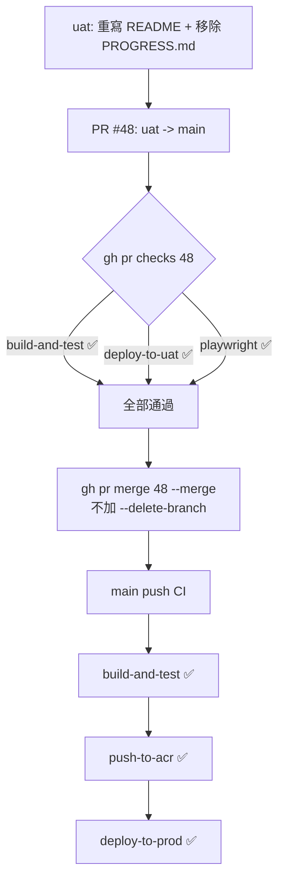

### 任務報告：release: UAT → Prod README 更新 — 2026-06-13

1. 主要解決什麼問題？
   - 將 uat 上的 README 重寫（專案介紹、線上 Demo、技術棧、架構特色、
     本機開發、測試說明、專案結構）與移除內部開發筆記 `PROGRESS.md`
     的變更，透過 PR #48 合併到 main，觸發 Prod 部署。

2. 如何證明是否執行正確？
   - PR #48 的 `gh pr checks 48`：`build-and-test`、`deploy-to-uat`、
     `playwright` 全部 ✅ pass，`deploy-to-prod`/`push-to-acr` 在
     PR 事件下為預期的 skipping。
   - `gh pr merge 48 --merge`（未加 `--delete-branch`），merge 後
     `git branch -r` 確認 `origin/uat` 仍存在。
   - main 的 push CI（run 27485135274）：`build-and-test`、
     `push-to-acr`、`deploy-to-prod` 全部 ✅ success。

3. 怎樣才是好的作法？
   - 純文件變更（README、移除內部筆記）一樣走完整的
     `feature/uat → PR → uat → PR → main` 流程，確保 CI/CD 與
     部署紀錄一致，不因「只是文件」而跳過驗證。

4. 最重要的知識或概念（最多三個）：
   - 即使是文件變更，push 到 `uat`/`main` 仍會觸發完整 CI/CD
     （build-and-test、push-to-acr、deploy-to-uat/prod），
     因為 workflow 是依分支而非依檔案類型觸發。
   - 公開 repo 的 README 應包含足夠的專案介紹、Demo 連結與技術棧，
     方便外部讀者快速理解專案；內部除錯筆記（如 PROGRESS.md）不應公開。
   - uat → main 的 PR 一律用 `--merge` 且不可 `--delete-branch`，
     確保 uat 分支可持續用於下一輪開發。

5. 核心的變因是什麼？
   - 本次無程式碼邏輯變更，核心變因僅為「文件內容是否準確、
     是否包含不適合公開的內部資訊」。

6. 新手可能常犯的誤區？
   - 以為文件變更不需要走 PR/CI 流程，直接 push 到 main。
   - README 中寫入會隨資料更新而過時的具體數字（如資料筆數），
     應改用「11,000+」等不需頻繁維護的描述。

7. 流程圖（Mermaid）：

8. 分支與部署記錄
   - 開發分支：uat（純文件變更，沿用現有 uat 分支）
   - PR 編號：#48
   - Merge 到：main
   - Merge 時間：2026-06-14 01:49（UTC）
   - CI 結果：✅ 成功（build-and-test / push-to-acr / deploy-to-prod 全綠）
   - UAT 部署：✅ 成功
   - Prod 部署：✅ 成功
