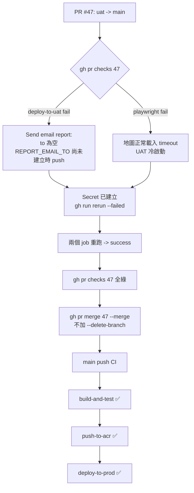

### 任務報告：release: UAT → Prod 安全性修正 — 2026-06-13

1. 主要解決什麼問題？
   - 將 uat 上的安全性修正（`.gitignore` 補上
     `.claude/settings.local.json`、`*.key`；CI 內 email 收件人改用
     `${{ secrets.REPORT_EMAIL_TO }}`）透過 PR #47 合併到 main，
     觸發 Prod 部署。
   - 合併前發現 PR #47 的 CI 有兩項失敗，先排查根本原因再回報「CI 全綠」。

2. 如何證明是否執行正確？
   - `deploy-to-uat`（run 27472878448）失敗於 `Send email report`：
     `At least one of 'to', 'cc' or 'bcc' must be specified`，
     原因是該次 push 發生在 `REPORT_EMAIL_TO` Secret 建立之前，
     Secret 解析為空字串。Secret 建立後用
     `gh run rerun 27472878448 --failed` 重跑，結果 ✅ success。
   - `playwright`（run 27483877111）的「地圖正常載入」測試失敗於
     `page.goto('/')` 逾時（`net::ERR_ABORTED`），重跑後 ✅ success
     （UAT 冷啟動造成的暫時性問題，與本次程式碼變更無關）。
   - 兩項重跑皆綠燈後，`gh pr checks 47` 全部 pass/skipping（skipping
     為 PR 事件下預期行為），執行 `gh pr merge 47 --merge`
     （未加 `--delete-branch`），merge 後 `git branch -r` 確認
     `origin/uat` 仍存在。
   - main 的 push CI（run 27484091440）：`build-and-test`、
     `push-to-acr`、`deploy-to-prod` 全部 ✅ success。

3. 怎樣才是好的作法？
   - CI workflow 改參照新的 GitHub Secret 前，先建立好 Secret 再 push，
     避免「先 push 後建 Secret」造成第一次執行必定失敗。
   - 遇到 CI 失敗不要急著改程式碼，先看是「暫時性/環境問題」還是
     「程式碼問題」；屬於前者時補齊依賴條件後重跑 job 即可。

4. 最重要的知識或概念（最多三個）：
   - GitHub Secret 沒建立時，`${{ secrets.X }}` 會變成空字串，
     不會讓 CI 直接報錯「找不到 Secret」，而是讓使用到它的步驟
     因為收到空值而失敗。
   - CI 失敗時，重跑（rerun）失敗的 job 不需要重新 push commit，
     只要造成失敗的外部條件（這裡是 Secret）已經補齊即可。
   - uat → main 的 PR，必須用 `--merge` 且不能加 `--delete-branch`，
     讓 uat 分支永久保留供下次開發使用。

5. 核心的變因是什麼？
   - GitHub Secret 的建立時間點，相對於「參照該 Secret 的 commit
     被 push 並觸發 CI」的時間點，決定了第一次執行是否會失敗。

6. 新手可能常犯的誤區？
   - 看到 CI 失敗就立刻改程式碼或重新 commit，沒有先看 log 找出
     是環境/相依資源的問題，導致多餘的 commit 與部署。
   - 把 PR 上顯示的「skipping」誤判為失敗；`deploy-to-uat` /
     `deploy-to-prod` 在 `pull_request` 事件下本來就會 skip
     （只在 `push` 事件觸發）。

7. 流程圖（Mermaid）：

8. 分支與部署記錄
   - 開發分支：uat（無新增 feature 分支，沿用既有安全性修正 commit）
   - PR 編號：#47
   - Merge 到：main
   - Merge 時間：2026-06-14 00:57（UTC）
   - CI 結果：✅ 成功（build-and-test / push-to-acr / deploy-to-prod 全綠）
   - UAT 部署：✅ 成功（重跑後）
   - Prod 部署：✅ 成功
