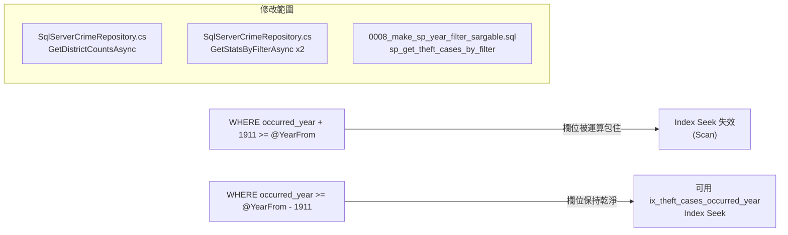

### 任務報告：occurred_year 篩選條件改為 Sargable — 2026-06-13

1. 主要解決什麼問題？
   - WHERE 條件寫成 `occurred_year + 1911 >= @YearFrom`，欄位被算式包住，
     SQL Server 無法使用 `ix_theft_cases_occurred_year` 做 Index Seek，
     改寫為 `occurred_year >= @YearFrom - 1911`，讓索引可被有效利用。

2. 如何證明是否執行正確？
   - 改寫前後邏輯數學上等價（`a + 1911 >= b` ⟺ `a >= b - 1911`）。
   - `dotnet build` 成功、`dotnet test` 全數通過（Domain 54、Application 34、Infrastructure 21）。
   - PR #45 CI（build-and-test）綠燈，merge 後 deploy-to-uat 全部步驟成功。

3. 怎樣才是好的作法？
   - WHERE/JOIN/ORDER BY 條件中，索引欄位不要被函式或運算式包住；
     需要的轉換運算一律移到常數/參數側。
   - 已部署的 SP migration script 不可修改，改用新增版本號（0008）覆寫。

4. 最重要的知識或概念（最多三個）：
   - 索引就像書的目錄，如果在目錄頁碼上先做加減乘除，就找不到對應的書頁了。
   - 把運算搬到「要比較的數字」那一邊，欄位本身保持乾淨，資料庫才能快速查表。
   - 邏輯不變，但寫法不同，速度可能差很多。

5. 核心的變因是什麼？
   - `occurred_year` 欄位是否被運算式包住，決定了 `ix_theft_cases_occurred_year`
     索引能否被 Index Seek 使用。

6. 新手可能常犯的誤區？
   - 以為「邏輯正確」就等於「寫法沒問題」，忽略了 WHERE 條件對索引欄位
     做運算會讓索引失效。
   - 直接修改已部署的舊 migration script，而不是新增一個版本。

7. 流程圖（Mermaid）：

8. 分支與部署記錄
   - 開發分支：feature/sargable-occurred-year-filter
   - PR 編號：#45
   - Merge 到：uat
   - Merge 時間：2026-06-13 15:18
   - CI 結果：✅ 成功
   - UAT 部署：✅ 成功
